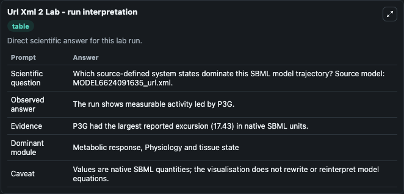
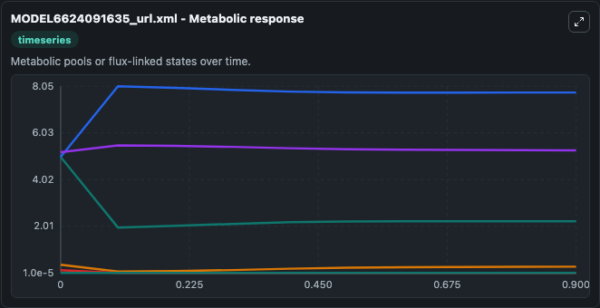
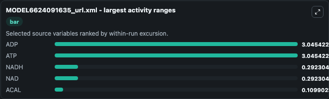
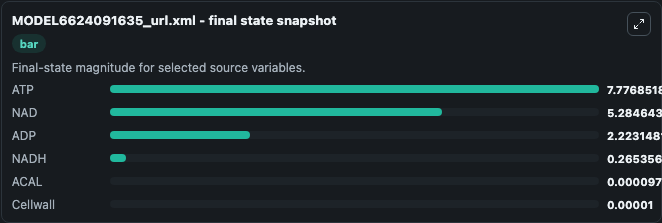
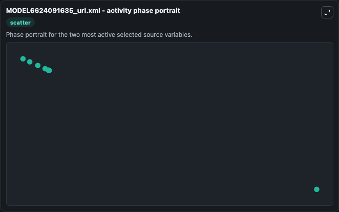

# Url Xml 2

This Biosimulant lab wraps `Url Xml 2` as a runnable systems biology model with a companion visualization module.
This model originates from BioModels Database: A Database of Annotated Published Models (http://www.ebi.ac.uk/biomodels/). It can be used to explore the configured dynamics and compare scenario outcomes across configurations.

## What You'll See

The lab asks: Which source-defined system states dominate this SBML model trajectory? Source model: MODEL6624091635_url.xml. It runs for 1.0 time units with a communication step of 0.1. The run uses the model defaults declared by the curated SBML wrapper. The generated visualizations focus on NAD, ATP, ADP, NADH, ACAL, and Cellwall, combining trajectory, endpoint-comparison, and summary-table views from one completed dark-mode run.

In this captured run, **ADP** moved from 5.000 to 2.223 across 1.0 simulation windows.


### Output Visualizations



*Summary table for Url Xml 2, reporting the scientific question, observed answer, dominant module, and caveat.*



*Trajectories of ADP, ATP, NADH, NAD, ACAL, and Cellwall across the 1.0 simulation. In this run **ATP** climbed from 5.000 to 7.777 and **ADP** fell from 5.000 to 2.223 — the largest movements among the focused observables.*



*Largest-excursion ranking of the focused observables — the absolute movement magnitude during the run. Top 3: **ADP** = 3.045, **ATP** = 3.045, **NADH** = 0.2923, with 2 more observables below.*



*Endpoint snapshot of the focused observables — final values from the captured run. Top 3 by value: **ATP** = 7.777, **NAD** = 5.285, **ADP** = 2.223, with 3 more observables below.*



*Visualization card from the Url Xml 2 dark-mode run.*


## Model Context

- Core model: `models/core`
- Visualization model: `models/visualisation`
- Standard: `other`
- Upstream source: `biomodels_ebi:MODEL6624091635`
- License: `CC0`

## Inputs

| Input | Maps To | Default | Notes |
|---|---|---|---|
| Initial Model State Nad | `systemsbiology_sbml_model6624091635_url_xml_model6624091635_model.initial_model_state_nad` | | Source state initial condition exposed as a model-specific control because no explicit intervention parameter is identifiable. Maps to SBML symbol `NAD`. |
| Initial Model State ATP | `systemsbiology_sbml_model6624091635_url_xml_model6624091635_model.initial_model_state_atp` | | Source state initial condition exposed as a model-specific control because no explicit intervention parameter is identifiable. Maps to SBML symbol `ATP`. |
| Initial Model State ADP | `systemsbiology_sbml_model6624091635_url_xml_model6624091635_model.initial_model_state_adp` | | Source state initial condition exposed as a model-specific control because no explicit intervention parameter is identifiable. Maps to SBML symbol `ADP`. |
| Initial Nadh | `systemsbiology_sbml_model6624091635_url_xml_model6624091635_model.initial_nadh` | | Source state initial condition exposed as a model-specific control because no explicit intervention parameter is identifiable. Maps to SBML symbol `NADH`. |
| Initial Acal | `systemsbiology_sbml_model6624091635_url_xml_model6624091635_model.initial_acal` | | Source state initial condition exposed as a model-specific control because no explicit intervention parameter is identifiable. Maps to SBML symbol `ACAL`. |
| Initial Cellwall | `systemsbiology_sbml_model6624091635_url_xml_model6624091635_model.initial_cellwall` | | Source state initial condition exposed as a model-specific control because no explicit intervention parameter is identifiable. Maps to SBML symbol `Cellwall`. |

## Outputs

| Output | Maps To | Role |
|---|---|---|
| `state` | `systemsbiology_sbml_model6624091635_url_xml_model6624091635_model.state` | Available to the visualization model and downstream workflows. |
| `summary` | `systemsbiology_sbml_model6624091635_url_xml_model6624091635_model.summary` | Available to the visualization model and downstream workflows. |
| `species_labels` | `systemsbiology_sbml_model6624091635_url_xml_model6624091635_model.species_labels` | Available to the visualization model and downstream workflows. |
| `nad` | `systemsbiology_sbml_model6624091635_url_xml_model6624091635_model.nad` | Available to the visualization model and downstream workflows. |
| `atp` | `systemsbiology_sbml_model6624091635_url_xml_model6624091635_model.atp` | Available to the visualization model and downstream workflows. |
| `adp` | `systemsbiology_sbml_model6624091635_url_xml_model6624091635_model.adp` | Available to the visualization model and downstream workflows. |
| `nadh` | `systemsbiology_sbml_model6624091635_url_xml_model6624091635_model.nadh` | Available to the visualization model and downstream workflows. |
| `acal` | `systemsbiology_sbml_model6624091635_url_xml_model6624091635_model.acal` | Available to the visualization model and downstream workflows. |
| `cellwall` | `systemsbiology_sbml_model6624091635_url_xml_model6624091635_model.cellwall` | Available to the visualization model and downstream workflows. |

## Runtime

- Duration: `1.0`
- Communication step: `0.1`

## Running Locally

```bash
biosimulant labs serve
```
