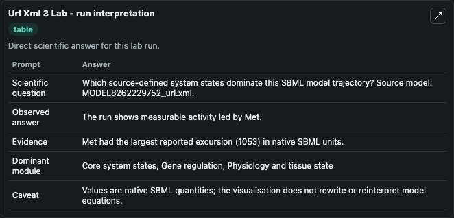
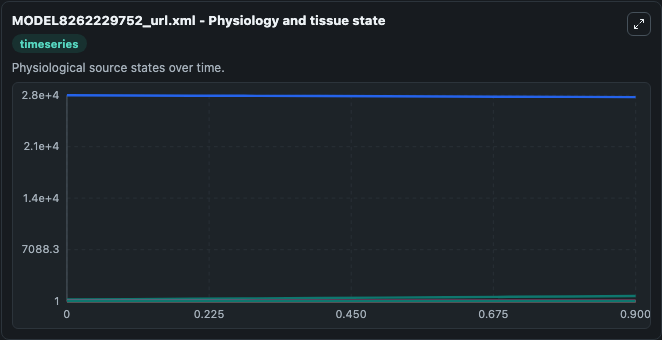
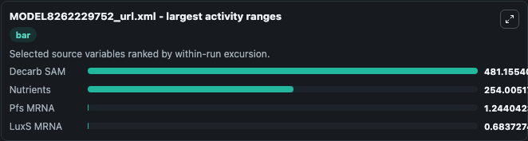
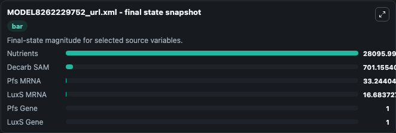
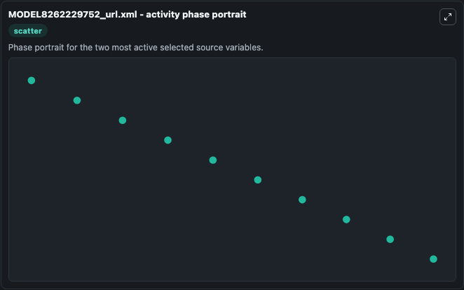

# Url Xml 3

This Biosimulant lab wraps `Url Xml 3` as a runnable systems biology model with a companion visualization module.
This model originates from BioModels Database: A Database of Annotated Published Models. It can be used to explore the configured dynamics and compare scenario outcomes across configurations.

## What You'll See

The lab asks: Which source-defined system states dominate this SBML model trajectory? Source model: MODEL8262229752_url.xml. It runs for 1.0 time units with a communication step of 0.1. The run uses the model defaults declared by the curated SBML wrapper. The generated visualizations focus on Decarb SAM, Pfs MRNA, LuxS MRNA, Pfs Gene, LuxS Gene, and Nutrients, combining trajectory, endpoint-comparison, and summary-table views from one completed dark-mode run.

In this captured run, **Decarb SAM** moved from 220.0 to 701.2 across 1.0 simulation windows.


### Output Visualizations



*Summary table for Url Xml 3, reporting the scientific question, observed answer, dominant module, and caveat.*



*Trajectories of Decarb SAM, Nutrients, Pfs MRNA, LuxS MRNA, Pfs Gene, and LuxS Gene across the 1.0 simulation. In this run **Decarb SAM** climbed from 220.0 to 701.2 and **Nutrients** fell from 2.84e+04 to 2.81e+04 — the largest movements among the focused observables.*



*Largest-excursion ranking of the focused observables — the absolute movement magnitude during the run. Top 3: **Decarb SAM** = 481.2, **Nutrients** = 254.0, **Pfs MRNA** = 1.244, with 1 more observable below.*



*Endpoint snapshot of the focused observables — final values from the captured run. Top 3 by value: **Nutrients** = 2.81e+04, **Decarb SAM** = 701.2, **Pfs MRNA** = 33.244, with 3 more observables below.*



*Visualization card from the Url Xml 3 dark-mode run.*


## Model Context

- Core model: `models/core`
- Visualization model: `models/visualisation`
- Standard: `other`
- Upstream source: `biomodels_ebi:MODEL8262229752`
- License: `CC0`

## Inputs

| Input | Maps To | Default | Notes |
|---|---|---|---|
| Initial Decarb Sam | `systemsbiology_sbml_model8262229752_url_xml_model8262229752_model.initial_decarb_sam` | | Source state initial condition exposed as a model-specific control because no explicit intervention parameter is identifiable. Maps to SBML symbol `Decarb_SAM`. |
| Initial Pfs MRNA | `systemsbiology_sbml_model8262229752_url_xml_model8262229752_model.initial_pfs_mrna` | | Source state initial condition exposed as a model-specific control because no explicit intervention parameter is identifiable. Maps to SBML symbol `Pfs_mRNA`. |
| Initial Lux S MRNA | `systemsbiology_sbml_model8262229752_url_xml_model8262229752_model.initial_lux_s_mrna` | | Source state initial condition exposed as a model-specific control because no explicit intervention parameter is identifiable. Maps to SBML symbol `LuxS_mRNA`. |
| Initial Pfs Gene | `systemsbiology_sbml_model8262229752_url_xml_model8262229752_model.initial_pfs_gene` | | Source state initial condition exposed as a model-specific control because no explicit intervention parameter is identifiable. Maps to SBML symbol `pfs_gene`. |
| Initial Lux S Gene | `systemsbiology_sbml_model8262229752_url_xml_model8262229752_model.initial_lux_s_gene` | | Source state initial condition exposed as a model-specific control because no explicit intervention parameter is identifiable. Maps to SBML symbol `LuxS_gene`. |
| Initial Nutrients | `systemsbiology_sbml_model8262229752_url_xml_model8262229752_model.initial_nutrients` | | Source state initial condition exposed as a model-specific control because no explicit intervention parameter is identifiable. Maps to SBML symbol `Nutrients`. |

## Outputs

| Output | Maps To | Role |
|---|---|---|
| `state` | `systemsbiology_sbml_model8262229752_url_xml_model8262229752_model.state` | Available to the visualization model and downstream workflows. |
| `summary` | `systemsbiology_sbml_model8262229752_url_xml_model8262229752_model.summary` | Available to the visualization model and downstream workflows. |
| `species_labels` | `systemsbiology_sbml_model8262229752_url_xml_model8262229752_model.species_labels` | Available to the visualization model and downstream workflows. |
| `decarb_sam` | `systemsbiology_sbml_model8262229752_url_xml_model8262229752_model.decarb_sam` | Available to the visualization model and downstream workflows. |
| `pfs_mrna` | `systemsbiology_sbml_model8262229752_url_xml_model8262229752_model.pfs_mrna` | Available to the visualization model and downstream workflows. |
| `lux_s_mrna` | `systemsbiology_sbml_model8262229752_url_xml_model8262229752_model.lux_s_mrna` | Available to the visualization model and downstream workflows. |
| `pfs_gene` | `systemsbiology_sbml_model8262229752_url_xml_model8262229752_model.pfs_gene` | Available to the visualization model and downstream workflows. |
| `lux_s_gene` | `systemsbiology_sbml_model8262229752_url_xml_model8262229752_model.lux_s_gene` | Available to the visualization model and downstream workflows. |
| `nutrients` | `systemsbiology_sbml_model8262229752_url_xml_model8262229752_model.nutrients` | Available to the visualization model and downstream workflows. |

## Runtime

- Duration: `1.0`
- Communication step: `0.1`

## Running Locally

```bash
biosimulant labs serve
```
