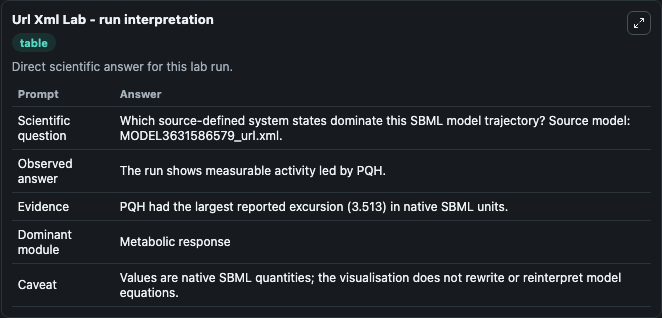
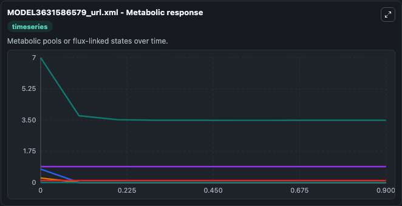
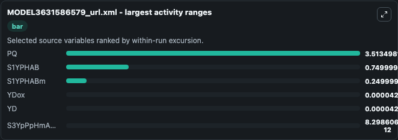
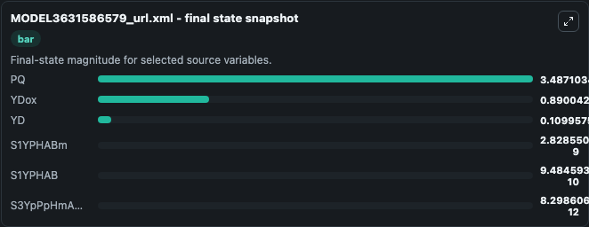
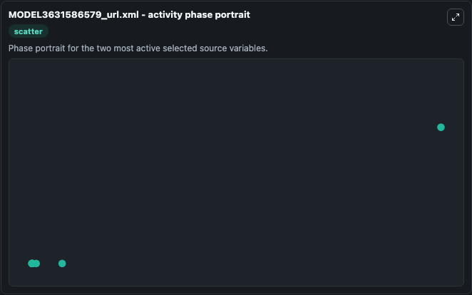

# Url Xml

This Biosimulant lab wraps `Url Xml` as a runnable systems biology model with a companion visualization module.
This is a kinetic model of the monomeric photosystem II (PSII). It can be used to explore the configured dynamics and compare scenario outcomes across configurations.

## What You'll See

The lab asks: Which source-defined system states dominate this SBML model trajectory? Source model: MODEL3631586579_url.xml. It runs for 1.0 time units with a communication step of 0.1. The run uses the model defaults declared by the curated SBML wrapper. The generated visualizations focus on PQ, YDox, S1YPHAB, S1YPHABm, YD, and S3YpPpHmAmBmm, combining trajectory, endpoint-comparison, and summary-table views from one completed dark-mode run.

In this captured run, **PQ** moved from 7.000 to 3.487 across 1.0 simulation windows.


### Output Visualizations



*Summary table for Url Xml, reporting the scientific question, observed answer, dominant module, and caveat.*



*Trajectories of PQ, S1YPHAB, S1YPHABm, YDox, YD, and S3YpPpHmAmBmm across the 1.0 simulation. In this run **YDox** climbed from 0.8900 to 0.8900 and **PQ** fell from 7.000 to 3.487 — the largest movements among the focused observables.*



*Largest-excursion ranking of the focused observables — the absolute movement magnitude during the run. Top 3: **PQ** = 3.513, **S1YPHAB** = 0.7500, **S1YPHABm** = 0.2500, with 3 more observables below.*



*Endpoint snapshot of the focused observables — final values from the captured run. Top 3 by value: **PQ** = 3.487, **YDox** = 0.8900, **YD** = 0.1100, with 3 more observables below.*



*Visualization card from the Url Xml dark-mode run.*


## Model Context

- Core model: `models/core`
- Visualization model: `models/visualisation`
- Standard: `other`
- Upstream source: `biomodels_ebi:MODEL3631586579`
- License: `CC0`

## Inputs

| Input | Maps To | Default | Notes |
|---|---|---|---|
| Initial Model State Pq | `systemsbiology_sbml_model3631586579_url_xml_model3631586579_model.initial_model_state_pq` | | Source state initial condition exposed as a model-specific control because no explicit intervention parameter is identifiable. Maps to SBML symbol `PQ`. |
| Initial Y Dox | `systemsbiology_sbml_model3631586579_url_xml_model3631586579_model.initial_y_dox` | | Source state initial condition exposed as a model-specific control because no explicit intervention parameter is identifiable. Maps to SBML symbol `YDox`. |
| Initial S1 Yphab | `systemsbiology_sbml_model3631586579_url_xml_model3631586579_model.initial_s1_yphab` | | Source state initial condition exposed as a model-specific control because no explicit intervention parameter is identifiable. Maps to SBML symbol `S1YPHAB`. |
| Initial S1 Ypha Bm | `systemsbiology_sbml_model3631586579_url_xml_model3631586579_model.initial_s1_ypha_bm` | | Source state initial condition exposed as a model-specific control because no explicit intervention parameter is identifiable. Maps to SBML symbol `S1YPHABm`. |
| Initial Model State Yd | `systemsbiology_sbml_model3631586579_url_xml_model3631586579_model.initial_model_state_yd` | | Source state initial condition exposed as a model-specific control because no explicit intervention parameter is identifiable. Maps to SBML symbol `YD`. |
| Initial S3 Yp Pp Hm Am Bmm | `systemsbiology_sbml_model3631586579_url_xml_model3631586579_model.initial_s3_yp_pp_hm_am_bmm` | | Source state initial condition exposed as a model-specific control because no explicit intervention parameter is identifiable. Maps to SBML symbol `S3YpPpHmAmBmm`. |

## Outputs

| Output | Maps To | Role |
|---|---|---|
| `state` | `systemsbiology_sbml_model3631586579_url_xml_model3631586579_model.state` | Available to the visualization model and downstream workflows. |
| `summary` | `systemsbiology_sbml_model3631586579_url_xml_model3631586579_model.summary` | Available to the visualization model and downstream workflows. |
| `species_labels` | `systemsbiology_sbml_model3631586579_url_xml_model3631586579_model.species_labels` | Available to the visualization model and downstream workflows. |
| `model_state_pq` | `systemsbiology_sbml_model3631586579_url_xml_model3631586579_model.model_state_pq` | Available to the visualization model and downstream workflows. |
| `y_dox` | `systemsbiology_sbml_model3631586579_url_xml_model3631586579_model.y_dox` | Available to the visualization model and downstream workflows. |
| `s1_yphab` | `systemsbiology_sbml_model3631586579_url_xml_model3631586579_model.s1_yphab` | Available to the visualization model and downstream workflows. |
| `s1_ypha_bm` | `systemsbiology_sbml_model3631586579_url_xml_model3631586579_model.s1_ypha_bm` | Available to the visualization model and downstream workflows. |
| `model_state_yd` | `systemsbiology_sbml_model3631586579_url_xml_model3631586579_model.model_state_yd` | Available to the visualization model and downstream workflows. |
| `s3_yp_pp_hm_am_bmm` | `systemsbiology_sbml_model3631586579_url_xml_model3631586579_model.s3_yp_pp_hm_am_bmm` | Available to the visualization model and downstream workflows. |

## Runtime

- Duration: `1.0`
- Communication step: `0.1`

## Running Locally

```bash
biosimulant labs serve
```
