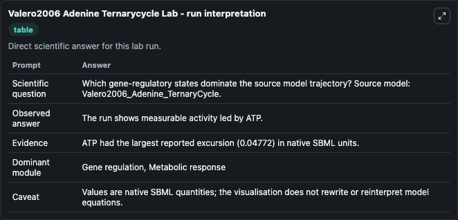
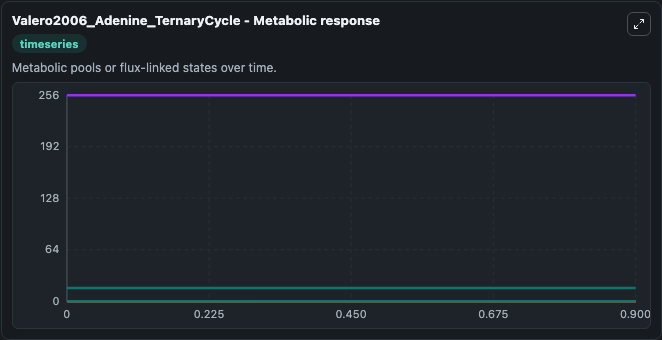
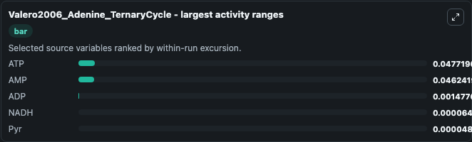
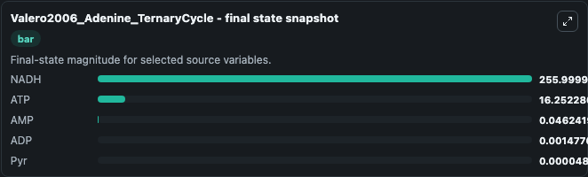
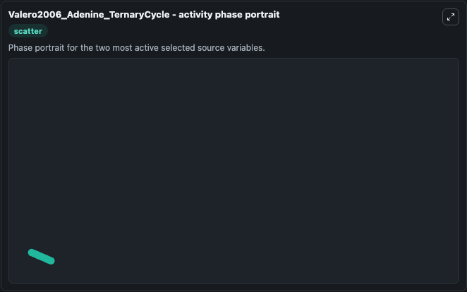

# Valero2006 Adenine Ternarycycle

This Biosimulant lab wraps `Valero2006 Adenine Ternarycycle` as a runnable systems biology model with a companion visualization module.
This a model from the article: A kinetic study of a ternary cycle between adenine nucleotides. It can be used to explore the configured dynamics and compare scenario outcomes across configurations.

## What You'll See

The lab asks: Which gene-regulatory states dominate the source model trajectory? Source model: Valero2006_Adenine_TernaryCycle. It runs for 1.0 time units with a communication step of 0.1. The run uses the model defaults declared by the curated SBML wrapper. The generated visualizations focus on NADH, ATP, ADP, Pyr, Lac, and AMP, combining trajectory, endpoint-comparison, and summary-table views from one completed dark-mode run.

In this captured run, **ATP** moved from 16.300 to 16.252 across 1.0 simulation windows.


### Output Visualizations



*Summary table for Valero2006 Adenine Ternarycycle, reporting the scientific question, observed answer, dominant module, and caveat.*



*Trajectories of ATP, AMP, ADP, NADH, Pyr, and Lac across the 1.0 simulation. In this run **AMP** climbed from 0 to 0.0462 and **ATP** fell from 16.300 to 16.252 — the largest movements among the focused observables.*



*Largest-excursion ranking of the focused observables — the absolute movement magnitude during the run. Top 3: **ATP** = 0.0477, **AMP** = 0.0462, **ADP** = 0.00148, with 2 more observables below.*



*Endpoint snapshot of the focused observables — final values from the captured run. Top 3 by value: **NADH** = 256.0, **ATP** = 16.252, **AMP** = 0.0462, with 2 more observables below.*



*Visualization card from the Valero2006 Adenine Ternarycycle dark-mode run.*


## Model Context

- Core model: `models/core`
- Visualization model: `models/visualisation`
- Standard: `other`
- Upstream source: `biomodels_ebi:BIOMD0000000231`
- License: `CC0`

## Inputs

| Input | Maps To | Default | Notes |
|---|---|---|---|
| Initial Nadh | `systemsbiology_sbml_valero2006_adenine_ternarycycle_biomd0000000231_model.initial_nadh` | | Source state initial condition exposed as a model-specific control because no explicit intervention parameter is identifiable. Maps to SBML symbol `NADH`. |
| Initial Model State ATP | `systemsbiology_sbml_valero2006_adenine_ternarycycle_biomd0000000231_model.initial_model_state_atp` | | Source state initial condition exposed as a model-specific control because no explicit intervention parameter is identifiable. Maps to SBML symbol `ATP`. |
| Initial Model State ADP | `systemsbiology_sbml_valero2006_adenine_ternarycycle_biomd0000000231_model.initial_model_state_adp` | | Source state initial condition exposed as a model-specific control because no explicit intervention parameter is identifiable. Maps to SBML symbol `ADP`. |
| Initial Model State Pyr | `systemsbiology_sbml_valero2006_adenine_ternarycycle_biomd0000000231_model.initial_model_state_pyr` | | Source state initial condition exposed as a model-specific control because no explicit intervention parameter is identifiable. Maps to SBML symbol `Pyr`. |
| Initial Model State Lac | `systemsbiology_sbml_valero2006_adenine_ternarycycle_biomd0000000231_model.initial_model_state_lac` | | Source state initial condition exposed as a model-specific control because no explicit intervention parameter is identifiable. Maps to SBML symbol `Lac`. |
| Initial Model State AMP | `systemsbiology_sbml_valero2006_adenine_ternarycycle_biomd0000000231_model.initial_model_state_amp` | | Source state initial condition exposed as a model-specific control because no explicit intervention parameter is identifiable. Maps to SBML symbol `AMP`. |

## Outputs

| Output | Maps To | Role |
|---|---|---|
| `state` | `systemsbiology_sbml_valero2006_adenine_ternarycycle_biomd0000000231_model.state` | Available to the visualization model and downstream workflows. |
| `summary` | `systemsbiology_sbml_valero2006_adenine_ternarycycle_biomd0000000231_model.summary` | Available to the visualization model and downstream workflows. |
| `species_labels` | `systemsbiology_sbml_valero2006_adenine_ternarycycle_biomd0000000231_model.species_labels` | Available to the visualization model and downstream workflows. |
| `nadh` | `systemsbiology_sbml_valero2006_adenine_ternarycycle_biomd0000000231_model.nadh` | Available to the visualization model and downstream workflows. |
| `atp` | `systemsbiology_sbml_valero2006_adenine_ternarycycle_biomd0000000231_model.atp` | Available to the visualization model and downstream workflows. |
| `adp` | `systemsbiology_sbml_valero2006_adenine_ternarycycle_biomd0000000231_model.adp` | Available to the visualization model and downstream workflows. |
| `pyr` | `systemsbiology_sbml_valero2006_adenine_ternarycycle_biomd0000000231_model.pyr` | Available to the visualization model and downstream workflows. |
| `lac` | `systemsbiology_sbml_valero2006_adenine_ternarycycle_biomd0000000231_model.lac` | Available to the visualization model and downstream workflows. |
| `amp` | `systemsbiology_sbml_valero2006_adenine_ternarycycle_biomd0000000231_model.amp` | Available to the visualization model and downstream workflows. |

## Runtime

- Duration: `1.0`
- Communication step: `0.1`

## Running Locally

```bash
biosimulant labs serve
```
