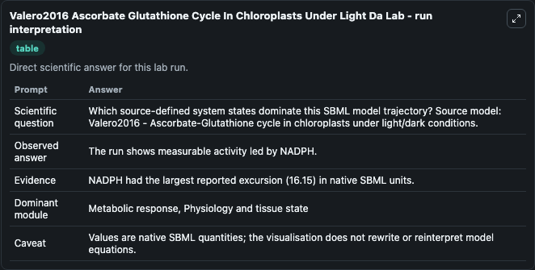
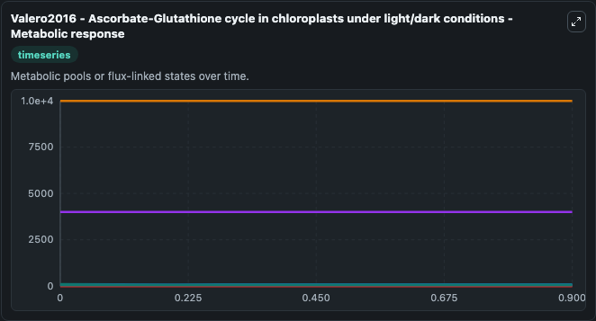
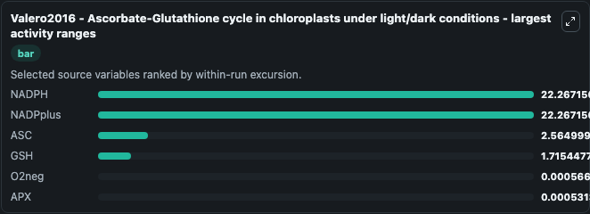
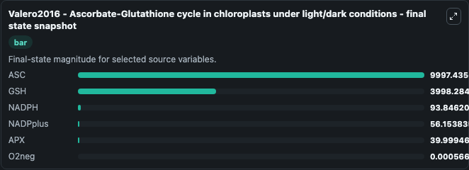
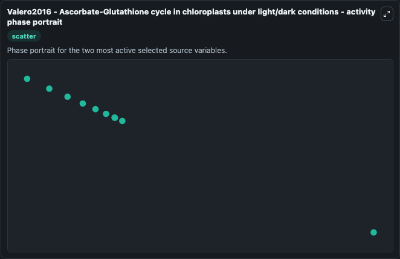

# Valero2016 Ascorbate Glutathione Cycle In Chloroplasts Under Light Da

This Biosimulant lab wraps `Valero2016 Ascorbate Glutathione Cycle In Chloroplasts Under Light Da` as a runnable systems biology model with a companion visualization module.
Valero2016 - Ascorbate-Glutathione cycle in chloroplasts under light/dark conditions This model is described in the article: Modeling the ascorbate-glutathione cycle in chloroplasts under light/dark c. It can be used to explore the configured dynamics and compare scenario outcomes across configurations.

## What You'll See

The lab asks: Which source-defined system states dominate this SBML model trajectory? Source model: Valero2016 - Ascorbate-Glutathione cycle in chloroplasts under light/dark conditions. It runs for 1.0 time units with a communication step of 0.1. The run uses the model defaults declared by the curated SBML wrapper. The generated visualizations focus on NADPH, NADPplus, ASC, GSH, APX, and O2neg, combining trajectory, endpoint-comparison, and summary-table views from one completed dark-mode run.

In this captured run, **NADPH** moved from 110.0 to 93.846 across 1.0 simulation windows.


### Output Visualizations



*Summary table for Valero2016 Ascorbate Glutathione Cycle In Chloroplasts Under Light Da, reporting the scientific question, observed answer, dominant module, and caveat.*



*Trajectories of NADPH, NADPplus, ASC, GSH, O2neg, and APX across the 1.0 simulation. In this run **NADPplus** climbed from 40.000 to 56.154 and **NADPH** fell from 110.0 to 93.846 — the largest movements among the focused observables.*



*Largest-excursion ranking of the focused observables — the absolute movement magnitude during the run. Top 3: **NADPH** = 22.267, **NADPplus** = 22.267, **ASC** = 2.565, with 3 more observables below.*



*Endpoint snapshot of the focused observables — final values from the captured run. Top 3 by value: **ASC** = 9997.4, **GSH** = 3998.3, **NADPH** = 93.846, with 3 more observables below.*



*Visualization card from the Valero2016 Ascorbate Glutathione Cycle In Chloroplasts Under Light Da dark-mode run.*


## Model Context

- Core model: `models/core`
- Visualization model: `models/visualisation`
- Standard: `other`
- Upstream source: `biomodels_ebi:BIOMD0000000589`
- License: `CC0`

## Inputs

| Input | Maps To | Default | Notes |
|---|---|---|---|
| Initial Nadph | `systemsbiology_sbml_valero2016_ascorbate_glutathione_cycle_in_chloro_biomd0000000589_model.initial_nadph` | | Source state initial condition exposed as a model-specific control because no explicit intervention parameter is identifiable. Maps to SBML symbol `NADPH`. |
| Initial Nad Pplus | `systemsbiology_sbml_valero2016_ascorbate_glutathione_cycle_in_chloro_biomd0000000589_model.initial_nad_pplus` | | Source state initial condition exposed as a model-specific control because no explicit intervention parameter is identifiable. Maps to SBML symbol `NADPplus`. |
| Initial Model State Asc | `systemsbiology_sbml_valero2016_ascorbate_glutathione_cycle_in_chloro_biomd0000000589_model.initial_model_state_asc` | | Source state initial condition exposed as a model-specific control because no explicit intervention parameter is identifiable. Maps to SBML symbol `ASC`. |
| Initial Model State Gsh | `systemsbiology_sbml_valero2016_ascorbate_glutathione_cycle_in_chloro_biomd0000000589_model.initial_model_state_gsh` | | Source state initial condition exposed as a model-specific control because no explicit intervention parameter is identifiable. Maps to SBML symbol `GSH`. |
| Initial Model State Apx | `systemsbiology_sbml_valero2016_ascorbate_glutathione_cycle_in_chloro_biomd0000000589_model.initial_model_state_apx` | | Source state initial condition exposed as a model-specific control because no explicit intervention parameter is identifiable. Maps to SBML symbol `APX`. |
| Initial O2neg | `systemsbiology_sbml_valero2016_ascorbate_glutathione_cycle_in_chloro_biomd0000000589_model.initial_o2neg` | | Source state initial condition exposed as a model-specific control because no explicit intervention parameter is identifiable. Maps to SBML symbol `O2neg`. |

## Outputs

| Output | Maps To | Role |
|---|---|---|
| `state` | `systemsbiology_sbml_valero2016_ascorbate_glutathione_cycle_in_chloro_biomd0000000589_model.state` | Available to the visualization model and downstream workflows. |
| `summary` | `systemsbiology_sbml_valero2016_ascorbate_glutathione_cycle_in_chloro_biomd0000000589_model.summary` | Available to the visualization model and downstream workflows. |
| `species_labels` | `systemsbiology_sbml_valero2016_ascorbate_glutathione_cycle_in_chloro_biomd0000000589_model.species_labels` | Available to the visualization model and downstream workflows. |
| `nadph` | `systemsbiology_sbml_valero2016_ascorbate_glutathione_cycle_in_chloro_biomd0000000589_model.nadph` | Available to the visualization model and downstream workflows. |
| `nad_pplus` | `systemsbiology_sbml_valero2016_ascorbate_glutathione_cycle_in_chloro_biomd0000000589_model.nad_pplus` | Available to the visualization model and downstream workflows. |
| `asc` | `systemsbiology_sbml_valero2016_ascorbate_glutathione_cycle_in_chloro_biomd0000000589_model.asc` | Available to the visualization model and downstream workflows. |
| `gsh` | `systemsbiology_sbml_valero2016_ascorbate_glutathione_cycle_in_chloro_biomd0000000589_model.gsh` | Available to the visualization model and downstream workflows. |
| `apx` | `systemsbiology_sbml_valero2016_ascorbate_glutathione_cycle_in_chloro_biomd0000000589_model.apx` | Available to the visualization model and downstream workflows. |
| `o2neg` | `systemsbiology_sbml_valero2016_ascorbate_glutathione_cycle_in_chloro_biomd0000000589_model.o2neg` | Available to the visualization model and downstream workflows. |

## Runtime

- Duration: `1.0`
- Communication step: `0.1`

## Running Locally

```bash
biosimulant labs serve
```
