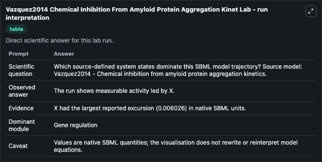
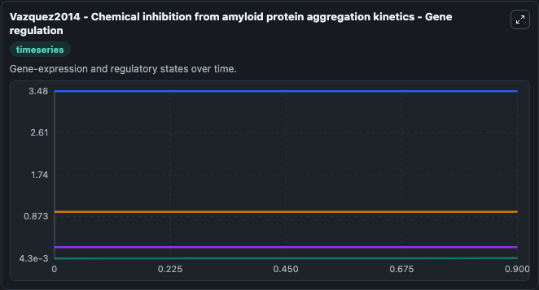
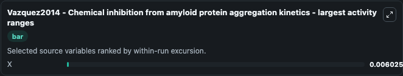
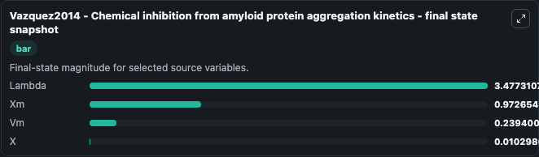

# Vazquez2014 Chemical Inhibition From Amyloid Protein Aggregation Kinet

This Biosimulant lab wraps `Vazquez2014 Chemical Inhibition From Amyloid Protein Aggregation Kinet` as a runnable systems biology model with a companion visualization module.
Vazquez2014 - Chemical inhibition fromamyloid protein aggregation kinetics This model is described in the article: Modeling of chemical inhibition from amyloid protein aggregation kinetics. It can be used to explore the configured dynamics and compare scenario outcomes across configurations.

## What You'll See

The lab asks: Which source-defined system states dominate this SBML model trajectory? Source model: Vazquez2014 - Chemical inhibition from amyloid protein aggregation kinetics. It runs for 1.0 time units with a communication step of 0.1. The run uses the model defaults declared by the curated SBML wrapper. The generated visualizations focus on Lambda, Xm, Vm, and X, combining trajectory, endpoint-comparison, and summary-table views from one completed dark-mode run.

In this captured run, **X** moved from 0.00427 to 0.0103 across 1.0 simulation windows.


### Output Visualizations



*Summary table for Vazquez2014 Chemical Inhibition From Amyloid Protein Aggregation Kinet, reporting the scientific question, observed answer, dominant module, and caveat.*



*Trajectories of X, Lambda, Xm, and Vm across the 1.0 simulation. In this run **X** climbed from 0.00427 to 0.0103 — the largest movements among the focused observables.*



*Largest-excursion ranking of the focused observables — the absolute movement magnitude during the run. Top 1: **X** = 0.00603.*



*Endpoint snapshot of the focused observables — final values from the captured run. Top 3 by value: **Lambda** = 3.477, **Xm** = 0.9727, **Vm** = 0.2394, with 1 more observable below.*


## Model Context

- Core model: `models/core`
- Visualization model: `models/visualisation`
- Standard: `other`
- Upstream source: `biomodels_ebi:BIOMD0000000532`
- License: `CC0`

## Inputs

| Input | Maps To | Default | Notes |
|---|---|---|---|
| Initial Lambda Value | `systemsbiology_sbml_vazquez2014_chemical_inhibition_from_amyloid_pro_biomd0000000532_model.initial_lambda_value` | | Source state initial condition exposed as a model-specific control because no explicit intervention parameter is identifiable. Maps to SBML symbol `Lambda`. |
| Initial Model State Xm | `systemsbiology_sbml_vazquez2014_chemical_inhibition_from_amyloid_pro_biomd0000000532_model.initial_model_state_xm` | | Source state initial condition exposed as a model-specific control because no explicit intervention parameter is identifiable. Maps to SBML symbol `Xm`. |
| Initial Model State Vm | `systemsbiology_sbml_vazquez2014_chemical_inhibition_from_amyloid_pro_biomd0000000532_model.initial_model_state_vm` | | Source state initial condition exposed as a model-specific control because no explicit intervention parameter is identifiable. Maps to SBML symbol `Vm`. |
| Initial Model State X | `systemsbiology_sbml_vazquez2014_chemical_inhibition_from_amyloid_pro_biomd0000000532_model.initial_model_state_x` | | Source state initial condition exposed as a model-specific control because no explicit intervention parameter is identifiable. Maps to SBML symbol `X`. |

## Outputs

| Output | Maps To | Role |
|---|---|---|
| `state` | `systemsbiology_sbml_vazquez2014_chemical_inhibition_from_amyloid_pro_biomd0000000532_model.state` | Available to the visualization model and downstream workflows. |
| `summary` | `systemsbiology_sbml_vazquez2014_chemical_inhibition_from_amyloid_pro_biomd0000000532_model.summary` | Available to the visualization model and downstream workflows. |
| `species_labels` | `systemsbiology_sbml_vazquez2014_chemical_inhibition_from_amyloid_pro_biomd0000000532_model.species_labels` | Available to the visualization model and downstream workflows. |
| `lambda_value` | `systemsbiology_sbml_vazquez2014_chemical_inhibition_from_amyloid_pro_biomd0000000532_model.lambda_value` | Available to the visualization model and downstream workflows. |
| `model_state_xm` | `systemsbiology_sbml_vazquez2014_chemical_inhibition_from_amyloid_pro_biomd0000000532_model.model_state_xm` | Available to the visualization model and downstream workflows. |
| `model_state_vm` | `systemsbiology_sbml_vazquez2014_chemical_inhibition_from_amyloid_pro_biomd0000000532_model.model_state_vm` | Available to the visualization model and downstream workflows. |
| `model_state_x` | `systemsbiology_sbml_vazquez2014_chemical_inhibition_from_amyloid_pro_biomd0000000532_model.model_state_x` | Available to the visualization model and downstream workflows. |

## Runtime

- Duration: `1.0`
- Communication step: `0.1`

## Running Locally

```bash
biosimulant labs serve
```
