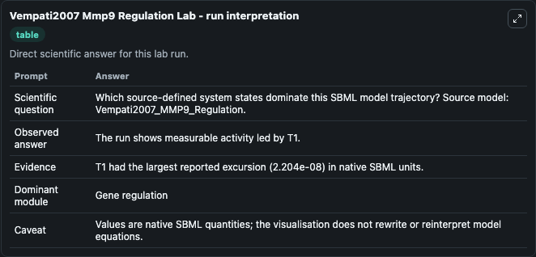
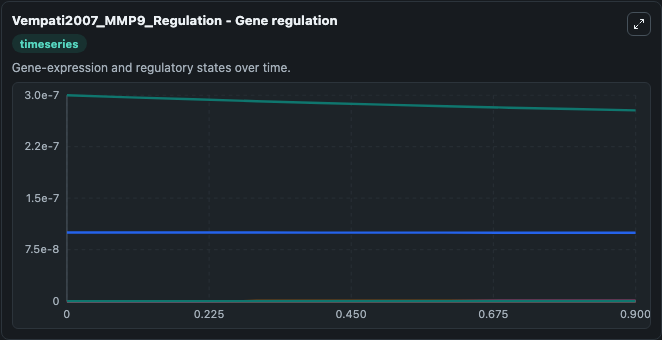
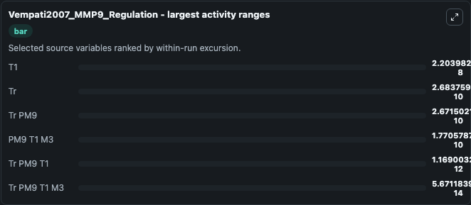
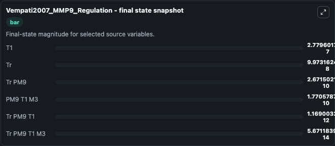
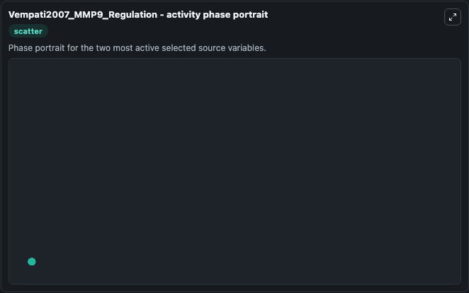

# Vempati2007 Mmp9 Regulation

This Biosimulant lab wraps `Vempati2007 Mmp9 Regulation` as a runnable systems biology model with a companion visualization module.
This is the model described in the article: A biochemical model of matrix metalloproteinase 9 activation and inhibition. It can be used to explore the configured dynamics and compare scenario outcomes across configurations.

## What You'll See

The lab asks: Which source-defined system states dominate this SBML model trajectory? Source model: Vempati2007_MMP9_Regulation. It runs for 1.0 time units with a communication step of 0.1. The run uses the model defaults declared by the curated SBML wrapper. The generated visualizations focus on Tr PM9 T1 M3, Tr PM9 T1, Tr PM9, Tr, T1, and PM9 T1 M3, combining trajectory, endpoint-comparison, and summary-table views from one completed dark-mode run.

In this captured run, **T1** moved from 3e-07 to 2.78e-07 across 1.0 simulation windows.


### Output Visualizations



*Summary table for Vempati2007 Mmp9 Regulation, reporting the scientific question, observed answer, dominant module, and caveat.*



*Trajectories of T1, Tr, Tr PM9, PM9 T1 M3, Tr PM9 T1, and Tr PM9 T1 M3 across the 1.0 simulation. In this run **Tr PM9** climbed from 0 to 2.67e-10 and **T1** fell from 3e-07 to 2.78e-07 — the largest movements among the focused observables.*



*Largest-excursion ranking of the focused observables — the absolute movement magnitude during the run. Top 3: **T1** = 2.2e-08, **Tr** = 2.68e-10, **Tr PM9** = 2.67e-10, with 3 more observables below.*



*Endpoint snapshot of the focused observables — final values from the captured run. Top 3 by value: **T1** = 2.78e-07, **Tr** = 9.97e-08, **Tr PM9** = 2.67e-10, with 3 more observables below.*



*Visualization card from the Vempati2007 Mmp9 Regulation dark-mode run.*


## Model Context

- Core model: `models/core`
- Visualization model: `models/visualisation`
- Standard: `other`
- Upstream source: `biomodels_ebi:MODEL7888000034`
- License: `CC0`

## Inputs

| Input | Maps To | Default | Notes |
|---|---|---|---|
| Initial Tr PM9 T1 M3 | `systemsbiology_sbml_vempati2007_mmp9_regulation_model7888000034_model.initial_tr_pm9_t1_m3` | | Source state initial condition exposed as a model-specific control because no explicit intervention parameter is identifiable. Maps to SBML symbol `Tr_pM9_T1_M3`. |
| Initial Tr PM9 T1 | `systemsbiology_sbml_vempati2007_mmp9_regulation_model7888000034_model.initial_tr_pm9_t1` | | Source state initial condition exposed as a model-specific control because no explicit intervention parameter is identifiable. Maps to SBML symbol `Tr_pM9_T1`. |
| Initial Tr PM9 | `systemsbiology_sbml_vempati2007_mmp9_regulation_model7888000034_model.initial_tr_pm9` | | Source state initial condition exposed as a model-specific control because no explicit intervention parameter is identifiable. Maps to SBML symbol `Tr_pM9`. |
| Initial Model State Tr | `systemsbiology_sbml_vempati2007_mmp9_regulation_model7888000034_model.initial_model_state_tr` | | Source state initial condition exposed as a model-specific control because no explicit intervention parameter is identifiable. Maps to SBML symbol `Tr`. |
| Initial Model State T1 | `systemsbiology_sbml_vempati2007_mmp9_regulation_model7888000034_model.initial_model_state_t1` | | Source state initial condition exposed as a model-specific control because no explicit intervention parameter is identifiable. Maps to SBML symbol `T1`. |
| Initial PM9 T1 M3 | `systemsbiology_sbml_vempati2007_mmp9_regulation_model7888000034_model.initial_pm9_t1_m3` | | Source state initial condition exposed as a model-specific control because no explicit intervention parameter is identifiable. Maps to SBML symbol `pM9_T1_M3`. |

## Outputs

| Output | Maps To | Role |
|---|---|---|
| `state` | `systemsbiology_sbml_vempati2007_mmp9_regulation_model7888000034_model.state` | Available to the visualization model and downstream workflows. |
| `summary` | `systemsbiology_sbml_vempati2007_mmp9_regulation_model7888000034_model.summary` | Available to the visualization model and downstream workflows. |
| `species_labels` | `systemsbiology_sbml_vempati2007_mmp9_regulation_model7888000034_model.species_labels` | Available to the visualization model and downstream workflows. |
| `tr_pm9_t1_m3` | `systemsbiology_sbml_vempati2007_mmp9_regulation_model7888000034_model.tr_pm9_t1_m3` | Available to the visualization model and downstream workflows. |
| `tr_pm9_t1` | `systemsbiology_sbml_vempati2007_mmp9_regulation_model7888000034_model.tr_pm9_t1` | Available to the visualization model and downstream workflows. |
| `tr_pm9` | `systemsbiology_sbml_vempati2007_mmp9_regulation_model7888000034_model.tr_pm9` | Available to the visualization model and downstream workflows. |
| `model_state_tr` | `systemsbiology_sbml_vempati2007_mmp9_regulation_model7888000034_model.model_state_tr` | Available to the visualization model and downstream workflows. |
| `model_state_t1` | `systemsbiology_sbml_vempati2007_mmp9_regulation_model7888000034_model.model_state_t1` | Available to the visualization model and downstream workflows. |
| `pm9_t1_m3` | `systemsbiology_sbml_vempati2007_mmp9_regulation_model7888000034_model.pm9_t1_m3` | Available to the visualization model and downstream workflows. |

## Runtime

- Duration: `1.0`
- Communication step: `0.1`

## Running Locally

```bash
biosimulant labs serve
```
