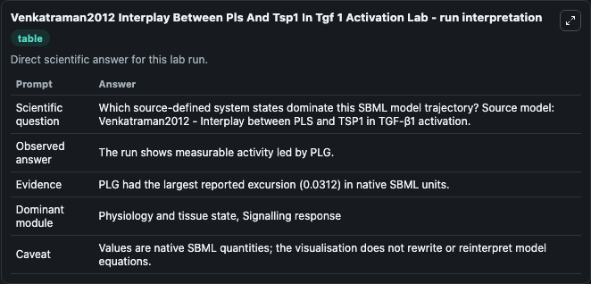
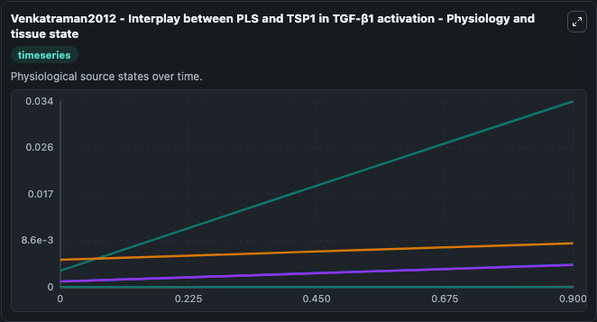
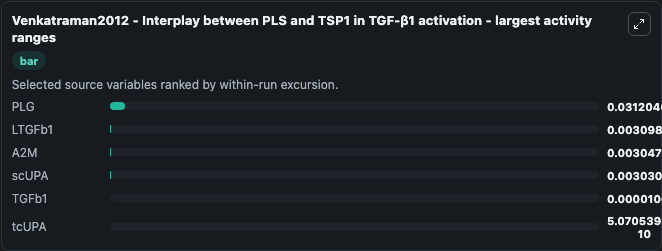
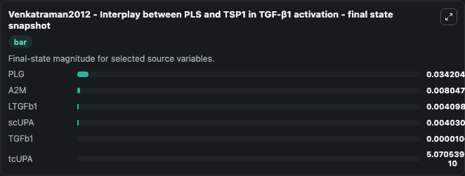
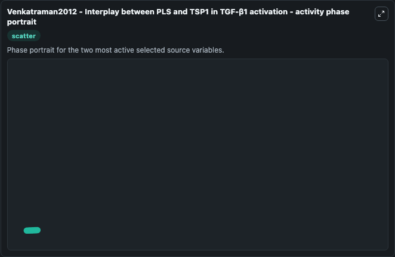

# Venkatraman2012 Interplay Between Pls And Tsp1 In Tgf 1 Activation

This Biosimulant lab wraps `Venkatraman2012 Interplay Between Pls And Tsp1 In Tgf 1 Activation` as a runnable systems biology model with a companion visualization module.
Venkatraman2012 - Interplay between PLS and TSP1 in TGF-β1 activation The interplay between PLS (Plasmin) and TSP1 (Thrombospondin-1) in TGF-β1 (Transforming growth factor-β1)is shown using mathematic. It can be used to explore the configured dynamics and compare scenario outcomes across configurations.

## What You'll See

The lab asks: Which source-defined system states dominate this SBML model trajectory? Source model: Venkatraman2012 - Interplay between PLS and TSP1 in TGF-β1 activation. It runs for 1.0 time units with a communication step of 0.1. The run uses the model defaults declared by the curated SBML wrapper. The generated visualizations focus on LTGFb1, TGFb1, A2M, PLG, scUPA, and tcUPA, combining trajectory, endpoint-comparison, and summary-table views from one completed dark-mode run.

In this captured run, **PLG** moved from 0.003 to 0.0342 across 1.0 simulation windows.


### Output Visualizations



*Summary table for Venkatraman2012 Interplay Between Pls And Tsp1 In Tgf 1 Activation, reporting the scientific question, observed answer, dominant module, and caveat.*



*Trajectories of PLG, LTGFb1, A2M, scUPA, TGFb1, and tcUPA across the 1.0 simulation. In this run **PLG** climbed from 0.003 to 0.0342 — the largest movements among the focused observables.*



*Largest-excursion ranking of the focused observables — the absolute movement magnitude during the run. Top 3: **PLG** = 0.0312, **LTGFb1** = 0.0031, **A2M** = 0.00305, with 3 more observables below.*



*Trajectories of PLG, LTGFb1, A2M, scUPA, TGFb1, and tcUPA across the 1.0 simulation. In this run **PLG** climbed from 0.003 to 0.0342 — the largest movements among the focused observables.*



*Visualization card from the Venkatraman2012 Interplay Between Pls And Tsp1 In Tgf 1 Activation dark-mode run.*


## Model Context

- Core model: `models/core`
- Visualization model: `models/visualisation`
- Standard: `other`
- Upstream source: `biomodels_ebi:BIOMD0000000447`
- License: `CC0`

## Inputs

| Input | Maps To | Default | Notes |
|---|---|---|---|
| Initial Ltg FB1 | `systemsbiology_sbml_venkatraman2012_interplay_between_pls_and_tsp1_i_biomd0000000447_model.initial_ltg_fb1` | | Source state initial condition exposed as a model-specific control because no explicit intervention parameter is identifiable. Maps to SBML symbol `species_5`. |
| Initial Tg FB1 | `systemsbiology_sbml_venkatraman2012_interplay_between_pls_and_tsp1_i_biomd0000000447_model.initial_tg_fb1` | | Source state initial condition exposed as a model-specific control because no explicit intervention parameter is identifiable. Maps to SBML symbol `species_6`. |
| Initial A2 M | `systemsbiology_sbml_venkatraman2012_interplay_between_pls_and_tsp1_i_biomd0000000447_model.initial_a2_m` | | Source state initial condition exposed as a model-specific control because no explicit intervention parameter is identifiable. Maps to SBML symbol `species_10`. |
| Initial Model State Plg | `systemsbiology_sbml_venkatraman2012_interplay_between_pls_and_tsp1_i_biomd0000000447_model.initial_model_state_plg` | | Source state initial condition exposed as a model-specific control because no explicit intervention parameter is identifiable. Maps to SBML symbol `species_1`. |
| Initial Sc Upa | `systemsbiology_sbml_venkatraman2012_interplay_between_pls_and_tsp1_i_biomd0000000447_model.initial_sc_upa` | | Source state initial condition exposed as a model-specific control because no explicit intervention parameter is identifiable. Maps to SBML symbol `species_3`. |
| Initial Tc Upa | `systemsbiology_sbml_venkatraman2012_interplay_between_pls_and_tsp1_i_biomd0000000447_model.initial_tc_upa` | | Source state initial condition exposed as a model-specific control because no explicit intervention parameter is identifiable. Maps to SBML symbol `species_4`. |

## Outputs

| Output | Maps To | Role |
|---|---|---|
| `state` | `systemsbiology_sbml_venkatraman2012_interplay_between_pls_and_tsp1_i_biomd0000000447_model.state` | Available to the visualization model and downstream workflows. |
| `summary` | `systemsbiology_sbml_venkatraman2012_interplay_between_pls_and_tsp1_i_biomd0000000447_model.summary` | Available to the visualization model and downstream workflows. |
| `species_labels` | `systemsbiology_sbml_venkatraman2012_interplay_between_pls_and_tsp1_i_biomd0000000447_model.species_labels` | Available to the visualization model and downstream workflows. |
| `ltg_fb1` | `systemsbiology_sbml_venkatraman2012_interplay_between_pls_and_tsp1_i_biomd0000000447_model.ltg_fb1` | Available to the visualization model and downstream workflows. |
| `tg_fb1` | `systemsbiology_sbml_venkatraman2012_interplay_between_pls_and_tsp1_i_biomd0000000447_model.tg_fb1` | Available to the visualization model and downstream workflows. |
| `a2_m` | `systemsbiology_sbml_venkatraman2012_interplay_between_pls_and_tsp1_i_biomd0000000447_model.a2_m` | Available to the visualization model and downstream workflows. |
| `plg` | `systemsbiology_sbml_venkatraman2012_interplay_between_pls_and_tsp1_i_biomd0000000447_model.plg` | Available to the visualization model and downstream workflows. |
| `sc_upa` | `systemsbiology_sbml_venkatraman2012_interplay_between_pls_and_tsp1_i_biomd0000000447_model.sc_upa` | Available to the visualization model and downstream workflows. |
| `tc_upa` | `systemsbiology_sbml_venkatraman2012_interplay_between_pls_and_tsp1_i_biomd0000000447_model.tc_upa` | Available to the visualization model and downstream workflows. |

## Runtime

- Duration: `1.0`
- Communication step: `0.1`

## Running Locally

```bash
biosimulant labs serve
```
