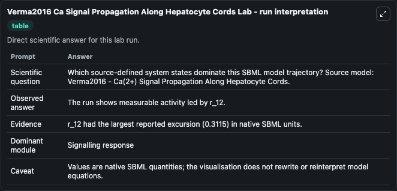
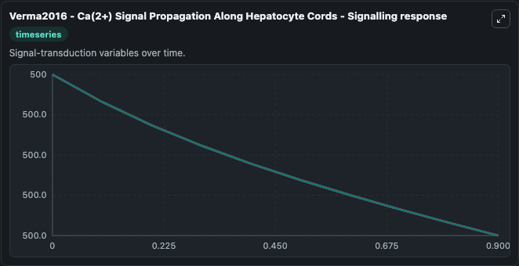
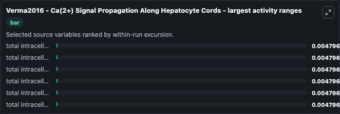
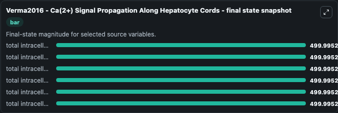
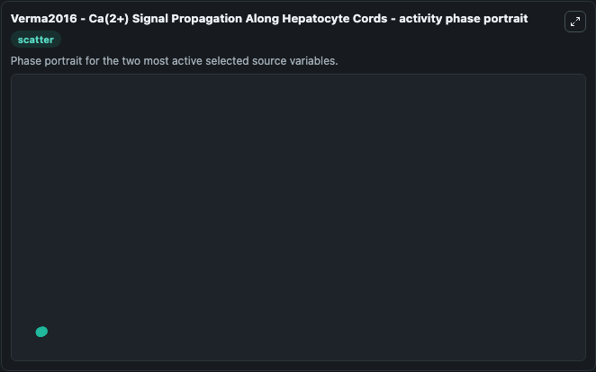

# Verma2016 Ca Signal Propagation Along Hepatocyte Cords

This Biosimulant lab wraps `Verma2016 Ca Signal Propagation Along Hepatocyte Cords` as a runnable systems biology model with a companion visualization module.
Verma2016 - Ca(2+) Signal Propagation Along Hepatocyte Cords This model is described in the article: Computational Modeling of Spatiotemporal Ca(2+) Signal Propagation Along Hepatocyte Cords. It can be used to explore the configured dynamics and compare scenario outcomes across configurations.

## What You'll See

The lab asks: Which source-defined system states dominate this SBML model trajectory? Source model: Verma2016 - Ca(2+) Signal Propagation Along Hepatocyte Cords. It runs for 1.0 time units with a communication step of 0.1. The run uses the model defaults declared by the curated SBML wrapper. The generated visualizations focus on total intracellular store Ca2+ content_CaT_9, total intracellular store Ca2+ content_CaT_8, total intracellular store Ca2+ content_CaT_7, total intracellular store Ca2+ content_CaT_6, total intracellular store Ca2+ content_CaT_5, and total intracellular store Ca2+ content_CaT_4, combining trajectory, endpoint-comparison, and summary-table views from one completed dark-mode run.

In this captured run, **total intracellular store Ca2+ content_CaT_5** moved from 500.0 to 500.0 across 1.0 simulation windows.


### Output Visualizations



*Summary table for Verma2016 Ca Signal Propagation Along Hepatocyte Cords, reporting the scientific question, observed answer, dominant module, and caveat.*



*Trajectories of total intracellular store Ca2+ content_CaT_5, total intracellular store Ca2+ content_CaT_4, total intracellular store Ca2+ content_CaT_6, total intracellular store Ca2+ content_CaT_8, total intracellular store Ca2+ content_CaT_7, and total intracellular store Ca2+ content_CaT_9 across the 1.0 simulation. In this run **total intracellular store Ca2+ content_CaT_5** fell from 500.0 to 500.0 — the largest movements among the focused observables.*



*Largest-excursion ranking of the focused observables — the absolute movement magnitude during the run. Top 3: **total intracellular store Ca2+ content_CaT_5** = 0.0048, **total intracellular store Ca2+ content_CaT_4** = 0.0048, **total intracellular store Ca2+ content_CaT_6** = 0.0048, with 3 more observables below.*



*Endpoint snapshot of the focused observables — final values from the captured run. Top 3 by value: **total intracellular store Ca2+ content_CaT_9** = 500.0, **total intracellular store Ca2+ content_CaT_7** = 500.0, **total intracellular store Ca2+ content_CaT_8** = 500.0, with 3 more observables below.*



*Visualization card from the Verma2016 Ca Signal Propagation Along Hepatocyte Cords dark-mode run.*


## Model Context

- Core model: `models/core`
- Visualization model: `models/visualisation`
- Standard: `other`
- Upstream source: `biomodels_ebi:BIOMD0000000834`
- License: `CC0`

## Inputs

| Input | Maps To | Default | Notes |
|---|---|---|---|
| Initial Total Intracellular Store CA2 Content Ca T 9 | `systemsbiology_sbml_verma2016_ca_2_signal_propagation_along_hepatocy_biomd0000000834_model.initial_total_intracellular_store_ca2_content_ca_t_9` | | Source state initial condition exposed as a model-specific control because no explicit intervention parameter is identifiable. Maps to SBML symbol `CaT_9`. |
| Initial Total Intracellular Store CA2 Content Ca T 8 | `systemsbiology_sbml_verma2016_ca_2_signal_propagation_along_hepatocy_biomd0000000834_model.initial_total_intracellular_store_ca2_content_ca_t_8` | | Source state initial condition exposed as a model-specific control because no explicit intervention parameter is identifiable. Maps to SBML symbol `CaT_8`. |
| Initial Total Intracellular Store CA2 Content Ca T 7 | `systemsbiology_sbml_verma2016_ca_2_signal_propagation_along_hepatocy_biomd0000000834_model.initial_total_intracellular_store_ca2_content_ca_t_7` | | Source state initial condition exposed as a model-specific control because no explicit intervention parameter is identifiable. Maps to SBML symbol `CaT_7`. |
| Initial Total Intracellular Store CA2 Content Ca T 6 | `systemsbiology_sbml_verma2016_ca_2_signal_propagation_along_hepatocy_biomd0000000834_model.initial_total_intracellular_store_ca2_content_ca_t_6` | | Source state initial condition exposed as a model-specific control because no explicit intervention parameter is identifiable. Maps to SBML symbol `CaT_6`. |
| Initial Total Intracellular Store CA2 Content Ca T 5 | `systemsbiology_sbml_verma2016_ca_2_signal_propagation_along_hepatocy_biomd0000000834_model.initial_total_intracellular_store_ca2_content_ca_t_5` | | Source state initial condition exposed as a model-specific control because no explicit intervention parameter is identifiable. Maps to SBML symbol `CaT_5`. |
| Initial Total Intracellular Store CA2 Content Ca T 4 | `systemsbiology_sbml_verma2016_ca_2_signal_propagation_along_hepatocy_biomd0000000834_model.initial_total_intracellular_store_ca2_content_ca_t_4` | | Source state initial condition exposed as a model-specific control because no explicit intervention parameter is identifiable. Maps to SBML symbol `CaT_4`. |

## Outputs

| Output | Maps To | Role |
|---|---|---|
| `state` | `systemsbiology_sbml_verma2016_ca_2_signal_propagation_along_hepatocy_biomd0000000834_model.state` | Available to the visualization model and downstream workflows. |
| `summary` | `systemsbiology_sbml_verma2016_ca_2_signal_propagation_along_hepatocy_biomd0000000834_model.summary` | Available to the visualization model and downstream workflows. |
| `species_labels` | `systemsbiology_sbml_verma2016_ca_2_signal_propagation_along_hepatocy_biomd0000000834_model.species_labels` | Available to the visualization model and downstream workflows. |
| `total_intracellular_store_ca2_content_ca_t_9` | `systemsbiology_sbml_verma2016_ca_2_signal_propagation_along_hepatocy_biomd0000000834_model.total_intracellular_store_ca2_content_ca_t_9` | Available to the visualization model and downstream workflows. |
| `total_intracellular_store_ca2_content_ca_t_8` | `systemsbiology_sbml_verma2016_ca_2_signal_propagation_along_hepatocy_biomd0000000834_model.total_intracellular_store_ca2_content_ca_t_8` | Available to the visualization model and downstream workflows. |
| `total_intracellular_store_ca2_content_ca_t_7` | `systemsbiology_sbml_verma2016_ca_2_signal_propagation_along_hepatocy_biomd0000000834_model.total_intracellular_store_ca2_content_ca_t_7` | Available to the visualization model and downstream workflows. |
| `total_intracellular_store_ca2_content_ca_t_6` | `systemsbiology_sbml_verma2016_ca_2_signal_propagation_along_hepatocy_biomd0000000834_model.total_intracellular_store_ca2_content_ca_t_6` | Available to the visualization model and downstream workflows. |
| `total_intracellular_store_ca2_content_ca_t_5` | `systemsbiology_sbml_verma2016_ca_2_signal_propagation_along_hepatocy_biomd0000000834_model.total_intracellular_store_ca2_content_ca_t_5` | Available to the visualization model and downstream workflows. |
| `total_intracellular_store_ca2_content_ca_t_4` | `systemsbiology_sbml_verma2016_ca_2_signal_propagation_along_hepatocy_biomd0000000834_model.total_intracellular_store_ca2_content_ca_t_4` | Available to the visualization model and downstream workflows. |

## Runtime

- Duration: `1.0`
- Communication step: `0.1`

## Running Locally

```bash
biosimulant labs serve
```
