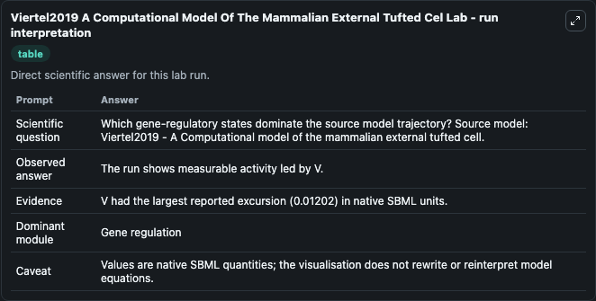
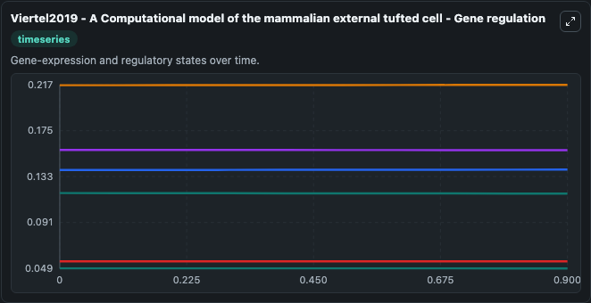
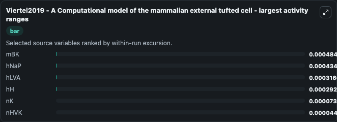
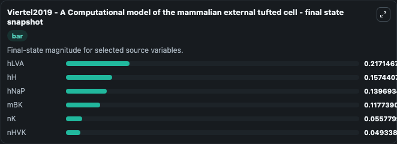
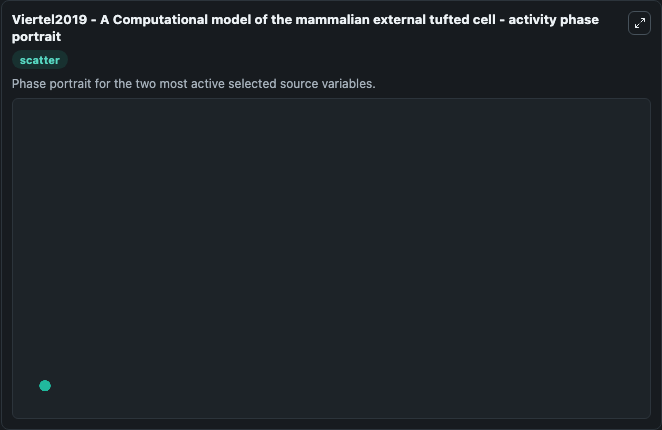

# Viertel2019 A Computational Model Of The Mammalian External Tufted Cel

This Biosimulant lab wraps `Viertel2019 A Computational Model Of The Mammalian External Tufted Cel` as a runnable systems biology model with a companion visualization module.
This is a mathematical conductance-based model of the bursting activity in external tufted (ET) cells of the olfactory bulb. It can be used to explore the configured dynamics and compare scenario outcomes across configurations.

## What You'll See

The lab asks: Which gene-regulatory states dominate the source model trajectory? Source model: Viertel2019 - A Computational model of the mammalian external tufted cell. It runs for 1.0 time units with a communication step of 0.1. The run uses the model defaults declared by the curated SBML wrapper. The generated visualizations focus on hLVA, hH, hNaP, mBK, nK, and nHVK, combining trajectory, endpoint-comparison, and summary-table views from one completed dark-mode run.

In this captured run, **mBK** moved from 0.1182 to 0.1177 across 1.0 simulation windows.


### Output Visualizations



*Summary table for Viertel2019 A Computational Model Of The Mammalian External Tufted Cel, reporting the scientific question, observed answer, dominant module, and caveat.*



*Trajectories of mBK, hNaP, hLVA, hH, nK, and nHVK across the 1.0 simulation. In this run **hNaP** climbed from 0.1393 to 0.1397 and **mBK** fell from 0.1182 to 0.1177 — the largest movements among the focused observables.*



*Largest-excursion ranking of the focused observables — the absolute movement magnitude during the run. Top 3: **mBK** = 0.000484, **hNaP** = 0.000434, **hLVA** = 0.000317, with 3 more observables below.*



*Endpoint snapshot of the focused observables — final values from the captured run. Top 3 by value: **hLVA** = 0.2171, **hH** = 0.1574, **hNaP** = 0.1397, with 3 more observables below.*



*Visualization card from the Viertel2019 A Computational Model Of The Mammalian External Tufted Cel dark-mode run.*


## Model Context

- Core model: `models/core`
- Visualization model: `models/visualisation`
- Standard: `other`
- Upstream source: `biomodels_ebi:BIOMD0000000844`
- License: `CC0`

## Inputs

| Input | Maps To | Default | Notes |
|---|---|---|---|
| Initial H Lva | `systemsbiology_sbml_viertel2019_a_computational_model_of_the_mammali_biomd0000000844_model.initial_h_lva` | | Source state initial condition exposed as a model-specific control because no explicit intervention parameter is identifiable. Maps to SBML symbol `hLVA`. |
| Initial Model State H H | `systemsbiology_sbml_viertel2019_a_computational_model_of_the_mammali_biomd0000000844_model.initial_model_state_h_h` | | Source state initial condition exposed as a model-specific control because no explicit intervention parameter is identifiable. Maps to SBML symbol `hH`. |
| Initial H Na P | `systemsbiology_sbml_viertel2019_a_computational_model_of_the_mammali_biomd0000000844_model.initial_h_na_p` | | Source state initial condition exposed as a model-specific control because no explicit intervention parameter is identifiable. Maps to SBML symbol `hNaP`. |
| Initial M Bk | `systemsbiology_sbml_viertel2019_a_computational_model_of_the_mammali_biomd0000000844_model.initial_m_bk` | | Source state initial condition exposed as a model-specific control because no explicit intervention parameter is identifiable. Maps to SBML symbol `mBK`. |
| Initial Model State N K | `systemsbiology_sbml_viertel2019_a_computational_model_of_the_mammali_biomd0000000844_model.initial_model_state_n_k` | | Source state initial condition exposed as a model-specific control because no explicit intervention parameter is identifiable. Maps to SBML symbol `nK`. |
| Initial N Hvk | `systemsbiology_sbml_viertel2019_a_computational_model_of_the_mammali_biomd0000000844_model.initial_n_hvk` | | Source state initial condition exposed as a model-specific control because no explicit intervention parameter is identifiable. Maps to SBML symbol `nHVK`. |

## Outputs

| Output | Maps To | Role |
|---|---|---|
| `state` | `systemsbiology_sbml_viertel2019_a_computational_model_of_the_mammali_biomd0000000844_model.state` | Available to the visualization model and downstream workflows. |
| `summary` | `systemsbiology_sbml_viertel2019_a_computational_model_of_the_mammali_biomd0000000844_model.summary` | Available to the visualization model and downstream workflows. |
| `species_labels` | `systemsbiology_sbml_viertel2019_a_computational_model_of_the_mammali_biomd0000000844_model.species_labels` | Available to the visualization model and downstream workflows. |
| `h_lva` | `systemsbiology_sbml_viertel2019_a_computational_model_of_the_mammali_biomd0000000844_model.h_lva` | Available to the visualization model and downstream workflows. |
| `h_h` | `systemsbiology_sbml_viertel2019_a_computational_model_of_the_mammali_biomd0000000844_model.h_h` | Available to the visualization model and downstream workflows. |
| `h_na_p` | `systemsbiology_sbml_viertel2019_a_computational_model_of_the_mammali_biomd0000000844_model.h_na_p` | Available to the visualization model and downstream workflows. |
| `m_bk` | `systemsbiology_sbml_viertel2019_a_computational_model_of_the_mammali_biomd0000000844_model.m_bk` | Available to the visualization model and downstream workflows. |
| `n_k` | `systemsbiology_sbml_viertel2019_a_computational_model_of_the_mammali_biomd0000000844_model.n_k` | Available to the visualization model and downstream workflows. |
| `n_hvk` | `systemsbiology_sbml_viertel2019_a_computational_model_of_the_mammali_biomd0000000844_model.n_hvk` | Available to the visualization model and downstream workflows. |

## Runtime

- Duration: `1.0`
- Communication step: `0.1`

## Running Locally

```bash
biosimulant labs serve
```
