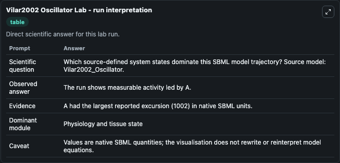
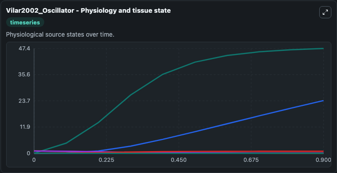
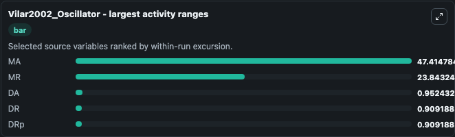
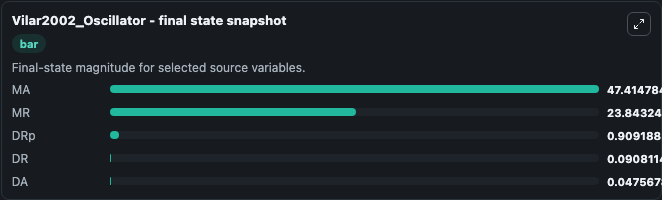
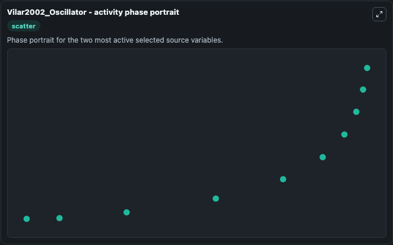

# Vilar2002 Oscillator

This Biosimulant lab wraps `Vilar2002 Oscillator` as a runnable systems biology model with a companion visualization module.
Minimal Model for Circadian Oscillations Citation Vilar JMG, Kueh HY, Barkai N, Leibler S, (2002). It can be used to explore the configured dynamics and compare scenario outcomes across configurations.

## What You'll See

The lab asks: Which source-defined system states dominate this SBML model trajectory? Source model: Vilar2002_Oscillator. It runs for 1.0 time units with a communication step of 0.1. The run uses the model defaults declared by the curated SBML wrapper. The generated visualizations focus on DR, DA, MR, MA, EmptySet, and DRp, combining trajectory, endpoint-comparison, and summary-table views from one completed dark-mode run.

In this captured run, **MA** moved from 0 to 47.415 across 1.0 simulation windows.


### Output Visualizations



*Summary table for Vilar2002 Oscillator, reporting the scientific question, observed answer, dominant module, and caveat.*



*Trajectories of MA, MR, DA, DR, DRp, and EmptySet across the 1.0 simulation. In this run **MA** climbed from 0 to 47.415 and **DA** fell from 1.000 to 0.0476 — the largest movements among the focused observables.*



*Largest-excursion ranking of the focused observables — the absolute movement magnitude during the run. Top 3: **MA** = 47.415, **MR** = 23.843, **DA** = 0.9524, with 2 more observables below.*



*Endpoint snapshot of the focused observables — final values from the captured run. Top 3 by value: **MA** = 47.415, **MR** = 23.843, **DRp** = 0.9092, with 2 more observables below.*



*Visualization card from the Vilar2002 Oscillator dark-mode run.*


## Model Context

- Core model: `models/core`
- Visualization model: `models/visualisation`
- Standard: `other`
- Upstream source: `biomodels_ebi:BIOMD0000000035`
- License: `CC0`

## Inputs

| Input | Maps To | Default | Notes |
|---|---|---|---|
| Initial Model State Dr | `systemsbiology_sbml_vilar2002_oscillator_biomd0000000035_model.initial_model_state_dr` | | Source state initial condition exposed as a model-specific control because no explicit intervention parameter is identifiable. Maps to SBML symbol `DR`. |
| Initial Model State Da | `systemsbiology_sbml_vilar2002_oscillator_biomd0000000035_model.initial_model_state_da` | | Source state initial condition exposed as a model-specific control because no explicit intervention parameter is identifiable. Maps to SBML symbol `DA`. |
| Initial Model State Mr | `systemsbiology_sbml_vilar2002_oscillator_biomd0000000035_model.initial_model_state_mr` | | Source state initial condition exposed as a model-specific control because no explicit intervention parameter is identifiable. Maps to SBML symbol `MR`. |
| Initial Model State Ma | `systemsbiology_sbml_vilar2002_oscillator_biomd0000000035_model.initial_model_state_ma` | | Source state initial condition exposed as a model-specific control because no explicit intervention parameter is identifiable. Maps to SBML symbol `MA`. |
| Initial Empty Set | `systemsbiology_sbml_vilar2002_oscillator_biomd0000000035_model.initial_empty_set` | | Source state initial condition exposed as a model-specific control because no explicit intervention parameter is identifiable. Maps to SBML symbol `EmptySet`. |
| Initial D Rp | `systemsbiology_sbml_vilar2002_oscillator_biomd0000000035_model.initial_d_rp` | | Source state initial condition exposed as a model-specific control because no explicit intervention parameter is identifiable. Maps to SBML symbol `DRp`. |

## Outputs

| Output | Maps To | Role |
|---|---|---|
| `state` | `systemsbiology_sbml_vilar2002_oscillator_biomd0000000035_model.state` | Available to the visualization model and downstream workflows. |
| `summary` | `systemsbiology_sbml_vilar2002_oscillator_biomd0000000035_model.summary` | Available to the visualization model and downstream workflows. |
| `species_labels` | `systemsbiology_sbml_vilar2002_oscillator_biomd0000000035_model.species_labels` | Available to the visualization model and downstream workflows. |
| `model_state_dr` | `systemsbiology_sbml_vilar2002_oscillator_biomd0000000035_model.model_state_dr` | Available to the visualization model and downstream workflows. |
| `model_state_da` | `systemsbiology_sbml_vilar2002_oscillator_biomd0000000035_model.model_state_da` | Available to the visualization model and downstream workflows. |
| `model_state_mr` | `systemsbiology_sbml_vilar2002_oscillator_biomd0000000035_model.model_state_mr` | Available to the visualization model and downstream workflows. |
| `model_state_ma` | `systemsbiology_sbml_vilar2002_oscillator_biomd0000000035_model.model_state_ma` | Available to the visualization model and downstream workflows. |
| `empty_set` | `systemsbiology_sbml_vilar2002_oscillator_biomd0000000035_model.empty_set` | Available to the visualization model and downstream workflows. |
| `d_rp` | `systemsbiology_sbml_vilar2002_oscillator_biomd0000000035_model.d_rp` | Available to the visualization model and downstream workflows. |

## Runtime

- Duration: `1.0`
- Communication step: `0.1`

## Running Locally

```bash
biosimulant labs serve
```
