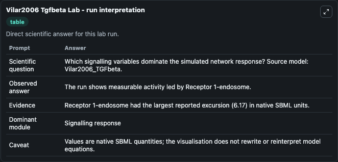
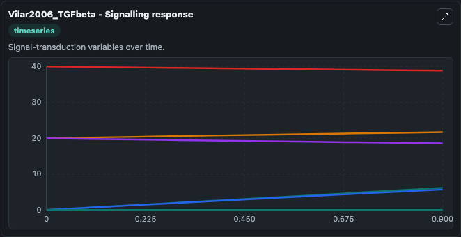
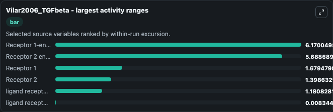
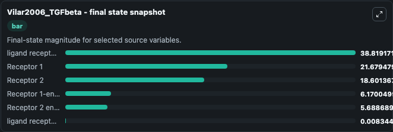
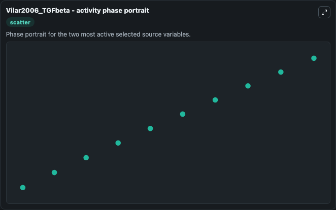

# Vilar2006 Tgfbeta

This Biosimulant lab wraps `Vilar2006 Tgfbeta` as a runnable systems biology model with a companion visualization module.
The model reproduces Fig 5A of the paper. It can be used to explore the configured dynamics and compare scenario outcomes across configurations.

## What You'll See

The lab asks: Which signalling variables dominate the simulated network response? Source model: Vilar2006_TGFbeta. It runs for 1.0 time units with a communication step of 0.1. The run uses the model defaults declared by the curated SBML wrapper. The generated visualizations focus on ligand receptor complex-endosome, Receptor 2, Receptor 1, ligand receptor complex-plasma membrane, Receptor 2 endosome, and Receptor 1-endosome, combining trajectory, endpoint-comparison, and summary-table views from one completed dark-mode run.

In this captured run, **Receptor 1-endosome** moved from 0 to 6.170 across 1.0 simulation windows.


### Output Visualizations



*Summary table for Vilar2006 Tgfbeta, reporting the scientific question, observed answer, dominant module, and caveat.*



*Trajectories of Receptor 1-endosome, Receptor 2 endosome, Receptor 1, Receptor 2, ligand receptor complex-endosome, and ligand receptor complex-plasma membrane across the 1.0 simulation. In this run **Receptor 1-endosome** climbed from 0 to 6.170 and **Receptor 2** fell from 20.000 to 18.601 — the largest movements among the focused observables.*



*Largest-excursion ranking of the focused observables — the absolute movement magnitude during the run. Top 3: **Receptor 1-endosome** = 6.170, **Receptor 2 endosome** = 5.689, **Receptor 1** = 1.679, with 3 more observables below.*



*Endpoint snapshot of the focused observables — final values from the captured run. Top 3 by value: **ligand receptor complex-endosome** = 38.819, **Receptor 1** = 21.679, **Receptor 2** = 18.601, with 3 more observables below.*



*Visualization card from the Vilar2006 Tgfbeta dark-mode run.*


## Model Context

- Core model: `models/core`
- Visualization model: `models/visualisation`
- Standard: `other`
- Upstream source: `biomodels_ebi:BIOMD0000000101`
- License: `CC0`

## Inputs

| Input | Maps To | Default | Notes |
|---|---|---|---|
| Initial Ligand Receptor Complex Endosome | `systemsbiology_sbml_vilar2006_tgfbeta_biomd0000000101_model.initial_ligand_receptor_complex_endosome` | | Source state initial condition exposed as a model-specific control because no explicit intervention parameter is identifiable. Maps to SBML symbol `lRIRII_endo`. |
| Initial Receptor 2 | `systemsbiology_sbml_vilar2006_tgfbeta_biomd0000000101_model.initial_receptor_2` | | Source state initial condition exposed as a model-specific control because no explicit intervention parameter is identifiable. Maps to SBML symbol `RII`. |
| Initial Receptor 1 | `systemsbiology_sbml_vilar2006_tgfbeta_biomd0000000101_model.initial_receptor_1` | | Source state initial condition exposed as a model-specific control because no explicit intervention parameter is identifiable. Maps to SBML symbol `RI`. |
| Initial Ligand Receptor Complex Plasma Membrane | `systemsbiology_sbml_vilar2006_tgfbeta_biomd0000000101_model.initial_ligand_receptor_complex_plasma_membrane` | | Source state initial condition exposed as a model-specific control because no explicit intervention parameter is identifiable. Maps to SBML symbol `lRIRII`. |
| Initial Receptor 2 Endosome | `systemsbiology_sbml_vilar2006_tgfbeta_biomd0000000101_model.initial_receptor_2_endosome` | | Source state initial condition exposed as a model-specific control because no explicit intervention parameter is identifiable. Maps to SBML symbol `RII_endo`. |
| Initial Receptor 1 Endosome | `systemsbiology_sbml_vilar2006_tgfbeta_biomd0000000101_model.initial_receptor_1_endosome` | | Source state initial condition exposed as a model-specific control because no explicit intervention parameter is identifiable. Maps to SBML symbol `RI_endo`. |

## Outputs

| Output | Maps To | Role |
|---|---|---|
| `state` | `systemsbiology_sbml_vilar2006_tgfbeta_biomd0000000101_model.state` | Available to the visualization model and downstream workflows. |
| `summary` | `systemsbiology_sbml_vilar2006_tgfbeta_biomd0000000101_model.summary` | Available to the visualization model and downstream workflows. |
| `species_labels` | `systemsbiology_sbml_vilar2006_tgfbeta_biomd0000000101_model.species_labels` | Available to the visualization model and downstream workflows. |
| `ligand_receptor_complex_endosome` | `systemsbiology_sbml_vilar2006_tgfbeta_biomd0000000101_model.ligand_receptor_complex_endosome` | Available to the visualization model and downstream workflows. |
| `receptor_2` | `systemsbiology_sbml_vilar2006_tgfbeta_biomd0000000101_model.receptor_2` | Available to the visualization model and downstream workflows. |
| `receptor_1` | `systemsbiology_sbml_vilar2006_tgfbeta_biomd0000000101_model.receptor_1` | Available to the visualization model and downstream workflows. |
| `ligand_receptor_complex_plasma_membrane` | `systemsbiology_sbml_vilar2006_tgfbeta_biomd0000000101_model.ligand_receptor_complex_plasma_membrane` | Available to the visualization model and downstream workflows. |
| `receptor_2_endosome` | `systemsbiology_sbml_vilar2006_tgfbeta_biomd0000000101_model.receptor_2_endosome` | Available to the visualization model and downstream workflows. |
| `receptor_1_endosome` | `systemsbiology_sbml_vilar2006_tgfbeta_biomd0000000101_model.receptor_1_endosome` | Available to the visualization model and downstream workflows. |

## Runtime

- Duration: `1.0`
- Communication step: `0.1`

## Running Locally

```bash
biosimulant labs serve
```
