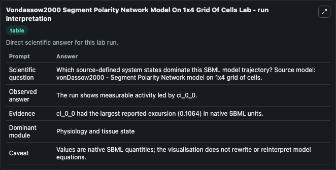
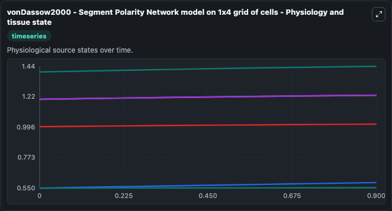
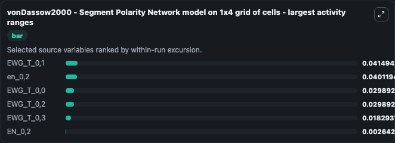
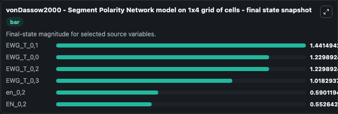
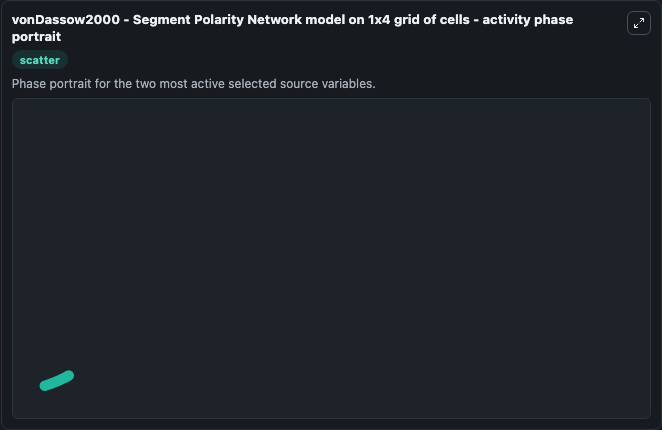

# Vondassow2000 Segment Polarity Network Model On 1x4 Grid Of Cells

This Biosimulant lab wraps `Vondassow2000 Segment Polarity Network Model On 1x4 Grid Of Cells` as a runnable systems biology model with a companion visualization module.
This is the segment polarity network model described by von Dassow et al. It can be used to explore the configured dynamics and compare scenario outcomes across configurations.

## What You'll See

The lab asks: Which source-defined system states dominate this SBML model trajectory? Source model: vonDassow2000 - Segment Polarity Network model on 1x4 grid of cells. It runs for 1.0 time units with a communication step of 0.1. The run uses the model defaults declared by the curated SBML wrapper. The generated visualizations focus on EWG_T_0,1, EWG_T_0,2, EWG_T_0,0, EWG_T_0,3, en_0,2, and EN_0,2, combining trajectory, endpoint-comparison, and summary-table views from one completed dark-mode run.

In this captured run, **EWG_T_0,1** moved from 1.400 to 1.441 across 1.0 simulation windows.


### Output Visualizations



*Summary table for Vondassow2000 Segment Polarity Network Model On 1x4 Grid Of Cells, reporting the scientific question, observed answer, dominant module, and caveat.*



*Trajectories of EWG_T_0,1, en_0,2, EWG_T_0,0, EWG_T_0,2, EWG_T_0,3, and EN_0,2 across the 1.0 simulation. In this run **EWG_T_0,1** climbed from 1.400 to 1.441 — the largest movements among the focused observables.*



*Largest-excursion ranking of the focused observables — the absolute movement magnitude during the run. Top 3: **EWG_T_0,1** = 0.0415, **en_0,2** = 0.0401, **EWG_T_0,0** = 0.0299, with 3 more observables below.*



*Trajectories of EWG_T_0,1, en_0,2, EWG_T_0,0, EWG_T_0,2, EWG_T_0,3, and EN_0,2 across the 1.0 simulation. In this run **EWG_T_0,1** climbed from 1.400 to 1.441 — the largest movements among the focused observables.*



*Visualization card from the Vondassow2000 Segment Polarity Network Model On 1x4 Grid Of Cells dark-mode run.*


## Model Context

- Core model: `models/core`
- Visualization model: `models/visualisation`
- Standard: `other`
- Upstream source: `biomodels_ebi:BIOMD0000001065`
- License: `CC0`

## Inputs

| Input | Maps To | Default | Notes |
|---|---|---|---|
| Initial Ewg T 0 1 | `systemsbiology_sbml_vondassow2000_segment_polarity_network_model_on_biomd0000001065_model.initial_ewg_t_0_1` | | Source state initial condition exposed as a model-specific control because no explicit intervention parameter is identifiable. Maps to SBML symbol `EWG_T_0_1`. |
| Initial Ewg T 0 2 | `systemsbiology_sbml_vondassow2000_segment_polarity_network_model_on_biomd0000001065_model.initial_ewg_t_0_2` | | Source state initial condition exposed as a model-specific control because no explicit intervention parameter is identifiable. Maps to SBML symbol `EWG_T_0_2`. |
| Initial Ewg T 0 0 | `systemsbiology_sbml_vondassow2000_segment_polarity_network_model_on_biomd0000001065_model.initial_ewg_t_0_0` | | Source state initial condition exposed as a model-specific control because no explicit intervention parameter is identifiable. Maps to SBML symbol `EWG_T_0_0`. |
| Initial Ewg T 0 3 | `systemsbiology_sbml_vondassow2000_segment_polarity_network_model_on_biomd0000001065_model.initial_ewg_t_0_3` | | Source state initial condition exposed as a model-specific control because no explicit intervention parameter is identifiable. Maps to SBML symbol `EWG_T_0_3`. |
| Initial En 0 2 | `systemsbiology_sbml_vondassow2000_segment_polarity_network_model_on_biomd0000001065_model.initial_en_0_2` | | Source state initial condition exposed as a model-specific control because no explicit intervention parameter is identifiable. Maps to SBML symbol `en_0_2`. |
| Initial En 0 2 2 | `systemsbiology_sbml_vondassow2000_segment_polarity_network_model_on_biomd0000001065_model.initial_en_0_2_2` | | Source state initial condition exposed as a model-specific control because no explicit intervention parameter is identifiable. Maps to SBML symbol `EN_0_2`. |

## Outputs

| Output | Maps To | Role |
|---|---|---|
| `state` | `systemsbiology_sbml_vondassow2000_segment_polarity_network_model_on_biomd0000001065_model.state` | Available to the visualization model and downstream workflows. |
| `summary` | `systemsbiology_sbml_vondassow2000_segment_polarity_network_model_on_biomd0000001065_model.summary` | Available to the visualization model and downstream workflows. |
| `species_labels` | `systemsbiology_sbml_vondassow2000_segment_polarity_network_model_on_biomd0000001065_model.species_labels` | Available to the visualization model and downstream workflows. |
| `ewg_t_0_1` | `systemsbiology_sbml_vondassow2000_segment_polarity_network_model_on_biomd0000001065_model.ewg_t_0_1` | Available to the visualization model and downstream workflows. |
| `ewg_t_0_2` | `systemsbiology_sbml_vondassow2000_segment_polarity_network_model_on_biomd0000001065_model.ewg_t_0_2` | Available to the visualization model and downstream workflows. |
| `ewg_t_0_0` | `systemsbiology_sbml_vondassow2000_segment_polarity_network_model_on_biomd0000001065_model.ewg_t_0_0` | Available to the visualization model and downstream workflows. |
| `ewg_t_0_3` | `systemsbiology_sbml_vondassow2000_segment_polarity_network_model_on_biomd0000001065_model.ewg_t_0_3` | Available to the visualization model and downstream workflows. |
| `en_0_2` | `systemsbiology_sbml_vondassow2000_segment_polarity_network_model_on_biomd0000001065_model.en_0_2` | Available to the visualization model and downstream workflows. |
| `en_0_2_2` | `systemsbiology_sbml_vondassow2000_segment_polarity_network_model_on_biomd0000001065_model.en_0_2_2` | Available to the visualization model and downstream workflows. |

## Runtime

- Duration: `1.0`
- Communication step: `0.1`

## Running Locally

```bash
biosimulant labs serve
```
