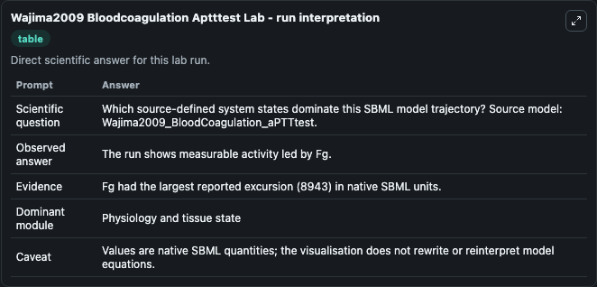
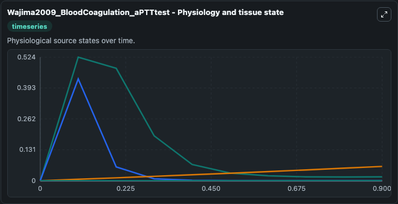
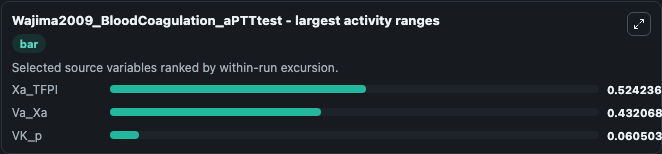
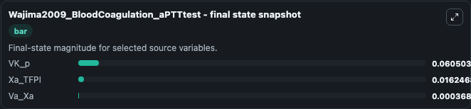
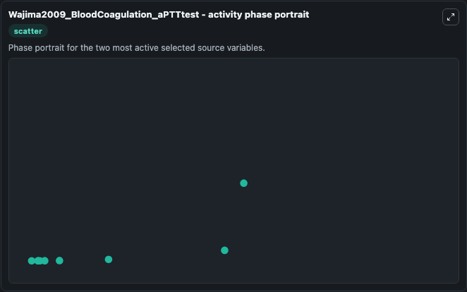

# Wajima2009 Bloodcoagulation Aptttest

This Biosimulant lab wraps `Wajima2009 Bloodcoagulation Aptttest` as a runnable systems biology model with a companion visualization module.
This model is from the article: A comprehensive model for the humoral coagulation network in humans. It can be used to explore the configured dynamics and compare scenario outcomes across configurations.

## What You'll See

The lab asks: Which source-defined system states dominate this SBML model trajectory? Source model: Wajima2009_BloodCoagulation_aPTTtest. It runs for 1.0 time units with a communication step of 0.1. The run uses the model defaults declared by the curated SBML wrapper. The generated visualizations focus on Xa_TFPI, Xa_ATIII_Heparin, Va_Xa, VK_p, VIIa_TF_Xa_TFPI, and VIIa_TF, combining trajectory, endpoint-comparison, and summary-table views from one completed dark-mode run.

In this captured run, **VK_p** moved from 0 to 0.0605 across 1.0 simulation windows.


### Output Visualizations



*Summary table for Wajima2009 Bloodcoagulation Aptttest, reporting the scientific question, observed answer, dominant module, and caveat.*



*Trajectories of Xa_TFPI, Va_Xa, VK_p, Xa_ATIII_Heparin, VIIa_TF_Xa_TFPI, and VIIa_TF across the 1.0 simulation. In this run **VK_p** climbed from 0 to 0.0605 — the largest movements among the focused observables.*



*Largest-excursion ranking of the focused observables — the absolute movement magnitude during the run. Top 3: **Xa_TFPI** = 0.5242, **Va_Xa** = 0.4321, **VK_p** = 0.0605.*



*Endpoint snapshot of the focused observables — final values from the captured run. Top 3 by value: **VK_p** = 0.0605, **Xa_TFPI** = 0.0162, **Va_Xa** = 0.000368.*



*Visualization card from the Wajima2009 Bloodcoagulation Aptttest dark-mode run.*


## Model Context

- Core model: `models/core`
- Visualization model: `models/visualisation`
- Standard: `other`
- Upstream source: `biomodels_ebi:BIOMD0000000338`
- License: `CC0`

## Inputs

| Input | Maps To | Default | Notes |
|---|---|---|---|
| Initial Xa Tfpi | `systemsbiology_sbml_wajima2009_bloodcoagulation_aptttest_biomd0000000338_model.initial_xa_tfpi` | | Source state initial condition exposed as a model-specific control because no explicit intervention parameter is identifiable. Maps to SBML symbol `Xa_TFPI`. |
| Initial Xa Atiii Heparin | `systemsbiology_sbml_wajima2009_bloodcoagulation_aptttest_biomd0000000338_model.initial_xa_atiii_heparin` | | Source state initial condition exposed as a model-specific control because no explicit intervention parameter is identifiable. Maps to SBML symbol `Xa_ATIII_Heparin`. |
| Initial Va Xa | `systemsbiology_sbml_wajima2009_bloodcoagulation_aptttest_biomd0000000338_model.initial_va_xa` | | Source state initial condition exposed as a model-specific control because no explicit intervention parameter is identifiable. Maps to SBML symbol `Va_Xa`. |
| Initial Vk P | `systemsbiology_sbml_wajima2009_bloodcoagulation_aptttest_biomd0000000338_model.initial_vk_p` | | Source state initial condition exposed as a model-specific control because no explicit intervention parameter is identifiable. Maps to SBML symbol `VK_p`. |
| Initial Vi Ia Tf Xa Tfpi | `systemsbiology_sbml_wajima2009_bloodcoagulation_aptttest_biomd0000000338_model.initial_vi_ia_tf_xa_tfpi` | | Source state initial condition exposed as a model-specific control because no explicit intervention parameter is identifiable. Maps to SBML symbol `VIIa_TF_Xa_TFPI`. |
| Initial Vi Ia Tf | `systemsbiology_sbml_wajima2009_bloodcoagulation_aptttest_biomd0000000338_model.initial_vi_ia_tf` | | Source state initial condition exposed as a model-specific control because no explicit intervention parameter is identifiable. Maps to SBML symbol `VIIa_TF`. |

## Outputs

| Output | Maps To | Role |
|---|---|---|
| `state` | `systemsbiology_sbml_wajima2009_bloodcoagulation_aptttest_biomd0000000338_model.state` | Available to the visualization model and downstream workflows. |
| `summary` | `systemsbiology_sbml_wajima2009_bloodcoagulation_aptttest_biomd0000000338_model.summary` | Available to the visualization model and downstream workflows. |
| `species_labels` | `systemsbiology_sbml_wajima2009_bloodcoagulation_aptttest_biomd0000000338_model.species_labels` | Available to the visualization model and downstream workflows. |
| `xa_tfpi` | `systemsbiology_sbml_wajima2009_bloodcoagulation_aptttest_biomd0000000338_model.xa_tfpi` | Available to the visualization model and downstream workflows. |
| `xa_atiii_heparin` | `systemsbiology_sbml_wajima2009_bloodcoagulation_aptttest_biomd0000000338_model.xa_atiii_heparin` | Available to the visualization model and downstream workflows. |
| `va_xa` | `systemsbiology_sbml_wajima2009_bloodcoagulation_aptttest_biomd0000000338_model.va_xa` | Available to the visualization model and downstream workflows. |
| `vk_p` | `systemsbiology_sbml_wajima2009_bloodcoagulation_aptttest_biomd0000000338_model.vk_p` | Available to the visualization model and downstream workflows. |
| `vi_ia_tf_xa_tfpi` | `systemsbiology_sbml_wajima2009_bloodcoagulation_aptttest_biomd0000000338_model.vi_ia_tf_xa_tfpi` | Available to the visualization model and downstream workflows. |
| `vi_ia_tf` | `systemsbiology_sbml_wajima2009_bloodcoagulation_aptttest_biomd0000000338_model.vi_ia_tf` | Available to the visualization model and downstream workflows. |

## Runtime

- Duration: `1.0`
- Communication step: `0.1`

## Running Locally

```bash
biosimulant labs serve
```
