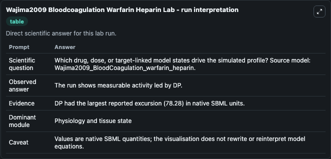
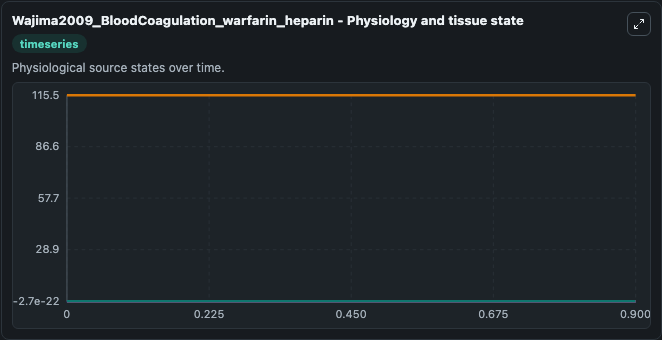
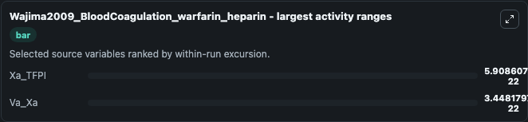
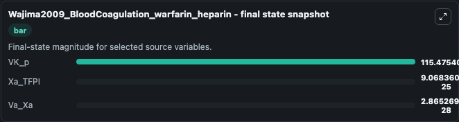
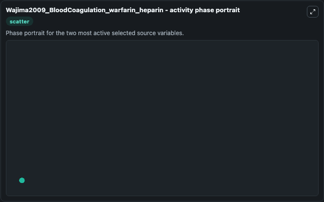

# Wajima2009 Bloodcoagulation Warfarin Heparin

This Biosimulant lab wraps `Wajima2009 Bloodcoagulation Warfarin Heparin` as a runnable systems biology model with a companion visualization module.
This model is from the article: A comprehensive model for the humoral coagulation network in humans. It can be used to explore the configured dynamics and compare scenario outcomes across configurations.

## What You'll See

The lab asks: Which drug, dose, or target-linked model states drive the simulated profile? Source model: Wajima2009_BloodCoagulation_warfarin_heparin. It runs for 1.0 time units with a communication step of 0.1. The run uses the model defaults declared by the curated SBML wrapper. The generated visualizations focus on VK_p, Xa_TFPI, Xa_ATIII_Heparin, Va_Xa, VIIa_TF_Xa_TFPI, and VIIa_TF, combining trajectory, endpoint-comparison, and summary-table views from one completed dark-mode run.

In this captured run, **Xa_TFPI** moved from 0 to 9.07e-25 across 1.0 simulation windows.


### Output Visualizations



*Summary table for Wajima2009 Bloodcoagulation Warfarin Heparin, reporting the scientific question, observed answer, dominant module, and caveat.*



*Trajectories of Xa_TFPI, Va_Xa, VK_p, Xa_ATIII_Heparin, VIIa_TF_Xa_TFPI, and VIIa_TF across the 1.0 simulation. In this run **Xa_TFPI** climbed from 0 to 9.07e-25 — the largest movements among the focused observables.*



*Largest-excursion ranking of the focused observables — the absolute movement magnitude during the run. Top 2: **Xa_TFPI** = 5.91e-22, **Va_Xa** = 3.45e-22.*



*Endpoint snapshot of the focused observables — final values from the captured run. Top 3 by value: **VK_p** = 115.5, **Xa_TFPI** = 9.07e-25, **Va_Xa** = 2.87e-28.*



*Visualization card from the Wajima2009 Bloodcoagulation Warfarin Heparin dark-mode run.*


## Model Context

- Core model: `models/core`
- Visualization model: `models/visualisation`
- Standard: `other`
- Upstream source: `biomodels_ebi:BIOMD0000000340`
- License: `CC0`

## Inputs

| Input | Maps To | Default | Notes |
|---|---|---|---|
| Warfarin Daily Dose | `systemsbiology_sbml_wajima2009_bloodcoagulation_warfarin_heparin_biomd0000000340_model.warfarin_daily_dose` | | Source parameter exposed because its SBML label indicates a boundary, stimulus, dose, ligand, protocol, substrate, or environmental control. Maps to SBML symbol `warfarin_daily_dose`. |

## Outputs

| Output | Maps To | Role |
|---|---|---|
| `state` | `systemsbiology_sbml_wajima2009_bloodcoagulation_warfarin_heparin_biomd0000000340_model.state` | Available to the visualization model and downstream workflows. |
| `summary` | `systemsbiology_sbml_wajima2009_bloodcoagulation_warfarin_heparin_biomd0000000340_model.summary` | Available to the visualization model and downstream workflows. |
| `species_labels` | `systemsbiology_sbml_wajima2009_bloodcoagulation_warfarin_heparin_biomd0000000340_model.species_labels` | Available to the visualization model and downstream workflows. |
| `vk_p` | `systemsbiology_sbml_wajima2009_bloodcoagulation_warfarin_heparin_biomd0000000340_model.vk_p` | Available to the visualization model and downstream workflows. |
| `xa_tfpi` | `systemsbiology_sbml_wajima2009_bloodcoagulation_warfarin_heparin_biomd0000000340_model.xa_tfpi` | Available to the visualization model and downstream workflows. |
| `xa_atiii_heparin` | `systemsbiology_sbml_wajima2009_bloodcoagulation_warfarin_heparin_biomd0000000340_model.xa_atiii_heparin` | Available to the visualization model and downstream workflows. |
| `va_xa` | `systemsbiology_sbml_wajima2009_bloodcoagulation_warfarin_heparin_biomd0000000340_model.va_xa` | Available to the visualization model and downstream workflows. |
| `vi_ia_tf_xa_tfpi` | `systemsbiology_sbml_wajima2009_bloodcoagulation_warfarin_heparin_biomd0000000340_model.vi_ia_tf_xa_tfpi` | Available to the visualization model and downstream workflows. |
| `vi_ia_tf` | `systemsbiology_sbml_wajima2009_bloodcoagulation_warfarin_heparin_biomd0000000340_model.vi_ia_tf` | Available to the visualization model and downstream workflows. |

## Runtime

- Duration: `1.0`
- Communication step: `0.1`

## Running Locally

```bash
biosimulant labs serve
```
