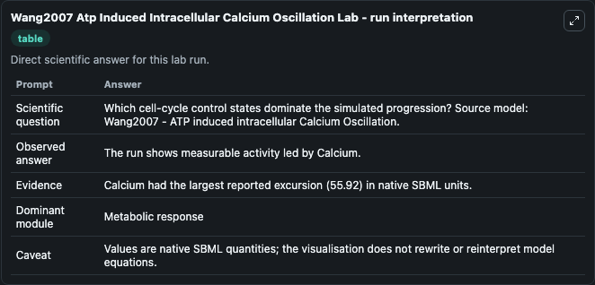
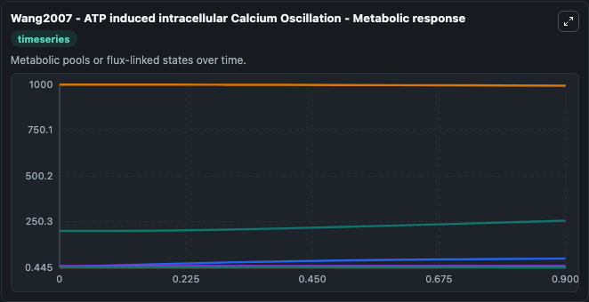
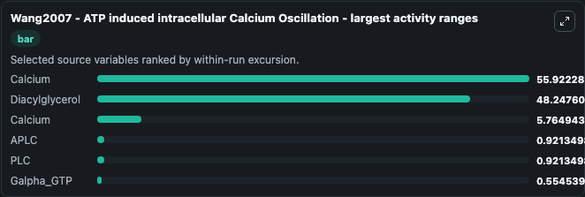
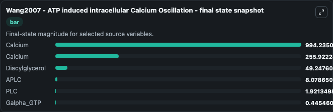
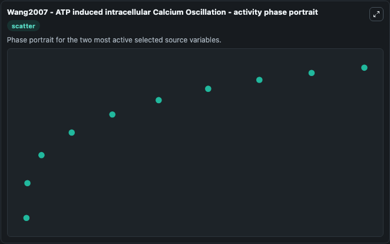

# Wang2007 Atp Induced Intracellular Calcium Oscillation

This Biosimulant lab wraps `Wang2007 Atp Induced Intracellular Calcium Oscillation` as a runnable systems biology model with a companion visualization module.
Wang2007 - ATP induced intracellular Calicum Oscillation The model simulate the ATP-induced intracellular Ca 2+ oscillations and the quantitative effect of ATP concentration on the oscillation charact. It can be used to explore the configured dynamics and compare scenario outcomes across configurations.

## What You'll See

The lab asks: Which cell-cycle control states dominate the simulated progression? Source model: Wang2007 - ATP induced intracellular Calcium Oscillation. It runs for 1.0 time units with a communication step of 0.1. The run uses the model defaults declared by the curated SBML wrapper. The generated visualizations focus on Calcium, Galpha_GTP, Diacylglycerol, APLC, and PLC, combining trajectory, endpoint-comparison, and summary-table views from one completed dark-mode run.

In this captured run, **Calcium** moved from 200.0 to 255.9 across 1.0 simulation windows.


### Output Visualizations



*Summary table for Wang2007 Atp Induced Intracellular Calcium Oscillation, reporting the scientific question, observed answer, dominant module, and caveat.*



*Trajectories of Calcium, Diacylglycerol, Calcium, APLC, PLC, and Galpha_GTP across the 1.0 simulation. In this run **Calcium** climbed from 200.0 to 255.9 and **Calcium** fell from 1000.0 to 994.2 — the largest movements among the focused observables.*



*Largest-excursion ranking of the focused observables — the absolute movement magnitude during the run. Top 3: **Calcium** = 55.922, **Diacylglycerol** = 48.248, **Calcium** = 5.765, with 3 more observables below.*



*Endpoint snapshot of the focused observables — final values from the captured run. Top 3 by value: **Calcium** = 994.2, **Calcium** = 255.9, **Diacylglycerol** = 49.248, with 3 more observables below.*



*Visualization card from the Wang2007 Atp Induced Intracellular Calcium Oscillation dark-mode run.*


## Model Context

- Core model: `models/core`
- Visualization model: `models/visualisation`
- Standard: `other`
- Upstream source: `biomodels_ebi:BIOMD0000000145`
- License: `CC0`

## Inputs

| Input | Maps To | Default | Notes |
|---|---|---|---|
| Initial Calcium | `systemsbiology_sbml_wang2007_atp_induced_intracellular_calcium_oscil_biomd0000000145_model.initial_calcium` | | Source state initial condition exposed as a model-specific control because no explicit intervention parameter is identifiable. Maps to SBML symbol `Ca_ER`. |
| Initial Calcium 2 | `systemsbiology_sbml_wang2007_atp_induced_intracellular_calcium_oscil_biomd0000000145_model.initial_calcium_2` | | Source state initial condition exposed as a model-specific control because no explicit intervention parameter is identifiable. Maps to SBML symbol `Ca_Cyt`. |
| Initial Galpha Gtp | `systemsbiology_sbml_wang2007_atp_induced_intracellular_calcium_oscil_biomd0000000145_model.initial_galpha_gtp` | | Source state initial condition exposed as a model-specific control because no explicit intervention parameter is identifiable. Maps to SBML symbol `Galpha_GTP`. |
| Initial Diacylglycerol | `systemsbiology_sbml_wang2007_atp_induced_intracellular_calcium_oscil_biomd0000000145_model.initial_diacylglycerol` | | Source state initial condition exposed as a model-specific control because no explicit intervention parameter is identifiable. Maps to SBML symbol `DG`. |
| Initial Aplc | `systemsbiology_sbml_wang2007_atp_induced_intracellular_calcium_oscil_biomd0000000145_model.initial_aplc` | | Source state initial condition exposed as a model-specific control because no explicit intervention parameter is identifiable. Maps to SBML symbol `APLC`. |
| Initial Model State Plc | `systemsbiology_sbml_wang2007_atp_induced_intracellular_calcium_oscil_biomd0000000145_model.initial_model_state_plc` | | Source state initial condition exposed as a model-specific control because no explicit intervention parameter is identifiable. Maps to SBML symbol `PLC`. |

## Outputs

| Output | Maps To | Role |
|---|---|---|
| `state` | `systemsbiology_sbml_wang2007_atp_induced_intracellular_calcium_oscil_biomd0000000145_model.state` | Available to the visualization model and downstream workflows. |
| `summary` | `systemsbiology_sbml_wang2007_atp_induced_intracellular_calcium_oscil_biomd0000000145_model.summary` | Available to the visualization model and downstream workflows. |
| `species_labels` | `systemsbiology_sbml_wang2007_atp_induced_intracellular_calcium_oscil_biomd0000000145_model.species_labels` | Available to the visualization model and downstream workflows. |
| `calcium` | `systemsbiology_sbml_wang2007_atp_induced_intracellular_calcium_oscil_biomd0000000145_model.calcium` | Available to the visualization model and downstream workflows. |
| `calcium_2` | `systemsbiology_sbml_wang2007_atp_induced_intracellular_calcium_oscil_biomd0000000145_model.calcium_2` | Available to the visualization model and downstream workflows. |
| `galpha_gtp` | `systemsbiology_sbml_wang2007_atp_induced_intracellular_calcium_oscil_biomd0000000145_model.galpha_gtp` | Available to the visualization model and downstream workflows. |
| `diacylglycerol` | `systemsbiology_sbml_wang2007_atp_induced_intracellular_calcium_oscil_biomd0000000145_model.diacylglycerol` | Available to the visualization model and downstream workflows. |
| `aplc` | `systemsbiology_sbml_wang2007_atp_induced_intracellular_calcium_oscil_biomd0000000145_model.aplc` | Available to the visualization model and downstream workflows. |
| `plc` | `systemsbiology_sbml_wang2007_atp_induced_intracellular_calcium_oscil_biomd0000000145_model.plc` | Available to the visualization model and downstream workflows. |

## Runtime

- Duration: `1.0`
- Communication step: `0.1`

## Running Locally

```bash
biosimulant labs serve
```
