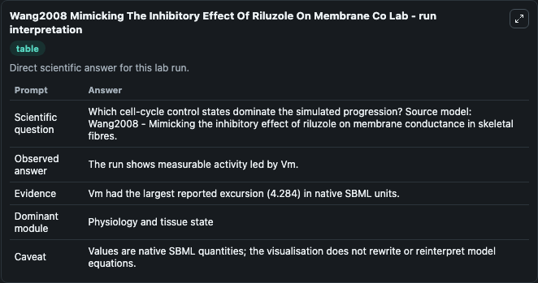
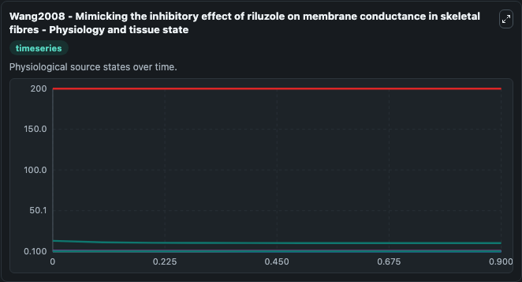
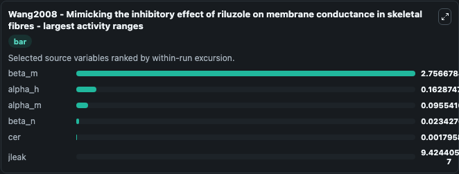
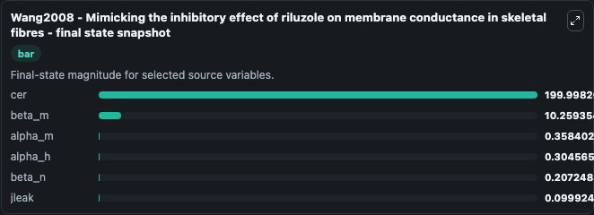
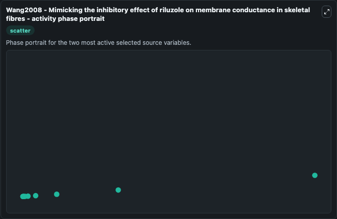

# Wang2008 Mimicking The Inhibitory Effect Of Riluzole On Membrane Co

This Biosimulant lab wraps `Wang2008 Mimicking The Inhibitory Effect Of Riluzole On Membrane Co` as a runnable systems biology model with a companion visualization module.
Wang2008 - Mimicking the inhibitory effect ofriluzole on membrane conductance in skeletal fibres This model is described in the article: Riluzole-induced block of voltage-gated Na+ current and activat. It can be used to explore the configured dynamics and compare scenario outcomes across configurations.

## What You'll See

The lab asks: Which cell-cycle control states dominate the simulated progression? Source model: Wang2008 - Mimicking the inhibitory effect of riluzole on membrane conductance in skeletal fibres. It runs for 1.0 time units with a communication step of 0.1. The run uses the model defaults declared by the curated SBML wrapper. The generated visualizations focus on cer, beta_m, alpha_h, alpha_m, beta_n, and jleak, combining trajectory, endpoint-comparison, and summary-table views from one completed dark-mode run.

In this captured run, **beta_m** moved from 13.016 to 10.259 across 1.0 simulation windows.


### Output Visualizations



*Summary table for Wang2008 Mimicking The Inhibitory Effect Of Riluzole On Membrane Co, reporting the scientific question, observed answer, dominant module, and caveat.*



*Trajectories of beta_m, alpha_h, alpha_m, beta_n, cer, and jleak across the 1.0 simulation. In this run **alpha_m** climbed from 0.2629 to 0.3584 and **beta_m** fell from 13.016 to 10.259 — the largest movements among the focused observables.*



*Largest-excursion ranking of the focused observables — the absolute movement magnitude during the run. Top 3: **beta_m** = 2.757, **alpha_h** = 0.1629, **alpha_m** = 0.0955, with 3 more observables below.*



*Endpoint snapshot of the focused observables — final values from the captured run. Top 3 by value: **cer** = 200.0, **beta_m** = 10.259, **alpha_m** = 0.3584, with 3 more observables below.*



*Visualization card from the Wang2008 Mimicking The Inhibitory Effect Of Riluzole On Membrane Co dark-mode run.*


## Model Context

- Core model: `models/core`
- Visualization model: `models/visualisation`
- Standard: `other`
- Upstream source: `biomodels_ebi:BIOMD0000000693`
- License: `CC0`

## Inputs

| Input | Maps To | Default | Notes |
|---|---|---|---|
| Stimulus Duration | `systemsbiology_sbml_wang2008_mimicking_the_inhibitory_effect_of_rilu_biomd0000000693_model.stimulus_duration` | | Source parameter exposed because its SBML label indicates a boundary, stimulus, dose, ligand, protocol, substrate, or environmental control. Maps to SBML symbol `Stimulus_Duration`. |
| Stimulus Magnitude | `systemsbiology_sbml_wang2008_mimicking_the_inhibitory_effect_of_rilu_biomd0000000693_model.stimulus_magnitude` | | Source parameter exposed because its SBML label indicates a boundary, stimulus, dose, ligand, protocol, substrate, or environmental control. Maps to SBML symbol `Stimulus_Magnitude`. |
| Stimulus Period | `systemsbiology_sbml_wang2008_mimicking_the_inhibitory_effect_of_rilu_biomd0000000693_model.stimulus_period` | | Source parameter exposed because its SBML label indicates a boundary, stimulus, dose, ligand, protocol, substrate, or environmental control. Maps to SBML symbol `Stimulus_Period`. |
| Stimulus Start | `systemsbiology_sbml_wang2008_mimicking_the_inhibitory_effect_of_rilu_biomd0000000693_model.stimulus_start` | | Source parameter exposed because its SBML label indicates a boundary, stimulus, dose, ligand, protocol, substrate, or environmental control. Maps to SBML symbol `Stimulus_Start`. |

## Outputs

| Output | Maps To | Role |
|---|---|---|
| `state` | `systemsbiology_sbml_wang2008_mimicking_the_inhibitory_effect_of_rilu_biomd0000000693_model.state` | Available to the visualization model and downstream workflows. |
| `summary` | `systemsbiology_sbml_wang2008_mimicking_the_inhibitory_effect_of_rilu_biomd0000000693_model.summary` | Available to the visualization model and downstream workflows. |
| `species_labels` | `systemsbiology_sbml_wang2008_mimicking_the_inhibitory_effect_of_rilu_biomd0000000693_model.species_labels` | Available to the visualization model and downstream workflows. |
| `cer` | `systemsbiology_sbml_wang2008_mimicking_the_inhibitory_effect_of_rilu_biomd0000000693_model.cer` | Available to the visualization model and downstream workflows. |
| `beta_m` | `systemsbiology_sbml_wang2008_mimicking_the_inhibitory_effect_of_rilu_biomd0000000693_model.beta_m` | Available to the visualization model and downstream workflows. |
| `alpha_h` | `systemsbiology_sbml_wang2008_mimicking_the_inhibitory_effect_of_rilu_biomd0000000693_model.alpha_h` | Available to the visualization model and downstream workflows. |
| `alpha_m` | `systemsbiology_sbml_wang2008_mimicking_the_inhibitory_effect_of_rilu_biomd0000000693_model.alpha_m` | Available to the visualization model and downstream workflows. |
| `beta_n` | `systemsbiology_sbml_wang2008_mimicking_the_inhibitory_effect_of_rilu_biomd0000000693_model.beta_n` | Available to the visualization model and downstream workflows. |
| `jleak` | `systemsbiology_sbml_wang2008_mimicking_the_inhibitory_effect_of_rilu_biomd0000000693_model.jleak` | Available to the visualization model and downstream workflows. |

## Runtime

- Duration: `1.0`
- Communication step: `0.1`

## Running Locally

```bash
biosimulant labs serve
```
