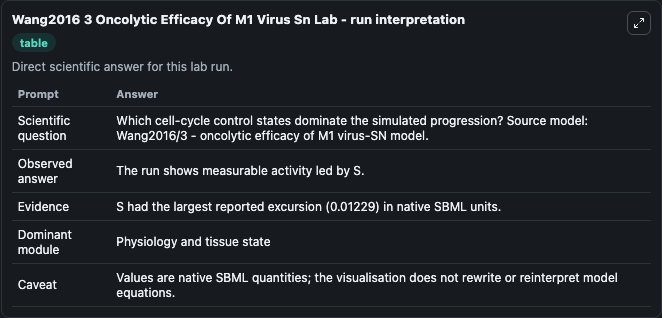
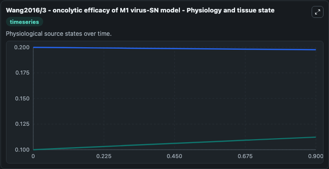
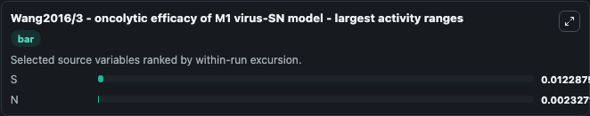
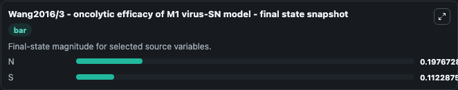
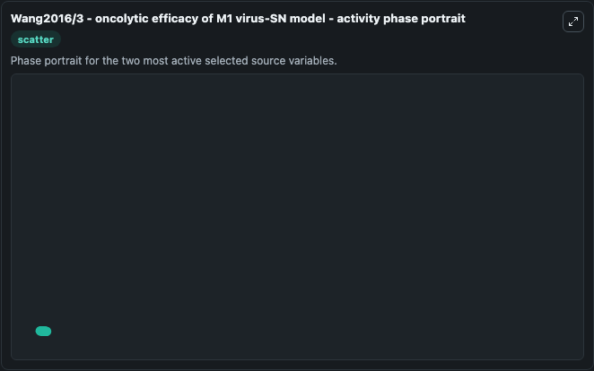

# Wang2016 3 Oncolytic Efficacy Of M1 Virus Sn

This Biosimulant lab wraps `Wang2016 3 Oncolytic Efficacy Of M1 Virus Sn` as a runnable systems biology model with a companion visualization module.
The paper describes a basic model of oncolytic virotherapy. It can be used to explore the configured dynamics and compare scenario outcomes across configurations.

## What You'll See

The lab asks: Which cell-cycle control states dominate the simulated progression? Source model: Wang2016/3 - oncolytic efficacy of M1 virus-SN model. It runs for 1.0 time units with a communication step of 0.1. The run uses the model defaults declared by the curated SBML wrapper. The generated visualizations focus on N, and S, combining trajectory, endpoint-comparison, and summary-table views from one completed dark-mode run.

In this captured run, **S** moved from 0.1000 to 0.1123 across 1.0 simulation windows.


### Output Visualizations



*Summary table for Wang2016 3 Oncolytic Efficacy Of M1 Virus Sn, reporting the scientific question, observed answer, dominant module, and caveat.*



*Trajectories of S, and N across the 1.0 simulation. In this run **S** climbed from 0.1000 to 0.1123 and **N** fell from 0.2000 to 0.1977 — the largest movements among the focused observables.*



*Largest-excursion ranking of the focused observables — the absolute movement magnitude during the run. Top 2: **S** = 0.0123, **N** = 0.00233.*



*Endpoint snapshot of the focused observables — final values from the captured run. Top 2 by value: **N** = 0.1977, **S** = 0.1123.*



*Visualization card from the Wang2016 3 Oncolytic Efficacy Of M1 Virus Sn dark-mode run.*


## Model Context

- Core model: `models/core`
- Visualization model: `models/visualisation`
- Standard: `other`
- Upstream source: `biomodels_ebi:BIOMD0000000782`
- License: `CC0`

## Inputs

| Input | Maps To | Default | Notes |
|---|---|---|---|
| Initial Model State N | `systemsbiology_sbml_wang2016_3_oncolytic_efficacy_of_m1_virus_sn_mod_biomd0000000782_model.initial_model_state_n` | | Source state initial condition exposed as a model-specific control because no explicit intervention parameter is identifiable. Maps to SBML symbol `N`. |
| Initial Model State S | `systemsbiology_sbml_wang2016_3_oncolytic_efficacy_of_m1_virus_sn_mod_biomd0000000782_model.initial_model_state_s` | | Source state initial condition exposed as a model-specific control because no explicit intervention parameter is identifiable. Maps to SBML symbol `S`. |

## Outputs

| Output | Maps To | Role |
|---|---|---|
| `state` | `systemsbiology_sbml_wang2016_3_oncolytic_efficacy_of_m1_virus_sn_mod_biomd0000000782_model.state` | Available to the visualization model and downstream workflows. |
| `summary` | `systemsbiology_sbml_wang2016_3_oncolytic_efficacy_of_m1_virus_sn_mod_biomd0000000782_model.summary` | Available to the visualization model and downstream workflows. |
| `species_labels` | `systemsbiology_sbml_wang2016_3_oncolytic_efficacy_of_m1_virus_sn_mod_biomd0000000782_model.species_labels` | Available to the visualization model and downstream workflows. |
| `model_state_n` | `systemsbiology_sbml_wang2016_3_oncolytic_efficacy_of_m1_virus_sn_mod_biomd0000000782_model.model_state_n` | Available to the visualization model and downstream workflows. |
| `model_state_s` | `systemsbiology_sbml_wang2016_3_oncolytic_efficacy_of_m1_virus_sn_mod_biomd0000000782_model.model_state_s` | Available to the visualization model and downstream workflows. |

## Runtime

- Duration: `1.0`
- Communication step: `0.1`

## Running Locally

```bash
biosimulant labs serve
```
