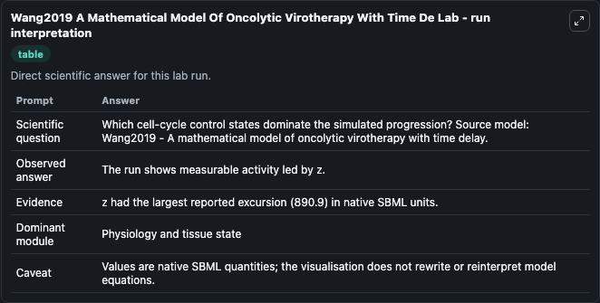
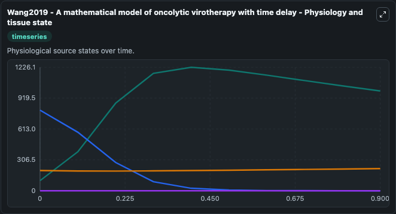
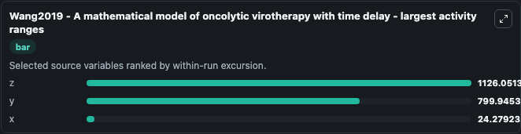
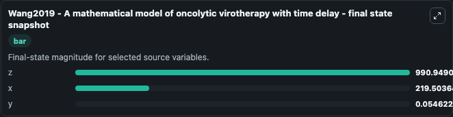
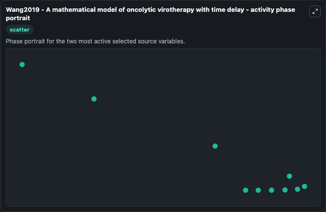

# Wang2019 A Mathematical Model Of Oncolytic Virotherapy With Time De (BIOMD0000000772)

This Biosimulant lab wraps `BIOMD0000000772 Wang2019 A Mathematical Model Of Oncolytic Virotherapy With Time De` as a runnable systems biology model with a companion visualization module.
A mathematical model describing oncolytic virotherapy with incorporation the viral lytic cycle and the virus-specific CTL response. It can be used to explore the configured dynamics and compare scenario outcomes across configurations.

## What You'll See

The lab asks: Which cell-cycle control states dominate the simulated progression? Source model: Wang2019 - A mathematical model of oncolytic virotherapy with time delay. It runs for 1.0 time units with a communication step of 0.1. The run uses the model defaults declared by the curated SBML wrapper. The generated visualizations focus on y, x, z, and I, combining trajectory, endpoint-comparison, and summary-table views from one completed dark-mode run.

In this captured run, **z** moved from 100.0 to 990.9 across 1.0 simulation windows.


### Output Visualizations



*Summary table for Wang2019 A Mathematical Model Of Oncolytic Virotherapy With Time De, reporting the scientific question, observed answer, dominant module, and caveat.*



*Trajectories of z, y, x, and I across the 1.0 simulation. In this run **z** climbed from 100.0 to 990.9 and **y** fell from 800.0 to 0.0546 — the largest movements among the focused observables.*



*Largest-excursion ranking of the focused observables — the absolute movement magnitude during the run. Top 3: **z** = 1126.1, **y** = 799.9, **x** = 24.279.*



*Endpoint snapshot of the focused observables — final values from the captured run. Top 3 by value: **z** = 990.9, **x** = 219.5, **y** = 0.0546.*



*Visualization card from the Wang2019 A Mathematical Model Of Oncolytic Virotherapy With Time De dark-mode run.*


## Model Context

- Core model: `models/core`
- Visualization model: `models/visualisation`
- Standard: `other`
- Upstream source: `biomodels_ebi:BIOMD0000000772`
- License: `CC0`

## Inputs

| Input | Maps To | Default | Notes |
|---|---|---|---|
| Initial Model State Y | `systemsbiology_sbml_wang2019_a_mathematical_model_of_oncolytic_virot_biomd0000000772_model.initial_model_state_y` | | Source state initial condition exposed as a model-specific control because no explicit intervention parameter is identifiable. Maps to SBML symbol `y`. |
| Initial Model State X | `systemsbiology_sbml_wang2019_a_mathematical_model_of_oncolytic_virot_biomd0000000772_model.initial_model_state_x` | | Source state initial condition exposed as a model-specific control because no explicit intervention parameter is identifiable. Maps to SBML symbol `x`. |
| Initial Model State Z | `systemsbiology_sbml_wang2019_a_mathematical_model_of_oncolytic_virot_biomd0000000772_model.initial_model_state_z` | | Source state initial condition exposed as a model-specific control because no explicit intervention parameter is identifiable. Maps to SBML symbol `z`. |
| Initial Model State I | `systemsbiology_sbml_wang2019_a_mathematical_model_of_oncolytic_virot_biomd0000000772_model.initial_model_state_i` | | Source state initial condition exposed as a model-specific control because no explicit intervention parameter is identifiable. Maps to SBML symbol `I`. |

## Outputs

| Output | Maps To | Role |
|---|---|---|
| `state` | `systemsbiology_sbml_wang2019_a_mathematical_model_of_oncolytic_virot_biomd0000000772_model.state` | Available to the visualization model and downstream workflows. |
| `summary` | `systemsbiology_sbml_wang2019_a_mathematical_model_of_oncolytic_virot_biomd0000000772_model.summary` | Available to the visualization model and downstream workflows. |
| `species_labels` | `systemsbiology_sbml_wang2019_a_mathematical_model_of_oncolytic_virot_biomd0000000772_model.species_labels` | Available to the visualization model and downstream workflows. |
| `model_state_y` | `systemsbiology_sbml_wang2019_a_mathematical_model_of_oncolytic_virot_biomd0000000772_model.model_state_y` | Available to the visualization model and downstream workflows. |
| `model_state_x` | `systemsbiology_sbml_wang2019_a_mathematical_model_of_oncolytic_virot_biomd0000000772_model.model_state_x` | Available to the visualization model and downstream workflows. |
| `model_state_z` | `systemsbiology_sbml_wang2019_a_mathematical_model_of_oncolytic_virot_biomd0000000772_model.model_state_z` | Available to the visualization model and downstream workflows. |
| `model_state_i` | `systemsbiology_sbml_wang2019_a_mathematical_model_of_oncolytic_virot_biomd0000000772_model.model_state_i` | Available to the visualization model and downstream workflows. |

## Runtime

- Duration: `1.0`
- Communication step: `0.1`

## Running Locally

```bash
biosimulant labs serve
```
