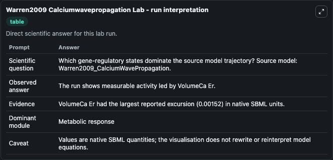
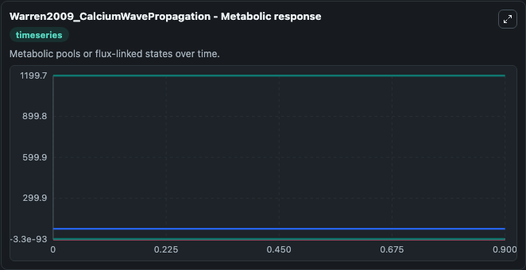
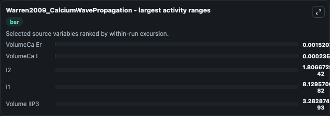
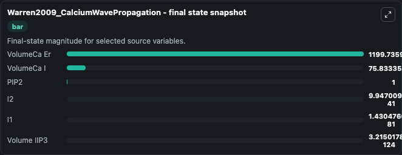
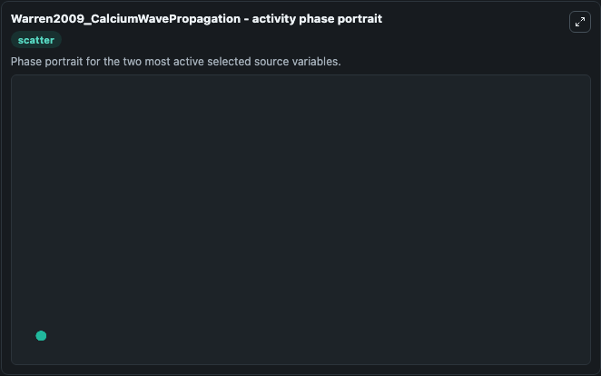

# Warren2009 Calciumwavepropagation

This Biosimulant lab wraps `Warren2009 Calciumwavepropagation` as a runnable systems biology model with a companion visualization module.
This a model from the article: Mathematical modelling of calcium wave propagation in mammalian airwayepithelium: evidence for regenerative ATP release. It can be used to explore the configured dynamics and compare scenario outcomes across configurations.

## What You'll See

The lab asks: Which gene-regulatory states dominate the source model trajectory? Source model: Warren2009_CalciumWavePropagation. It runs for 1.0 time units with a communication step of 0.1. The run uses the model defaults declared by the curated SBML wrapper. The generated visualizations focus on VolumeCa I, VolumeCa Er, Volume IIP3, PIP2, I2, and I1, combining trajectory, endpoint-comparison, and summary-table views from one completed dark-mode run.

In this captured run, **VolumeCa Er** moved from 1199.7 to 1199.7 across 1.0 simulation windows.


### Output Visualizations



*Summary table for Warren2009 Calciumwavepropagation, reporting the scientific question, observed answer, dominant module, and caveat.*



*Trajectories of VolumeCa Er, VolumeCa I, I2, I1, Volume IIP3, and PIP2 across the 1.0 simulation. In this run **Volume IIP3** climbed from -3.28e-93 to -3.22e-124 and **VolumeCa Er** fell from 1199.7 to 1199.7 — the largest movements among the focused observables.*



*Largest-excursion ranking of the focused observables — the absolute movement magnitude during the run. Top 3: **VolumeCa Er** = 0.00152, **VolumeCa I** = 0.000236, **I2** = 1.81e-42, with 2 more observables below.*



*Endpoint snapshot of the focused observables — final values from the captured run. Top 3 by value: **VolumeCa Er** = 1199.7, **VolumeCa I** = 75.833, **PIP2** = 1.000, with 3 more observables below.*



*Visualization card from the Warren2009 Calciumwavepropagation dark-mode run.*


## Model Context

- Core model: `models/core`
- Visualization model: `models/visualisation`
- Standard: `other`
- Upstream source: `biomodels_ebi:MODEL1006230018`
- License: `CC0`

## Inputs

| Input | Maps To | Default | Notes |
|---|---|---|---|
| Initial Volume Ca I | `systemsbiology_sbml_warren2009_calciumwavepropagation_model1006230018_model.initial_volume_ca_i` | | Source state initial condition exposed as a model-specific control because no explicit intervention parameter is identifiable. Maps to SBML symbol `volumeCa_i`. |
| Initial Volume Ca Er | `systemsbiology_sbml_warren2009_calciumwavepropagation_model1006230018_model.initial_volume_ca_er` | | Source state initial condition exposed as a model-specific control because no explicit intervention parameter is identifiable. Maps to SBML symbol `volumeCa_er`. |
| Initial Volume Iip3 | `systemsbiology_sbml_warren2009_calciumwavepropagation_model1006230018_model.initial_volume_iip3` | | Source state initial condition exposed as a model-specific control because no explicit intervention parameter is identifiable. Maps to SBML symbol `volume_iIP3`. |
| Initial Pip2 | `systemsbiology_sbml_warren2009_calciumwavepropagation_model1006230018_model.initial_pip2` | | Source state initial condition exposed as a model-specific control because no explicit intervention parameter is identifiable. Maps to SBML symbol `PIP2`. |
| Initial Model State I2 | `systemsbiology_sbml_warren2009_calciumwavepropagation_model1006230018_model.initial_model_state_i2` | | Source state initial condition exposed as a model-specific control because no explicit intervention parameter is identifiable. Maps to SBML symbol `I2`. |
| Initial Model State I1 | `systemsbiology_sbml_warren2009_calciumwavepropagation_model1006230018_model.initial_model_state_i1` | | Source state initial condition exposed as a model-specific control because no explicit intervention parameter is identifiable. Maps to SBML symbol `I1`. |

## Outputs

| Output | Maps To | Role |
|---|---|---|
| `state` | `systemsbiology_sbml_warren2009_calciumwavepropagation_model1006230018_model.state` | Available to the visualization model and downstream workflows. |
| `summary` | `systemsbiology_sbml_warren2009_calciumwavepropagation_model1006230018_model.summary` | Available to the visualization model and downstream workflows. |
| `species_labels` | `systemsbiology_sbml_warren2009_calciumwavepropagation_model1006230018_model.species_labels` | Available to the visualization model and downstream workflows. |
| `volume_ca_i` | `systemsbiology_sbml_warren2009_calciumwavepropagation_model1006230018_model.volume_ca_i` | Available to the visualization model and downstream workflows. |
| `volume_ca_er` | `systemsbiology_sbml_warren2009_calciumwavepropagation_model1006230018_model.volume_ca_er` | Available to the visualization model and downstream workflows. |
| `volume_iip3` | `systemsbiology_sbml_warren2009_calciumwavepropagation_model1006230018_model.volume_iip3` | Available to the visualization model and downstream workflows. |
| `pip2` | `systemsbiology_sbml_warren2009_calciumwavepropagation_model1006230018_model.pip2` | Available to the visualization model and downstream workflows. |
| `model_state_i2` | `systemsbiology_sbml_warren2009_calciumwavepropagation_model1006230018_model.model_state_i2` | Available to the visualization model and downstream workflows. |
| `model_state_i1` | `systemsbiology_sbml_warren2009_calciumwavepropagation_model1006230018_model.model_state_i1` | Available to the visualization model and downstream workflows. |

## Runtime

- Duration: `1.0`
- Communication step: `0.1`

## Running Locally

```bash
biosimulant labs serve
```
