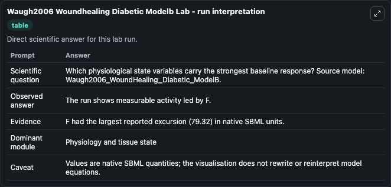
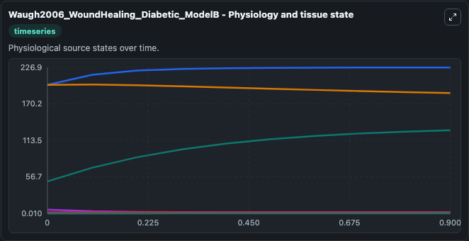
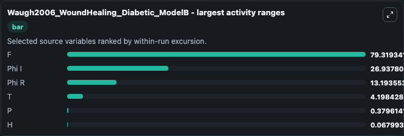
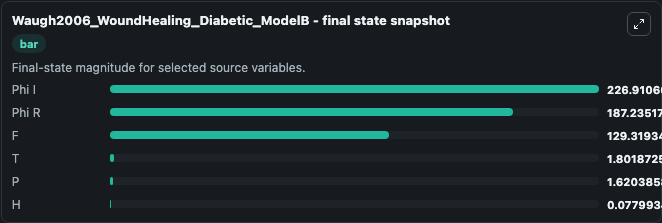
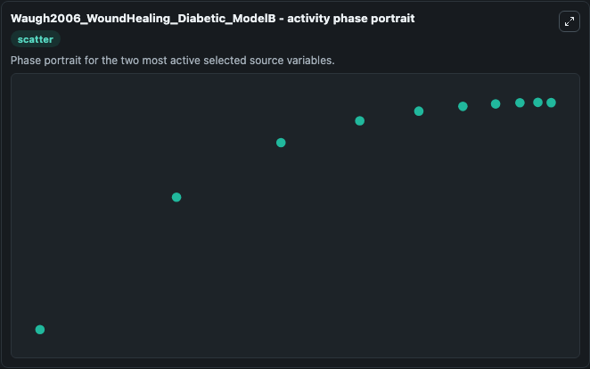

# Waugh2006 Woundhealing Diabetic Modelb

This Biosimulant lab wraps `Waugh2006 Woundhealing Diabetic Modelb` as a runnable systems biology model with a companion visualization module.
This a model from the article: Modeling the effects of treating diabetic wounds with engineered skinsubstitutes. It can be used to explore the configured dynamics and compare scenario outcomes across configurations.

## What You'll See

The lab asks: Which physiological state variables carry the strongest baseline response? Source model: Waugh2006_WoundHealing_Diabetic_ModelB. It runs for 1.0 time units with a communication step of 0.1. The run uses the model defaults declared by the curated SBML wrapper. The generated visualizations focus on Phi R, Phi I, T, P, H, and F, combining trajectory, endpoint-comparison, and summary-table views from one completed dark-mode run.

In this captured run, **F** moved from 50.000 to 129.3 across 1.0 simulation windows.


### Output Visualizations



*Summary table for Waugh2006 Woundhealing Diabetic Modelb, reporting the scientific question, observed answer, dominant module, and caveat.*



*Trajectories of F, Phi I, Phi R, T, P, and H across the 1.0 simulation. In this run **F** climbed from 50.000 to 129.3 and **Phi R** fell from 200.0 to 187.2 — the largest movements among the focused observables.*



*Largest-excursion ranking of the focused observables — the absolute movement magnitude during the run. Top 3: **F** = 79.319, **Phi I** = 26.938, **Phi R** = 13.194, with 3 more observables below.*



*Endpoint snapshot of the focused observables — final values from the captured run. Top 3 by value: **Phi I** = 226.9, **Phi R** = 187.2, **F** = 129.3, with 3 more observables below.*



*Visualization card from the Waugh2006 Woundhealing Diabetic Modelb dark-mode run.*


## Model Context

- Core model: `models/core`
- Visualization model: `models/visualisation`
- Standard: `other`
- Upstream source: `biomodels_ebi:MODEL1006230003`
- License: `CC0`

## Inputs

| Input | Maps To | Default | Notes |
|---|---|---|---|
| Initial Phi R | `systemsbiology_sbml_waugh2006_woundhealing_diabetic_modelb_model1006230003_model.initial_phi_r` | | Source state initial condition exposed as a model-specific control because no explicit intervention parameter is identifiable. Maps to SBML symbol `phi_R`. |
| Initial Phi I | `systemsbiology_sbml_waugh2006_woundhealing_diabetic_modelb_model1006230003_model.initial_phi_i` | | Source state initial condition exposed as a model-specific control because no explicit intervention parameter is identifiable. Maps to SBML symbol `phi_I`. |
| Initial Model State T | `systemsbiology_sbml_waugh2006_woundhealing_diabetic_modelb_model1006230003_model.initial_model_state_t` | | Source state initial condition exposed as a model-specific control because no explicit intervention parameter is identifiable. Maps to SBML symbol `T`. |
| Initial Model State P | `systemsbiology_sbml_waugh2006_woundhealing_diabetic_modelb_model1006230003_model.initial_model_state_p` | | Source state initial condition exposed as a model-specific control because no explicit intervention parameter is identifiable. Maps to SBML symbol `P`. |
| Initial Model State H | `systemsbiology_sbml_waugh2006_woundhealing_diabetic_modelb_model1006230003_model.initial_model_state_h` | | Source state initial condition exposed as a model-specific control because no explicit intervention parameter is identifiable. Maps to SBML symbol `H`. |
| Initial Model State F | `systemsbiology_sbml_waugh2006_woundhealing_diabetic_modelb_model1006230003_model.initial_model_state_f` | | Source state initial condition exposed as a model-specific control because no explicit intervention parameter is identifiable. Maps to SBML symbol `F`. |

## Outputs

| Output | Maps To | Role |
|---|---|---|
| `state` | `systemsbiology_sbml_waugh2006_woundhealing_diabetic_modelb_model1006230003_model.state` | Available to the visualization model and downstream workflows. |
| `summary` | `systemsbiology_sbml_waugh2006_woundhealing_diabetic_modelb_model1006230003_model.summary` | Available to the visualization model and downstream workflows. |
| `species_labels` | `systemsbiology_sbml_waugh2006_woundhealing_diabetic_modelb_model1006230003_model.species_labels` | Available to the visualization model and downstream workflows. |
| `phi_r` | `systemsbiology_sbml_waugh2006_woundhealing_diabetic_modelb_model1006230003_model.phi_r` | Available to the visualization model and downstream workflows. |
| `phi_i` | `systemsbiology_sbml_waugh2006_woundhealing_diabetic_modelb_model1006230003_model.phi_i` | Available to the visualization model and downstream workflows. |
| `model_state_t` | `systemsbiology_sbml_waugh2006_woundhealing_diabetic_modelb_model1006230003_model.model_state_t` | Available to the visualization model and downstream workflows. |
| `model_state_p` | `systemsbiology_sbml_waugh2006_woundhealing_diabetic_modelb_model1006230003_model.model_state_p` | Available to the visualization model and downstream workflows. |
| `model_state_h` | `systemsbiology_sbml_waugh2006_woundhealing_diabetic_modelb_model1006230003_model.model_state_h` | Available to the visualization model and downstream workflows. |
| `model_state_f` | `systemsbiology_sbml_waugh2006_woundhealing_diabetic_modelb_model1006230003_model.model_state_f` | Available to the visualization model and downstream workflows. |

## Runtime

- Duration: `1.0`
- Communication step: `0.1`

## Running Locally

```bash
biosimulant labs serve
```
