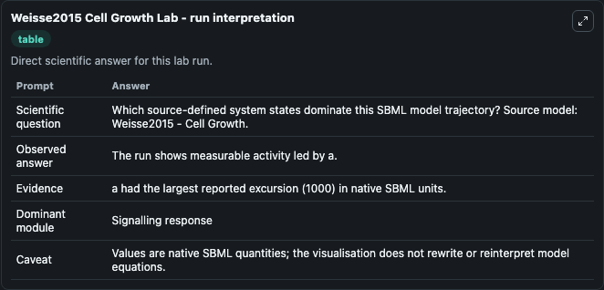
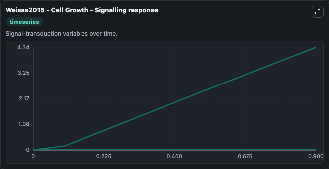

# Weisse2015 Cell Growth

This Biosimulant lab wraps `Weisse2015 Cell Growth` as a runnable systems biology model with a companion visualization module.
Systems Biology Weisse2015Cell Growth Model1502270000Model captures systems biology weisse2015 cell growth model1502270000 behavior in the context of systemsbiology, sbml, biomodels_ebi using a biomodels_ebi-sou. It can be used to explore the configured dynamics and compare scenario outcomes across configurations.

## What You'll See

The lab asks: Which source-defined system states dominate this SBML model trajectory? Source model: Weisse2015 - Cell Growth. It runs for 1.0 time units with a communication step of 0.1. The run uses the model defaults declared by the curated SBML wrapper. The generated visualizations focus on Zmt, Zmr, Zmq, Zmp, Zmm, and Si, combining trajectory, endpoint-comparison, and summary-table views from one completed dark-mode run.

In this captured run, **Si** moved from 0 to 4.335 across 1.0 simulation windows.


### Output Visualizations



*Summary table for Weisse2015 Cell Growth, reporting the scientific question, observed answer, dominant module, and caveat.*



*Trajectories of Si, Zmt, Zmr, Zmq, Zmp, and Zmm across the 1.0 simulation. In this run **Si** climbed from 0 to 4.335 — the largest movements among the focused observables.*


*Largest-excursion ranking of the focused observables — the absolute movement magnitude during the run. Top 1: **Si** = 4.335.*


*Endpoint snapshot of the focused observables — final values from the captured run. Top 1 by value: **Si** = 4.335.*


## Model Context

- Core model: `models/core`
- Visualization model: `models/visualisation`
- Standard: `other`
- Upstream source: `biomodels_ebi:MODEL1502270000`
- License: `CC0`

## Inputs

| Input | Maps To | Default | Notes |
|---|---|---|---|
| Initial Model State Zmt | `systemsbiology_sbml_weisse2015_cell_growth_model1502270000_model.initial_model_state_zmt` | | Source state initial condition exposed as a model-specific control because no explicit intervention parameter is identifiable. Maps to SBML symbol `zmt`. |
| Initial Model State Zmr | `systemsbiology_sbml_weisse2015_cell_growth_model1502270000_model.initial_model_state_zmr` | | Source state initial condition exposed as a model-specific control because no explicit intervention parameter is identifiable. Maps to SBML symbol `zmr`. |
| Initial Model State Zmq | `systemsbiology_sbml_weisse2015_cell_growth_model1502270000_model.initial_model_state_zmq` | | Source state initial condition exposed as a model-specific control because no explicit intervention parameter is identifiable. Maps to SBML symbol `zmq`. |
| Initial Model State Zmp | `systemsbiology_sbml_weisse2015_cell_growth_model1502270000_model.initial_model_state_zmp` | | Source state initial condition exposed as a model-specific control because no explicit intervention parameter is identifiable. Maps to SBML symbol `zmp`. |
| Initial Model State Zmm | `systemsbiology_sbml_weisse2015_cell_growth_model1502270000_model.initial_model_state_zmm` | | Source state initial condition exposed as a model-specific control because no explicit intervention parameter is identifiable. Maps to SBML symbol `zmm`. |
| Initial Model State Si | `systemsbiology_sbml_weisse2015_cell_growth_model1502270000_model.initial_model_state_si` | | Source state initial condition exposed as a model-specific control because no explicit intervention parameter is identifiable. Maps to SBML symbol `si`. |

## Outputs

| Output | Maps To | Role |
|---|---|---|
| `state` | `systemsbiology_sbml_weisse2015_cell_growth_model1502270000_model.state` | Available to the visualization model and downstream workflows. |
| `summary` | `systemsbiology_sbml_weisse2015_cell_growth_model1502270000_model.summary` | Available to the visualization model and downstream workflows. |
| `species_labels` | `systemsbiology_sbml_weisse2015_cell_growth_model1502270000_model.species_labels` | Available to the visualization model and downstream workflows. |
| `zmt` | `systemsbiology_sbml_weisse2015_cell_growth_model1502270000_model.zmt` | Available to the visualization model and downstream workflows. |
| `zmr` | `systemsbiology_sbml_weisse2015_cell_growth_model1502270000_model.zmr` | Available to the visualization model and downstream workflows. |
| `zmq` | `systemsbiology_sbml_weisse2015_cell_growth_model1502270000_model.zmq` | Available to the visualization model and downstream workflows. |
| `zmp` | `systemsbiology_sbml_weisse2015_cell_growth_model1502270000_model.zmp` | Available to the visualization model and downstream workflows. |
| `zmm` | `systemsbiology_sbml_weisse2015_cell_growth_model1502270000_model.zmm` | Available to the visualization model and downstream workflows. |
| `model_state_si` | `systemsbiology_sbml_weisse2015_cell_growth_model1502270000_model.model_state_si` | Available to the visualization model and downstream workflows. |

## Runtime

- Duration: `1.0`
- Communication step: `0.1`

## Running Locally

```bash
biosimulant labs serve
```
