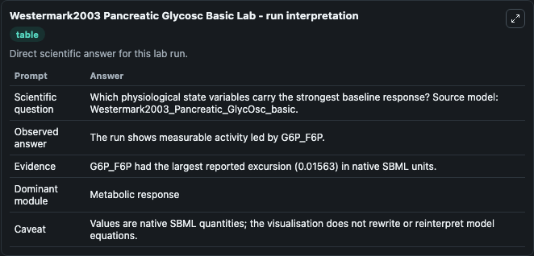
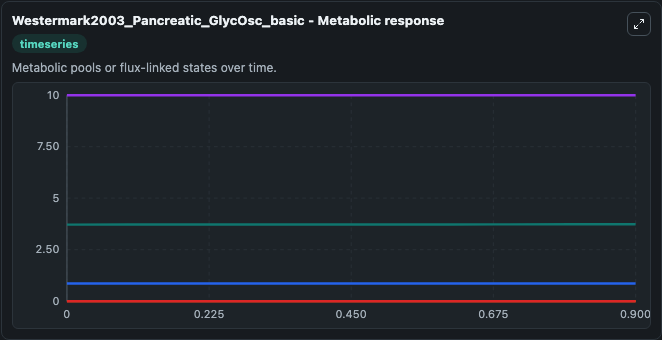
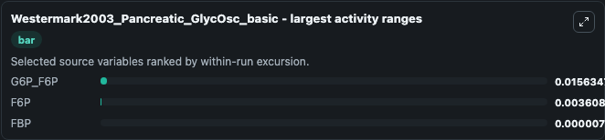
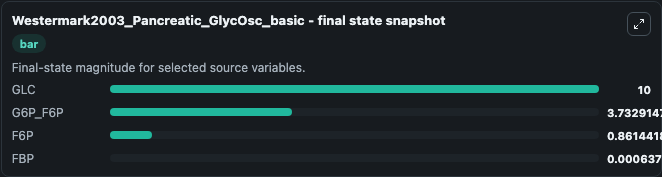
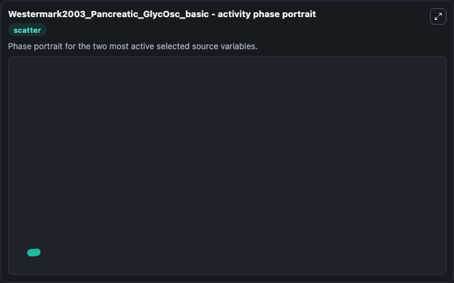

# Westermark2003 Pancreatic Glycosc Basic

This Biosimulant lab wraps `Westermark2003 Pancreatic Glycosc Basic` as a runnable systems biology model with a companion visualization module.
This is the basic model described in eq. 1 of the article: A model of phosphofructokinase and glycolytic oscillations in the pancreatic beta-cell. It can be used to explore the configured dynamics and compare scenario outcomes across configurations.

## What You'll See

The lab asks: Which physiological state variables carry the strongest baseline response? Source model: Westermark2003_Pancreatic_GlycOsc_basic. It runs for 1.0 time units with a communication step of 0.1. The run uses the model defaults declared by the curated SBML wrapper. The generated visualizations focus on G6P_F6P, GLC, FBP, G3P, and F6P, combining trajectory, endpoint-comparison, and summary-table views from one completed dark-mode run.

In this captured run, **G6P_F6P** moved from 3.717 to 3.733 across 1.0 simulation windows.


### Output Visualizations



*Summary table for Westermark2003 Pancreatic Glycosc Basic, reporting the scientific question, observed answer, dominant module, and caveat.*



*Trajectories of G6P_F6P, F6P, FBP, GLC, and G3P across the 1.0 simulation. In this run **G6P_F6P** climbed from 3.717 to 3.733 — the largest movements among the focused observables.*



*Largest-excursion ranking of the focused observables — the absolute movement magnitude during the run. Top 3: **G6P_F6P** = 0.0156, **F6P** = 0.00361, **FBP** = 7.61e-06.*



*Endpoint snapshot of the focused observables — final values from the captured run. Top 3 by value: **GLC** = 10.000, **G6P_F6P** = 3.733, **F6P** = 0.8614, with 1 more observable below.*



*Visualization card from the Westermark2003 Pancreatic Glycosc Basic dark-mode run.*


## Model Context

- Core model: `models/core`
- Visualization model: `models/visualisation`
- Standard: `other`
- Upstream source: `biomodels_ebi:BIOMD0000000225`
- License: `CC0`

## Inputs

| Input | Maps To | Default | Notes |
|---|---|---|---|
| Initial G6 P F6 P | `systemsbiology_sbml_westermark2003_pancreatic_glycosc_basic_biomd0000000225_model.initial_g6_p_f6_p` | | Source state initial condition exposed as a model-specific control because no explicit intervention parameter is identifiable. Maps to SBML symbol `G6P_F6P`. |
| Initial Model State Glc | `systemsbiology_sbml_westermark2003_pancreatic_glycosc_basic_biomd0000000225_model.initial_model_state_glc` | | Source state initial condition exposed as a model-specific control because no explicit intervention parameter is identifiable. Maps to SBML symbol `GLC`. |
| Initial Model State Fbp | `systemsbiology_sbml_westermark2003_pancreatic_glycosc_basic_biomd0000000225_model.initial_model_state_fbp` | | Source state initial condition exposed as a model-specific control because no explicit intervention parameter is identifiable. Maps to SBML symbol `FBP`. |
| Initial G3 P | `systemsbiology_sbml_westermark2003_pancreatic_glycosc_basic_biomd0000000225_model.initial_g3_p` | | Source state initial condition exposed as a model-specific control because no explicit intervention parameter is identifiable. Maps to SBML symbol `G3P`. |
| Initial F6 P | `systemsbiology_sbml_westermark2003_pancreatic_glycosc_basic_biomd0000000225_model.initial_f6_p` | | Source state initial condition exposed as a model-specific control because no explicit intervention parameter is identifiable. Maps to SBML symbol `F6P`. |

## Outputs

| Output | Maps To | Role |
|---|---|---|
| `state` | `systemsbiology_sbml_westermark2003_pancreatic_glycosc_basic_biomd0000000225_model.state` | Available to the visualization model and downstream workflows. |
| `summary` | `systemsbiology_sbml_westermark2003_pancreatic_glycosc_basic_biomd0000000225_model.summary` | Available to the visualization model and downstream workflows. |
| `species_labels` | `systemsbiology_sbml_westermark2003_pancreatic_glycosc_basic_biomd0000000225_model.species_labels` | Available to the visualization model and downstream workflows. |
| `g6_p_f6_p` | `systemsbiology_sbml_westermark2003_pancreatic_glycosc_basic_biomd0000000225_model.g6_p_f6_p` | Available to the visualization model and downstream workflows. |
| `glc` | `systemsbiology_sbml_westermark2003_pancreatic_glycosc_basic_biomd0000000225_model.glc` | Available to the visualization model and downstream workflows. |
| `fbp` | `systemsbiology_sbml_westermark2003_pancreatic_glycosc_basic_biomd0000000225_model.fbp` | Available to the visualization model and downstream workflows. |
| `g3_p` | `systemsbiology_sbml_westermark2003_pancreatic_glycosc_basic_biomd0000000225_model.g3_p` | Available to the visualization model and downstream workflows. |
| `f6_p` | `systemsbiology_sbml_westermark2003_pancreatic_glycosc_basic_biomd0000000225_model.f6_p` | Available to the visualization model and downstream workflows. |

## Runtime

- Duration: `1.0`
- Communication step: `0.1`

## Running Locally

```bash
biosimulant labs serve
```
