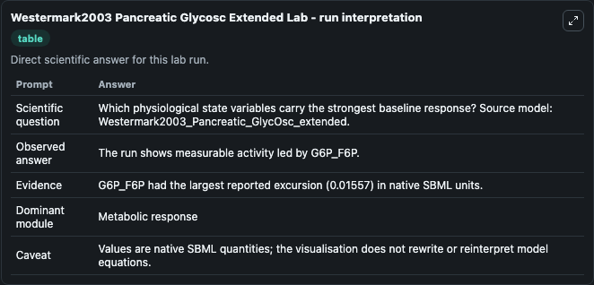
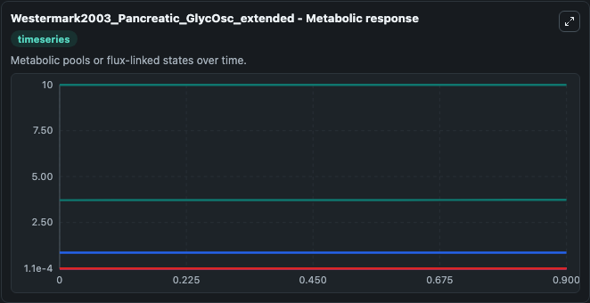
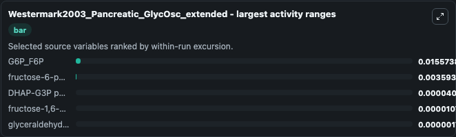
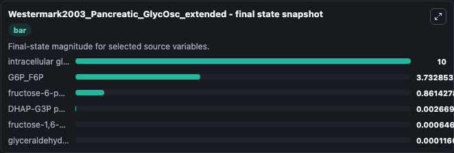
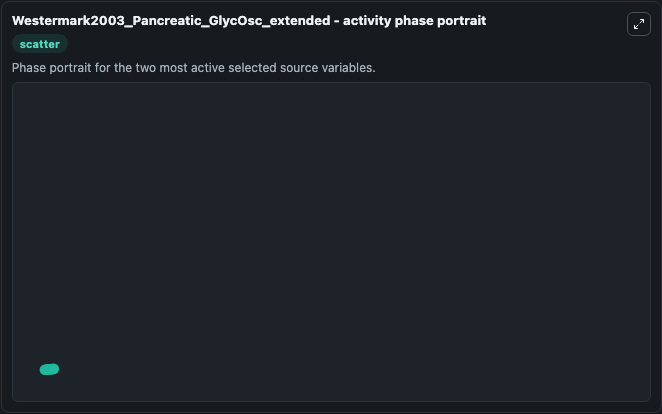

# Westermark2003 Pancreatic Glycosc Extended

This Biosimulant lab wraps `Westermark2003 Pancreatic Glycosc Extended` as a runnable systems biology model with a companion visualization module.
This is the extended model described in eq. 2 of the article: A model of phosphofructokinase and glycolytic oscillations in the pancreatic beta-cell. It can be used to explore the configured dynamics and compare scenario outcomes across configurations.

## What You'll See

The lab asks: Which physiological state variables carry the strongest baseline response? Source model: Westermark2003_Pancreatic_GlycOsc_extended. It runs for 1.0 time units with a communication step of 0.1. The run uses the model defaults declared by the curated SBML wrapper. The generated visualizations focus on intracellular glucose, G6P_F6P, DHAP-G3P pool, fructose-1,6-biphosphate, glyceraldehyde--phosphate, and fructose-6-phosphate, combining trajectory, endpoint-comparison, and summary-table views from one completed dark-mode run.

In this captured run, **G6P_F6P** moved from 3.717 to 3.733 across 1.0 simulation windows.


### Output Visualizations



*Summary table for Westermark2003 Pancreatic Glycosc Extended, reporting the scientific question, observed answer, dominant module, and caveat.*



*Trajectories of G6P_F6P, fructose-6-phosphate, DHAP-G3P pool, fructose-1,6-biphosphate, glyceraldehyde--phosphate, and intracellular glucose across the 1.0 simulation. In this run **G6P_F6P** climbed from 3.717 to 3.733 — the largest movements among the focused observables.*



*Largest-excursion ranking of the focused observables — the absolute movement magnitude during the run. Top 3: **G6P_F6P** = 0.0156, **fructose-6-phosphate** = 0.00359, **DHAP-G3P pool** = 4.01e-05, with 2 more observables below.*



*Endpoint snapshot of the focused observables — final values from the captured run. Top 3 by value: **intracellular glucose** = 10.000, **G6P_F6P** = 3.733, **fructose-6-phosphate** = 0.8614, with 3 more observables below.*



*Visualization card from the Westermark2003 Pancreatic Glycosc Extended dark-mode run.*


## Model Context

- Core model: `models/core`
- Visualization model: `models/visualisation`
- Standard: `other`
- Upstream source: `biomodels_ebi:BIOMD0000000236`
- License: `CC0`

## Inputs

| Input | Maps To | Default | Notes |
|---|---|---|---|
| Initial Intracellular Glucose | `systemsbiology_sbml_westermark2003_pancreatic_glycosc_extended_biomd0000000236_model.initial_intracellular_glucose` | | Source state initial condition exposed as a model-specific control because no explicit intervention parameter is identifiable. Maps to SBML symbol `GLC`. |
| Initial G6 P F6 P | `systemsbiology_sbml_westermark2003_pancreatic_glycosc_extended_biomd0000000236_model.initial_g6_p_f6_p` | | Source state initial condition exposed as a model-specific control because no explicit intervention parameter is identifiable. Maps to SBML symbol `G6P_F6P`. |
| Initial Dhap G3 P Pool | `systemsbiology_sbml_westermark2003_pancreatic_glycosc_extended_biomd0000000236_model.initial_dhap_g3_p_pool` | | Source state initial condition exposed as a model-specific control because no explicit intervention parameter is identifiable. Maps to SBML symbol `DHAP_G3P`. |
| Initial Fructose 1 6 Biphosphate | `systemsbiology_sbml_westermark2003_pancreatic_glycosc_extended_biomd0000000236_model.initial_fructose_1_6_biphosphate` | | Source state initial condition exposed as a model-specific control because no explicit intervention parameter is identifiable. Maps to SBML symbol `FBP`. |
| Initial Glyceraldehyde Phosphate | `systemsbiology_sbml_westermark2003_pancreatic_glycosc_extended_biomd0000000236_model.initial_glyceraldehyde_phosphate` | | Source state initial condition exposed as a model-specific control because no explicit intervention parameter is identifiable. Maps to SBML symbol `G3P`. |
| Initial Fructose 6 Phosphate | `systemsbiology_sbml_westermark2003_pancreatic_glycosc_extended_biomd0000000236_model.initial_fructose_6_phosphate` | | Source state initial condition exposed as a model-specific control because no explicit intervention parameter is identifiable. Maps to SBML symbol `F6P`. |

## Outputs

| Output | Maps To | Role |
|---|---|---|
| `state` | `systemsbiology_sbml_westermark2003_pancreatic_glycosc_extended_biomd0000000236_model.state` | Available to the visualization model and downstream workflows. |
| `summary` | `systemsbiology_sbml_westermark2003_pancreatic_glycosc_extended_biomd0000000236_model.summary` | Available to the visualization model and downstream workflows. |
| `species_labels` | `systemsbiology_sbml_westermark2003_pancreatic_glycosc_extended_biomd0000000236_model.species_labels` | Available to the visualization model and downstream workflows. |
| `intracellular_glucose` | `systemsbiology_sbml_westermark2003_pancreatic_glycosc_extended_biomd0000000236_model.intracellular_glucose` | Available to the visualization model and downstream workflows. |
| `g6_p_f6_p` | `systemsbiology_sbml_westermark2003_pancreatic_glycosc_extended_biomd0000000236_model.g6_p_f6_p` | Available to the visualization model and downstream workflows. |
| `dhap_g3_p_pool` | `systemsbiology_sbml_westermark2003_pancreatic_glycosc_extended_biomd0000000236_model.dhap_g3_p_pool` | Available to the visualization model and downstream workflows. |
| `fructose_1_6_biphosphate` | `systemsbiology_sbml_westermark2003_pancreatic_glycosc_extended_biomd0000000236_model.fructose_1_6_biphosphate` | Available to the visualization model and downstream workflows. |
| `glyceraldehyde_phosphate` | `systemsbiology_sbml_westermark2003_pancreatic_glycosc_extended_biomd0000000236_model.glyceraldehyde_phosphate` | Available to the visualization model and downstream workflows. |
| `fructose_6_phosphate` | `systemsbiology_sbml_westermark2003_pancreatic_glycosc_extended_biomd0000000236_model.fructose_6_phosphate` | Available to the visualization model and downstream workflows. |

## Runtime

- Duration: `1.0`
- Communication step: `0.1`

## Running Locally

```bash
biosimulant labs serve
```
