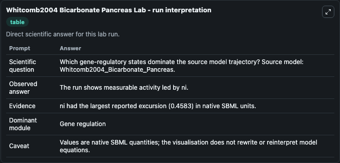
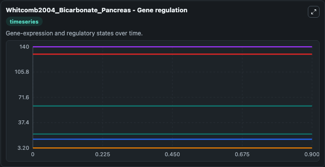
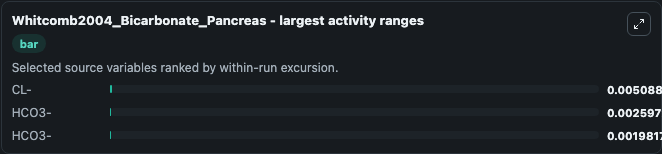
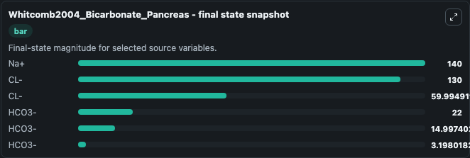
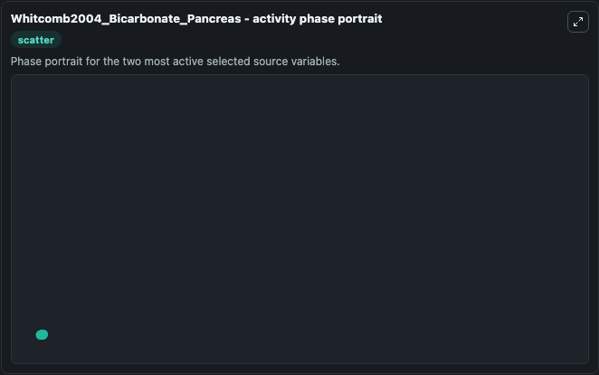

# Whitcomb2004 Bicarbonate Pancreas

This Biosimulant lab wraps `Whitcomb2004 Bicarbonate Pancreas` as a runnable systems biology model with a companion visualization module.
A mathematical model of the pancreatic duct cell generating high bicarbonate concentrations in pancreatic juice David C Whitcomb, G Bard Ermentrout, Pancreas 2004 29:e30-40; PubMedID: 15257112 Abstrac. It can be used to explore the configured dynamics and compare scenario outcomes across configurations.

## What You'll See

The lab asks: Which gene-regulatory states dominate the source model trajectory? Source model: Whitcomb2004_Bicarbonate_Pancreas. It runs for 1.0 time units with a communication step of 0.1. The run uses the model defaults declared by the curated SBML wrapper. The generated visualizations focus on Na+, CL-, and HCO3-, combining trajectory, endpoint-comparison, and summary-table views from one completed dark-mode run.

In this captured run, **CL-** moved from 60.000 to 59.995 across 1.0 simulation windows.


### Output Visualizations



*Summary table for Whitcomb2004 Bicarbonate Pancreas, reporting the scientific question, observed answer, dominant module, and caveat.*



*Trajectories of CL-, HCO3-, HCO3-, Na+, CL-, and HCO3- across the 1.0 simulation. In this run **CL-** fell from 60.000 to 59.995 — the largest movements among the focused observables.*



*Largest-excursion ranking of the focused observables — the absolute movement magnitude during the run. Top 3: **CL-** = 0.00509, **HCO3-** = 0.0026, **HCO3-** = 0.00198.*



*Endpoint snapshot of the focused observables — final values from the captured run. Top 3 by value: **Na+** = 140.0, **CL-** = 130.0, **CL-** = 59.995, with 3 more observables below.*



*Visualization card from the Whitcomb2004 Bicarbonate Pancreas dark-mode run.*


## Model Context

- Core model: `models/core`
- Visualization model: `models/visualisation`
- Standard: `other`
- Upstream source: `biomodels_ebi:BIOMD0000000327`
- License: `CC0`

## Inputs

| Input | Maps To | Default | Notes |
|---|---|---|---|
| Initial Model State Na | `systemsbiology_sbml_whitcomb2004_bicarbonate_pancreas_biomd0000000327_model.initial_model_state_na` | | Source state initial condition exposed as a model-specific control because no explicit intervention parameter is identifiable. Maps to SBML symbol `nb`. |
| Initial Model State Cl | `systemsbiology_sbml_whitcomb2004_bicarbonate_pancreas_biomd0000000327_model.initial_model_state_cl` | | Source state initial condition exposed as a model-specific control because no explicit intervention parameter is identifiable. Maps to SBML symbol `cb`. |
| Initial Model State Cl 2 | `systemsbiology_sbml_whitcomb2004_bicarbonate_pancreas_biomd0000000327_model.initial_model_state_cl_2` | | Source state initial condition exposed as a model-specific control because no explicit intervention parameter is identifiable. Maps to SBML symbol `ci`. |
| Initial Hco3 | `systemsbiology_sbml_whitcomb2004_bicarbonate_pancreas_biomd0000000327_model.initial_hco3` | | Source state initial condition exposed as a model-specific control because no explicit intervention parameter is identifiable. Maps to SBML symbol `bl`. |
| Initial Hco3 2 | `systemsbiology_sbml_whitcomb2004_bicarbonate_pancreas_biomd0000000327_model.initial_hco3_2` | | Source state initial condition exposed as a model-specific control because no explicit intervention parameter is identifiable. Maps to SBML symbol `bb`. |
| Initial Hco3 3 | `systemsbiology_sbml_whitcomb2004_bicarbonate_pancreas_biomd0000000327_model.initial_hco3_3` | | Source state initial condition exposed as a model-specific control because no explicit intervention parameter is identifiable. Maps to SBML symbol `bi`. |

## Outputs

| Output | Maps To | Role |
|---|---|---|
| `state` | `systemsbiology_sbml_whitcomb2004_bicarbonate_pancreas_biomd0000000327_model.state` | Available to the visualization model and downstream workflows. |
| `summary` | `systemsbiology_sbml_whitcomb2004_bicarbonate_pancreas_biomd0000000327_model.summary` | Available to the visualization model and downstream workflows. |
| `species_labels` | `systemsbiology_sbml_whitcomb2004_bicarbonate_pancreas_biomd0000000327_model.species_labels` | Available to the visualization model and downstream workflows. |
| `model_state_na` | `systemsbiology_sbml_whitcomb2004_bicarbonate_pancreas_biomd0000000327_model.model_state_na` | Available to the visualization model and downstream workflows. |
| `model_state_cl` | `systemsbiology_sbml_whitcomb2004_bicarbonate_pancreas_biomd0000000327_model.model_state_cl` | Available to the visualization model and downstream workflows. |
| `model_state_cl_2` | `systemsbiology_sbml_whitcomb2004_bicarbonate_pancreas_biomd0000000327_model.model_state_cl_2` | Available to the visualization model and downstream workflows. |
| `hco3` | `systemsbiology_sbml_whitcomb2004_bicarbonate_pancreas_biomd0000000327_model.hco3` | Available to the visualization model and downstream workflows. |
| `hco3_2` | `systemsbiology_sbml_whitcomb2004_bicarbonate_pancreas_biomd0000000327_model.hco3_2` | Available to the visualization model and downstream workflows. |
| `hco3_3` | `systemsbiology_sbml_whitcomb2004_bicarbonate_pancreas_biomd0000000327_model.hco3_3` | Available to the visualization model and downstream workflows. |

## Runtime

- Duration: `1.0`
- Communication step: `0.1`

## Running Locally

```bash
biosimulant labs serve
```
