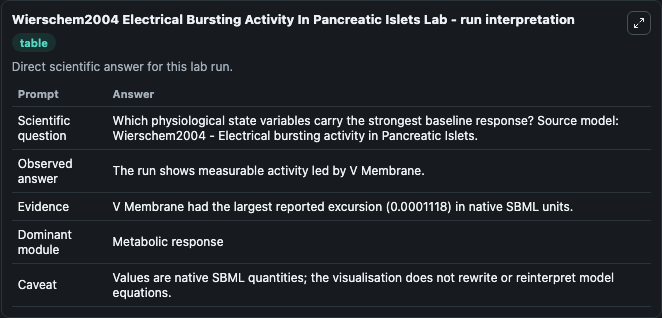
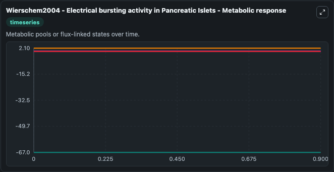
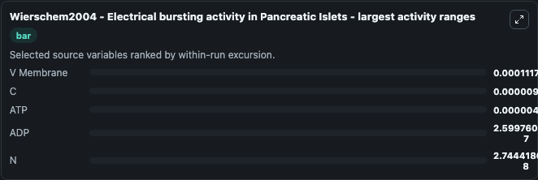
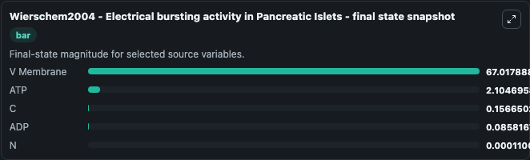
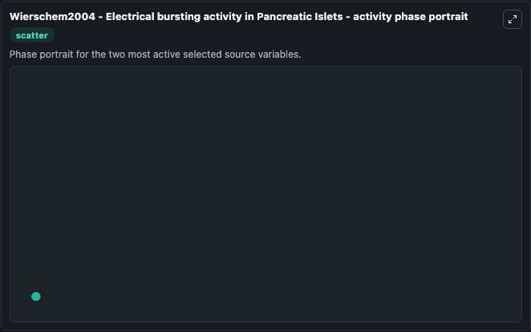

# Wierschem2004 Electrical Bursting Activity In Pancreatic Islets

This Biosimulant lab wraps `Wierschem2004 Electrical Bursting Activity In Pancreatic Islets` as a runnable systems biology model with a companion visualization module.
This a model from the article: Complex bursting in pancreatic islets: a potential glycolytic mechanism. It can be used to explore the configured dynamics and compare scenario outcomes across configurations.

## What You'll See

The lab asks: Which physiological state variables carry the strongest baseline response? Source model: Wierschem2004 - Electrical bursting activity in Pancreatic Islets. It runs for 1.0 time units with a communication step of 0.1. The run uses the model defaults declared by the curated SBML wrapper. The generated visualizations focus on V Membrane, ATP, ADP, N, and C, combining trajectory, endpoint-comparison, and summary-table views from one completed dark-mode run.

In this captured run, **V Membrane** moved from -67.018 to -67.018 across 1.0 simulation windows.


### Output Visualizations



*Summary table for Wierschem2004 Electrical Bursting Activity In Pancreatic Islets, reporting the scientific question, observed answer, dominant module, and caveat.*



*Trajectories of V Membrane, C, ATP, ADP, and N across the 1.0 simulation. In this run **V Membrane** climbed from -67.018 to -67.018 and **C** fell from 0.1567 to 0.1567 — the largest movements among the focused observables.*



*Largest-excursion ranking of the focused observables — the absolute movement magnitude during the run. Top 3: **V Membrane** = 0.000112, **C** = 9.74e-06, **ATP** = 4.15e-06, with 2 more observables below.*



*Trajectories of V Membrane, C, ATP, ADP, and N across the 1.0 simulation. In this run **V Membrane** climbed from -67.018 to -67.018 and **C** fell from 0.1567 to 0.1567 — the largest movements among the focused observables.*



*Visualization card from the Wierschem2004 Electrical Bursting Activity In Pancreatic Islets dark-mode run.*


## Model Context

- Core model: `models/core`
- Visualization model: `models/visualisation`
- Standard: `other`
- Upstream source: `biomodels_ebi:BIOMD0000000682`
- License: `CC0`

## Inputs

| Input | Maps To | Default | Notes |
|---|---|---|---|
| Initial V Membrane | `systemsbiology_sbml_wierschem2004_electrical_bursting_activity_in_pa_biomd0000000682_model.initial_v_membrane` | | Source state initial condition exposed as a model-specific control because no explicit intervention parameter is identifiable. Maps to SBML symbol `V_membrane`. |
| Initial Model State ATP | `systemsbiology_sbml_wierschem2004_electrical_bursting_activity_in_pa_biomd0000000682_model.initial_model_state_atp` | | Source state initial condition exposed as a model-specific control because no explicit intervention parameter is identifiable. Maps to SBML symbol `ATP`. |
| Initial Model State ADP | `systemsbiology_sbml_wierschem2004_electrical_bursting_activity_in_pa_biomd0000000682_model.initial_model_state_adp` | | Source state initial condition exposed as a model-specific control because no explicit intervention parameter is identifiable. Maps to SBML symbol `ADP`. |
| Initial Model State N | `systemsbiology_sbml_wierschem2004_electrical_bursting_activity_in_pa_biomd0000000682_model.initial_model_state_n` | | Source state initial condition exposed as a model-specific control because no explicit intervention parameter is identifiable. Maps to SBML symbol `n`. |
| Initial Model State C | `systemsbiology_sbml_wierschem2004_electrical_bursting_activity_in_pa_biomd0000000682_model.initial_model_state_c` | | Source state initial condition exposed as a model-specific control because no explicit intervention parameter is identifiable. Maps to SBML symbol `c`. |

## Outputs

| Output | Maps To | Role |
|---|---|---|
| `state` | `systemsbiology_sbml_wierschem2004_electrical_bursting_activity_in_pa_biomd0000000682_model.state` | Available to the visualization model and downstream workflows. |
| `summary` | `systemsbiology_sbml_wierschem2004_electrical_bursting_activity_in_pa_biomd0000000682_model.summary` | Available to the visualization model and downstream workflows. |
| `species_labels` | `systemsbiology_sbml_wierschem2004_electrical_bursting_activity_in_pa_biomd0000000682_model.species_labels` | Available to the visualization model and downstream workflows. |
| `v_membrane` | `systemsbiology_sbml_wierschem2004_electrical_bursting_activity_in_pa_biomd0000000682_model.v_membrane` | Available to the visualization model and downstream workflows. |
| `atp` | `systemsbiology_sbml_wierschem2004_electrical_bursting_activity_in_pa_biomd0000000682_model.atp` | Available to the visualization model and downstream workflows. |
| `adp` | `systemsbiology_sbml_wierschem2004_electrical_bursting_activity_in_pa_biomd0000000682_model.adp` | Available to the visualization model and downstream workflows. |
| `model_state_n` | `systemsbiology_sbml_wierschem2004_electrical_bursting_activity_in_pa_biomd0000000682_model.model_state_n` | Available to the visualization model and downstream workflows. |
| `model_state_c` | `systemsbiology_sbml_wierschem2004_electrical_bursting_activity_in_pa_biomd0000000682_model.model_state_c` | Available to the visualization model and downstream workflows. |

## Runtime

- Duration: `1.0`
- Communication step: `0.1`

## Running Locally

```bash
biosimulant labs serve
```
