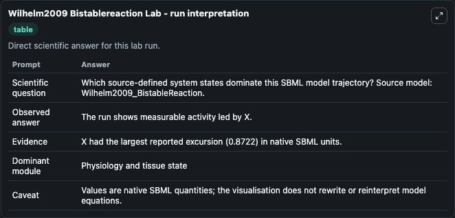
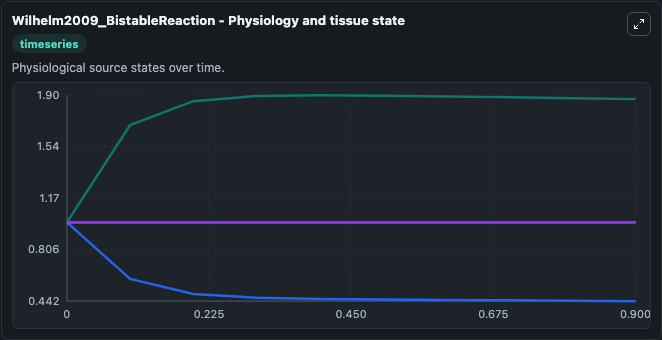
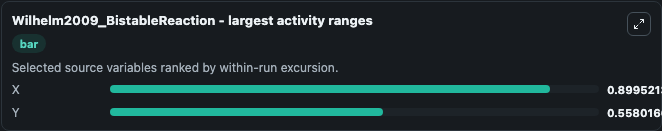
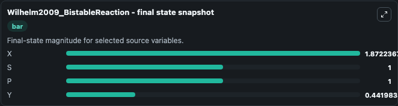
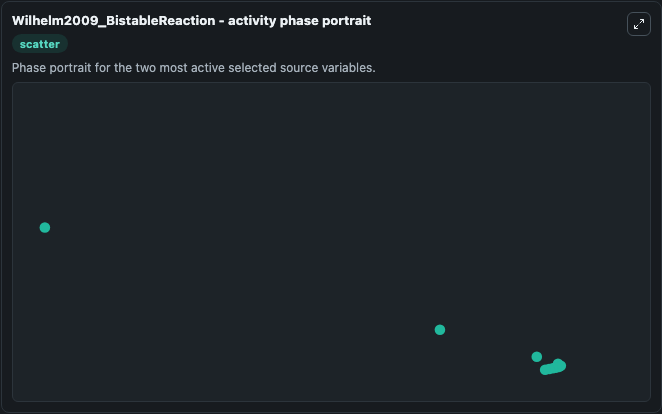

# Wilhelm2009 Bistablereaction

This Biosimulant lab wraps `Wilhelm2009 Bistablereaction` as a runnable systems biology model with a companion visualization module.
This a model from the article: The smallest chemical reaction system with bistability Thomas Wilhelm BMC Systems Biology 2009;Sep 8;3:90. 19737387 , Abstract: Background Bistability underlies basic bi. It can be used to explore the configured dynamics and compare scenario outcomes across configurations.

## What You'll See

The lab asks: Which source-defined system states dominate this SBML model trajectory? Source model: Wilhelm2009_BistableReaction. It runs for 1.0 time units with a communication step of 0.1. The run uses the model defaults declared by the curated SBML wrapper. The generated visualizations focus on Y, X, S, and P, combining trajectory, endpoint-comparison, and summary-table views from one completed dark-mode run.

In this captured run, **X** moved from 1.000 to 1.872 across 1.0 simulation windows.


### Output Visualizations



*Summary table for Wilhelm2009 Bistablereaction, reporting the scientific question, observed answer, dominant module, and caveat.*



*Trajectories of X, Y, S, and P across the 1.0 simulation. In this run **X** climbed from 1.000 to 1.872 and **Y** fell from 1.000 to 0.4420 — the largest movements among the focused observables.*



*Largest-excursion ranking of the focused observables — the absolute movement magnitude during the run. Top 2: **X** = 0.8995, **Y** = 0.5580.*



*Endpoint snapshot of the focused observables — final values from the captured run. Top 3 by value: **X** = 1.872, **S** = 1.000, **P** = 1.000, with 1 more observable below.*



*Visualization card from the Wilhelm2009 Bistablereaction dark-mode run.*


## Model Context

- Core model: `models/core`
- Visualization model: `models/visualisation`
- Standard: `other`
- Upstream source: `biomodels_ebi:BIOMD0000000233`
- License: `CC0`

## Inputs

| Input | Maps To | Default | Notes |
|---|---|---|---|
| Initial Model State Y | `systemsbiology_sbml_wilhelm2009_bistablereaction_biomd0000000233_model.initial_model_state_y` | | Source state initial condition exposed as a model-specific control because no explicit intervention parameter is identifiable. Maps to SBML symbol `Y`. |
| Initial Model State X | `systemsbiology_sbml_wilhelm2009_bistablereaction_biomd0000000233_model.initial_model_state_x` | | Source state initial condition exposed as a model-specific control because no explicit intervention parameter is identifiable. Maps to SBML symbol `X`. |
| Initial Model State S | `systemsbiology_sbml_wilhelm2009_bistablereaction_biomd0000000233_model.initial_model_state_s` | | Source state initial condition exposed as a model-specific control because no explicit intervention parameter is identifiable. Maps to SBML symbol `S`. |
| Initial Model State P | `systemsbiology_sbml_wilhelm2009_bistablereaction_biomd0000000233_model.initial_model_state_p` | | Source state initial condition exposed as a model-specific control because no explicit intervention parameter is identifiable. Maps to SBML symbol `P`. |

## Outputs

| Output | Maps To | Role |
|---|---|---|
| `state` | `systemsbiology_sbml_wilhelm2009_bistablereaction_biomd0000000233_model.state` | Available to the visualization model and downstream workflows. |
| `summary` | `systemsbiology_sbml_wilhelm2009_bistablereaction_biomd0000000233_model.summary` | Available to the visualization model and downstream workflows. |
| `species_labels` | `systemsbiology_sbml_wilhelm2009_bistablereaction_biomd0000000233_model.species_labels` | Available to the visualization model and downstream workflows. |
| `model_state_y` | `systemsbiology_sbml_wilhelm2009_bistablereaction_biomd0000000233_model.model_state_y` | Available to the visualization model and downstream workflows. |
| `model_state_x` | `systemsbiology_sbml_wilhelm2009_bistablereaction_biomd0000000233_model.model_state_x` | Available to the visualization model and downstream workflows. |
| `model_state_s` | `systemsbiology_sbml_wilhelm2009_bistablereaction_biomd0000000233_model.model_state_s` | Available to the visualization model and downstream workflows. |
| `model_state_p` | `systemsbiology_sbml_wilhelm2009_bistablereaction_biomd0000000233_model.model_state_p` | Available to the visualization model and downstream workflows. |

## Runtime

- Duration: `1.0`
- Communication step: `0.1`

## Running Locally

```bash
biosimulant labs serve
```
