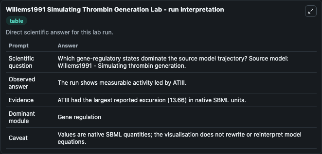
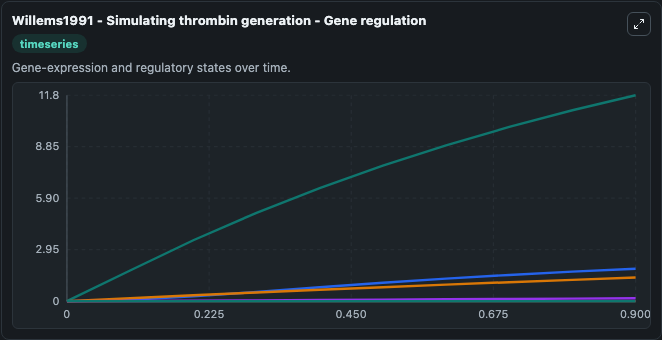
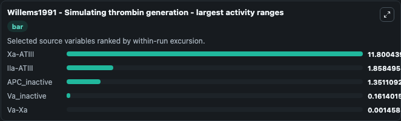
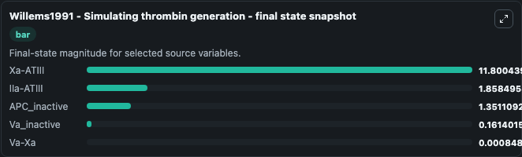
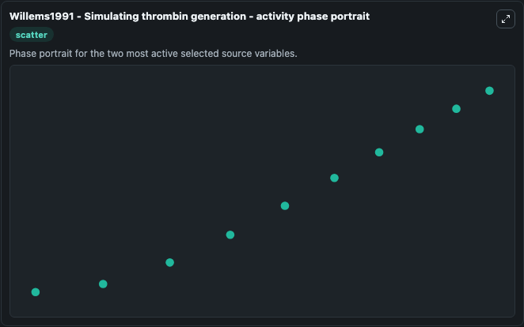

# Willems1991 Simulating Thrombin Generation

This Biosimulant lab wraps `Willems1991 Simulating Thrombin Generation` as a runnable systems biology model with a companion visualization module.
Mathematical model of blood coagulation to simulate factor IIa, Va and Xa concentration profiles. It can be used to explore the configured dynamics and compare scenario outcomes across configurations.

## What You'll See

The lab asks: Which gene-regulatory states dominate the source model trajectory? Source model: Willems1991 - Simulating thrombin generation. It runs for 1.0 time units with a communication step of 0.1. The run uses the model defaults declared by the curated SBML wrapper. The generated visualizations focus on Xa-ATIII, Va_inactive, Va-Xa, IIa-Hirudin, IIa-ATIII, and APC_inactive, combining trajectory, endpoint-comparison, and summary-table views from one completed dark-mode run.

In this captured run, **Xa-ATIII** moved from 0 to 11.800 across 1.0 simulation windows.


### Output Visualizations



*Summary table for Willems1991 Simulating Thrombin Generation, reporting the scientific question, observed answer, dominant module, and caveat.*



*Trajectories of Xa-ATIII, IIa-ATIII, APC_inactive, Va_inactive, Va-Xa, and IIa-Hirudin across the 1.0 simulation. In this run **Xa-ATIII** climbed from 0 to 11.800 — the largest movements among the focused observables.*



*Largest-excursion ranking of the focused observables — the absolute movement magnitude during the run. Top 3: **Xa-ATIII** = 11.800, **IIa-ATIII** = 1.858, **APC_inactive** = 1.351, with 2 more observables below.*



*Endpoint snapshot of the focused observables — final values from the captured run. Top 3 by value: **Xa-ATIII** = 11.800, **IIa-ATIII** = 1.858, **APC_inactive** = 1.351, with 2 more observables below.*



*Visualization card from the Willems1991 Simulating Thrombin Generation dark-mode run.*


## Model Context

- Core model: `models/core`
- Visualization model: `models/visualisation`
- Standard: `other`
- Upstream source: `biomodels_ebi:MODEL1807240002`
- License: `CC0`

## Inputs

| Input | Maps To | Default | Notes |
|---|---|---|---|
| Initial Xa Atiii | `systemsbiology_sbml_willems1991_simulating_thrombin_generation_model1807240002_model.initial_xa_atiii` | | Source state initial condition exposed as a model-specific control because no explicit intervention parameter is identifiable. Maps to SBML symbol `Xa_ATIII`. |
| Initial Va Inactive | `systemsbiology_sbml_willems1991_simulating_thrombin_generation_model1807240002_model.initial_va_inactive` | | Source state initial condition exposed as a model-specific control because no explicit intervention parameter is identifiable. Maps to SBML symbol `Va_inactive`. |
| Initial Va Xa | `systemsbiology_sbml_willems1991_simulating_thrombin_generation_model1807240002_model.initial_va_xa` | | Source state initial condition exposed as a model-specific control because no explicit intervention parameter is identifiable. Maps to SBML symbol `Va_Xa`. |
| Initial I Ia Hirudin | `systemsbiology_sbml_willems1991_simulating_thrombin_generation_model1807240002_model.initial_i_ia_hirudin` | | Source state initial condition exposed as a model-specific control because no explicit intervention parameter is identifiable. Maps to SBML symbol `IIa_Hirudin`. |
| Initial I Ia Atiii | `systemsbiology_sbml_willems1991_simulating_thrombin_generation_model1807240002_model.initial_i_ia_atiii` | | Source state initial condition exposed as a model-specific control because no explicit intervention parameter is identifiable. Maps to SBML symbol `IIa_ATIII`. |
| Initial Apc Inactive | `systemsbiology_sbml_willems1991_simulating_thrombin_generation_model1807240002_model.initial_apc_inactive` | | Source state initial condition exposed as a model-specific control because no explicit intervention parameter is identifiable. Maps to SBML symbol `APC_inactive`. |

## Outputs

| Output | Maps To | Role |
|---|---|---|
| `state` | `systemsbiology_sbml_willems1991_simulating_thrombin_generation_model1807240002_model.state` | Available to the visualization model and downstream workflows. |
| `summary` | `systemsbiology_sbml_willems1991_simulating_thrombin_generation_model1807240002_model.summary` | Available to the visualization model and downstream workflows. |
| `species_labels` | `systemsbiology_sbml_willems1991_simulating_thrombin_generation_model1807240002_model.species_labels` | Available to the visualization model and downstream workflows. |
| `xa_atiii` | `systemsbiology_sbml_willems1991_simulating_thrombin_generation_model1807240002_model.xa_atiii` | Available to the visualization model and downstream workflows. |
| `va_inactive` | `systemsbiology_sbml_willems1991_simulating_thrombin_generation_model1807240002_model.va_inactive` | Available to the visualization model and downstream workflows. |
| `va_xa` | `systemsbiology_sbml_willems1991_simulating_thrombin_generation_model1807240002_model.va_xa` | Available to the visualization model and downstream workflows. |
| `i_ia_hirudin` | `systemsbiology_sbml_willems1991_simulating_thrombin_generation_model1807240002_model.i_ia_hirudin` | Available to the visualization model and downstream workflows. |
| `i_ia_atiii` | `systemsbiology_sbml_willems1991_simulating_thrombin_generation_model1807240002_model.i_ia_atiii` | Available to the visualization model and downstream workflows. |
| `apc_inactive` | `systemsbiology_sbml_willems1991_simulating_thrombin_generation_model1807240002_model.apc_inactive` | Available to the visualization model and downstream workflows. |

## Runtime

- Duration: `1.0`
- Communication step: `0.1`

## Running Locally

```bash
biosimulant labs serve
```
