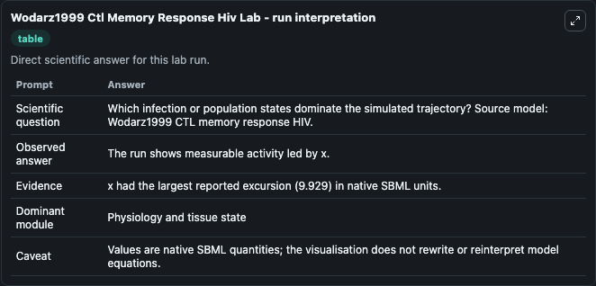
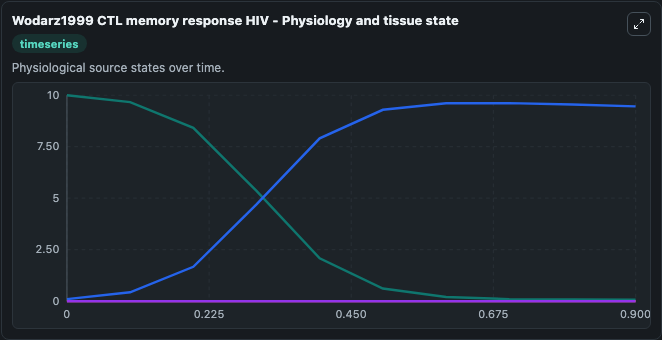
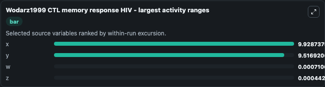
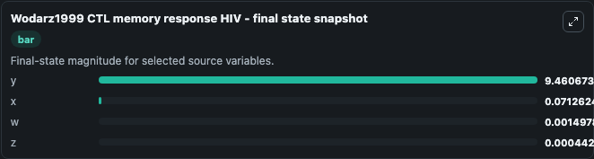
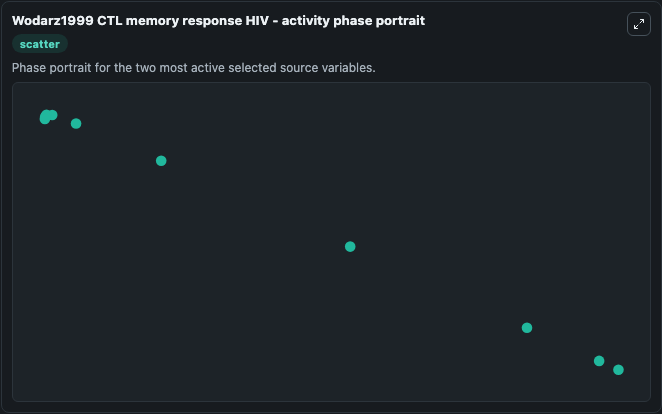

# Wodarz1999 Ctl Memory Response Hiv

This Biosimulant lab wraps `Wodarz1999 Ctl Memory Response Hiv` as a runnable systems biology model with a companion visualization module.
This a model from the article: Specific therapy regimes could lead to long-term immunological control of HIV. It can be used to explore the configured dynamics and compare scenario outcomes across configurations.

## What You'll See

The lab asks: Which infection or population states dominate the simulated trajectory? Source model: Wodarz1999 CTL memory response HIV. It runs for 1.0 time units with a communication step of 0.1. The run uses the model defaults declared by the curated SBML wrapper. The generated visualizations focus on x, y, w, and z, combining trajectory, endpoint-comparison, and summary-table views from one completed dark-mode run.

In this captured run, **x** moved from 10.000 to 0.0713 across 1.0 simulation windows.


### Output Visualizations



*Summary table for Wodarz1999 Ctl Memory Response Hiv, reporting the scientific question, observed answer, dominant module, and caveat.*



*Trajectories of x, y, w, and z across the 1.0 simulation. In this run **y** climbed from 0.1000 to 9.461 and **x** fell from 10.000 to 0.0713 — the largest movements among the focused observables.*



*Trajectories of x, y, w, and z across the 1.0 simulation. In this run **y** climbed from 0.1000 to 9.461 and **x** fell from 10.000 to 0.0713 — the largest movements among the focused observables.*



*Endpoint snapshot of the focused observables — final values from the captured run. Top 3 by value: **y** = 9.461, **x** = 0.0713, **w** = 0.0015, with 1 more observable below.*



*Trajectories of x, y, w, and z across the 1.0 simulation. In this run **y** climbed from 0.1000 to 9.461 and **x** fell from 10.000 to 0.0713 — the largest movements among the focused observables.*


## Model Context

- Core model: `models/core`
- Visualization model: `models/visualisation`
- Standard: `other`
- Upstream source: `biomodels_ebi:BIOMD0000000683`
- License: `CC0`

## Inputs

| Input | Maps To | Default | Notes |
|---|---|---|---|
| Initial Model State X | `systemsbiology_sbml_wodarz1999_ctl_memory_response_hiv_biomd0000000683_model.initial_model_state_x` | | Source state initial condition exposed as a model-specific control because no explicit intervention parameter is identifiable. Maps to SBML symbol `x`. |
| Initial Model State Y | `systemsbiology_sbml_wodarz1999_ctl_memory_response_hiv_biomd0000000683_model.initial_model_state_y` | | Source state initial condition exposed as a model-specific control because no explicit intervention parameter is identifiable. Maps to SBML symbol `y`. |
| Initial Model State W | `systemsbiology_sbml_wodarz1999_ctl_memory_response_hiv_biomd0000000683_model.initial_model_state_w` | | Source state initial condition exposed as a model-specific control because no explicit intervention parameter is identifiable. Maps to SBML symbol `w`. |
| Initial Model State Z | `systemsbiology_sbml_wodarz1999_ctl_memory_response_hiv_biomd0000000683_model.initial_model_state_z` | | Source state initial condition exposed as a model-specific control because no explicit intervention parameter is identifiable. Maps to SBML symbol `z`. |

## Outputs

| Output | Maps To | Role |
|---|---|---|
| `state` | `systemsbiology_sbml_wodarz1999_ctl_memory_response_hiv_biomd0000000683_model.state` | Available to the visualization model and downstream workflows. |
| `summary` | `systemsbiology_sbml_wodarz1999_ctl_memory_response_hiv_biomd0000000683_model.summary` | Available to the visualization model and downstream workflows. |
| `species_labels` | `systemsbiology_sbml_wodarz1999_ctl_memory_response_hiv_biomd0000000683_model.species_labels` | Available to the visualization model and downstream workflows. |
| `model_state_x` | `systemsbiology_sbml_wodarz1999_ctl_memory_response_hiv_biomd0000000683_model.model_state_x` | Available to the visualization model and downstream workflows. |
| `model_state_y` | `systemsbiology_sbml_wodarz1999_ctl_memory_response_hiv_biomd0000000683_model.model_state_y` | Available to the visualization model and downstream workflows. |
| `model_state_w` | `systemsbiology_sbml_wodarz1999_ctl_memory_response_hiv_biomd0000000683_model.model_state_w` | Available to the visualization model and downstream workflows. |
| `model_state_z` | `systemsbiology_sbml_wodarz1999_ctl_memory_response_hiv_biomd0000000683_model.model_state_z` | Available to the visualization model and downstream workflows. |

## Runtime

- Duration: `1.0`
- Communication step: `0.1`

## Running Locally

```bash
biosimulant labs serve
```
