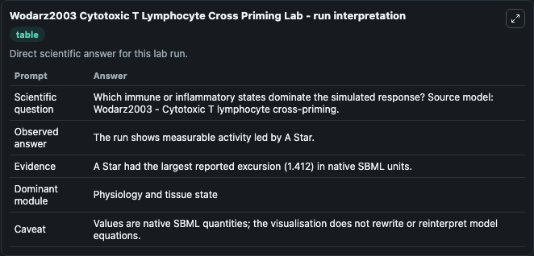
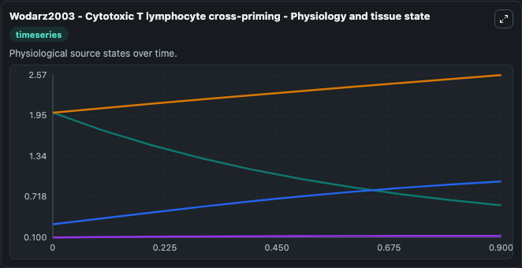
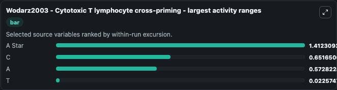
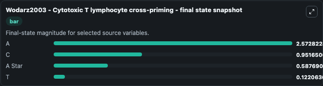
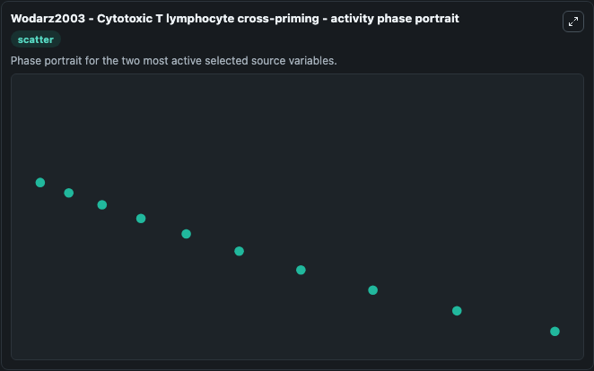

# Wodarz2003 Cytotoxic T Lymphocyte Cross Priming

This Biosimulant lab wraps `Wodarz2003 Cytotoxic T Lymphocyte Cross Priming` as a runnable systems biology model with a companion visualization module.
This a model from the article: A dynamical perspective of CTL cross-priming and regulation: implications forcancer immunology. It can be used to explore the configured dynamics and compare scenario outcomes across configurations.

## What You'll See

The lab asks: Which immune or inflammatory states dominate the simulated response? Source model: Wodarz2003 - Cytotoxic T lymphocyte cross-priming. It runs for 1.0 time units with a communication step of 0.1. The run uses the model defaults declared by the curated SBML wrapper. The generated visualizations focus on A Star, T, C, and A, combining trajectory, endpoint-comparison, and summary-table views from one completed dark-mode run.

In this captured run, **A Star** moved from 2.000 to 0.5877 across 1.0 simulation windows.


### Output Visualizations



*Summary table for Wodarz2003 Cytotoxic T Lymphocyte Cross Priming, reporting the scientific question, observed answer, dominant module, and caveat.*



*Trajectories of A Star, C, A, and T across the 1.0 simulation. In this run **C** climbed from 0.3000 to 0.9517 and **A Star** fell from 2.000 to 0.5877 — the largest movements among the focused observables.*



*Largest-excursion ranking of the focused observables — the absolute movement magnitude during the run. Top 3: **A Star** = 1.412, **C** = 0.6517, **A** = 0.5728, with 1 more observable below.*



*Endpoint snapshot of the focused observables — final values from the captured run. Top 3 by value: **A** = 2.573, **C** = 0.9517, **A Star** = 0.5877, with 1 more observable below.*



*Visualization card from the Wodarz2003 Cytotoxic T Lymphocyte Cross Priming dark-mode run.*


## Model Context

- Core model: `models/core`
- Visualization model: `models/visualisation`
- Standard: `other`
- Upstream source: `biomodels_ebi:BIOMD0000000685`
- License: `CC0`

## Inputs

| Input | Maps To | Default | Notes |
|---|---|---|---|
| Initial A Star | `systemsbiology_sbml_wodarz2003_cytotoxic_t_lymphocyte_cross_priming_biomd0000000685_model.initial_a_star` | | Source state initial condition exposed as a model-specific control because no explicit intervention parameter is identifiable. Maps to SBML symbol `A_star`. |
| Initial Model State T | `systemsbiology_sbml_wodarz2003_cytotoxic_t_lymphocyte_cross_priming_biomd0000000685_model.initial_model_state_t` | | Source state initial condition exposed as a model-specific control because no explicit intervention parameter is identifiable. Maps to SBML symbol `T`. |
| Initial Model State C | `systemsbiology_sbml_wodarz2003_cytotoxic_t_lymphocyte_cross_priming_biomd0000000685_model.initial_model_state_c` | | Source state initial condition exposed as a model-specific control because no explicit intervention parameter is identifiable. Maps to SBML symbol `C`. |
| Initial Model State A | `systemsbiology_sbml_wodarz2003_cytotoxic_t_lymphocyte_cross_priming_biomd0000000685_model.initial_model_state_a` | | Source state initial condition exposed as a model-specific control because no explicit intervention parameter is identifiable. Maps to SBML symbol `A`. |

## Outputs

| Output | Maps To | Role |
|---|---|---|
| `state` | `systemsbiology_sbml_wodarz2003_cytotoxic_t_lymphocyte_cross_priming_biomd0000000685_model.state` | Available to the visualization model and downstream workflows. |
| `summary` | `systemsbiology_sbml_wodarz2003_cytotoxic_t_lymphocyte_cross_priming_biomd0000000685_model.summary` | Available to the visualization model and downstream workflows. |
| `species_labels` | `systemsbiology_sbml_wodarz2003_cytotoxic_t_lymphocyte_cross_priming_biomd0000000685_model.species_labels` | Available to the visualization model and downstream workflows. |
| `a_star` | `systemsbiology_sbml_wodarz2003_cytotoxic_t_lymphocyte_cross_priming_biomd0000000685_model.a_star` | Available to the visualization model and downstream workflows. |
| `model_state_t` | `systemsbiology_sbml_wodarz2003_cytotoxic_t_lymphocyte_cross_priming_biomd0000000685_model.model_state_t` | Available to the visualization model and downstream workflows. |
| `model_state_c` | `systemsbiology_sbml_wodarz2003_cytotoxic_t_lymphocyte_cross_priming_biomd0000000685_model.model_state_c` | Available to the visualization model and downstream workflows. |
| `model_state_a` | `systemsbiology_sbml_wodarz2003_cytotoxic_t_lymphocyte_cross_priming_biomd0000000685_model.model_state_a` | Available to the visualization model and downstream workflows. |

## Runtime

- Duration: `1.0`
- Communication step: `0.1`

## Running Locally

```bash
biosimulant labs serve
```
