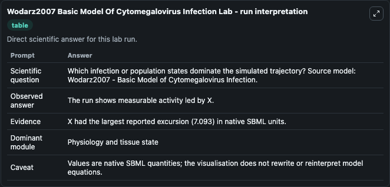
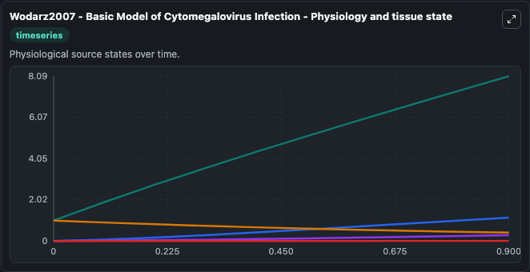
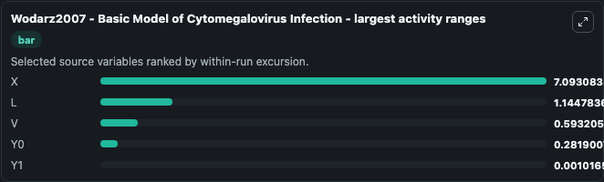
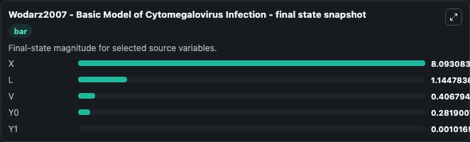
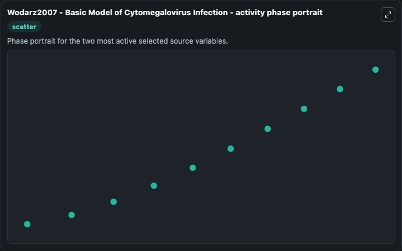

# Wodarz2007 Basic Model Of Cytomegalovirus Infection

This Biosimulant lab wraps `Wodarz2007 Basic Model Of Cytomegalovirus Infection` as a runnable systems biology model with a companion visualization module.
This a model from the article: Dynamics of killer T cell inflation in viral infections. It can be used to explore the configured dynamics and compare scenario outcomes across configurations.

## What You'll See

The lab asks: Which infection or population states dominate the simulated trajectory? Source model: Wodarz2007 - Basic Model of Cytomegalovirus Infection. It runs for 1.0 time units with a communication step of 0.1. The run uses the model defaults declared by the curated SBML wrapper. The generated visualizations focus on Y1, Y0, X, V, and L, combining trajectory, endpoint-comparison, and summary-table views from one completed dark-mode run.

In this captured run, **X** moved from 1.000 to 8.093 across 1.0 simulation windows.


### Output Visualizations



*Summary table for Wodarz2007 Basic Model Of Cytomegalovirus Infection, reporting the scientific question, observed answer, dominant module, and caveat.*



*Trajectories of X, L, V, Y0, and Y1 across the 1.0 simulation. In this run **X** climbed from 1.000 to 8.093 and **V** fell from 1.000 to 0.4068 — the largest movements among the focused observables.*



*Largest-excursion ranking of the focused observables — the absolute movement magnitude during the run. Top 3: **X** = 7.093, **L** = 1.145, **V** = 0.5932, with 2 more observables below.*



*Endpoint snapshot of the focused observables — final values from the captured run. Top 3 by value: **X** = 8.093, **L** = 1.145, **V** = 0.4068, with 2 more observables below.*



*Visualization card from the Wodarz2007 Basic Model Of Cytomegalovirus Infection dark-mode run.*


## Model Context

- Core model: `models/core`
- Visualization model: `models/visualisation`
- Standard: `other`
- Upstream source: `biomodels_ebi:BIOMD0000000686`
- License: `CC0`

## Inputs

| Input | Maps To | Default | Notes |
|---|---|---|---|
| Initial Model State Y1 | `systemsbiology_sbml_wodarz2007_basic_model_of_cytomegalovirus_infect_biomd0000000686_model.initial_model_state_y1` | | Source state initial condition exposed as a model-specific control because no explicit intervention parameter is identifiable. Maps to SBML symbol `y1`. |
| Initial Model State Y0 | `systemsbiology_sbml_wodarz2007_basic_model_of_cytomegalovirus_infect_biomd0000000686_model.initial_model_state_y0` | | Source state initial condition exposed as a model-specific control because no explicit intervention parameter is identifiable. Maps to SBML symbol `y0`. |
| Initial Model State X | `systemsbiology_sbml_wodarz2007_basic_model_of_cytomegalovirus_infect_biomd0000000686_model.initial_model_state_x` | | Source state initial condition exposed as a model-specific control because no explicit intervention parameter is identifiable. Maps to SBML symbol `x`. |
| Initial Model State V | `systemsbiology_sbml_wodarz2007_basic_model_of_cytomegalovirus_infect_biomd0000000686_model.initial_model_state_v` | | Source state initial condition exposed as a model-specific control because no explicit intervention parameter is identifiable. Maps to SBML symbol `v`. |
| Initial Model State L | `systemsbiology_sbml_wodarz2007_basic_model_of_cytomegalovirus_infect_biomd0000000686_model.initial_model_state_l` | | Source state initial condition exposed as a model-specific control because no explicit intervention parameter is identifiable. Maps to SBML symbol `L`. |

## Outputs

| Output | Maps To | Role |
|---|---|---|
| `state` | `systemsbiology_sbml_wodarz2007_basic_model_of_cytomegalovirus_infect_biomd0000000686_model.state` | Available to the visualization model and downstream workflows. |
| `summary` | `systemsbiology_sbml_wodarz2007_basic_model_of_cytomegalovirus_infect_biomd0000000686_model.summary` | Available to the visualization model and downstream workflows. |
| `species_labels` | `systemsbiology_sbml_wodarz2007_basic_model_of_cytomegalovirus_infect_biomd0000000686_model.species_labels` | Available to the visualization model and downstream workflows. |
| `model_state_y1` | `systemsbiology_sbml_wodarz2007_basic_model_of_cytomegalovirus_infect_biomd0000000686_model.model_state_y1` | Available to the visualization model and downstream workflows. |
| `model_state_y0` | `systemsbiology_sbml_wodarz2007_basic_model_of_cytomegalovirus_infect_biomd0000000686_model.model_state_y0` | Available to the visualization model and downstream workflows. |
| `model_state_x` | `systemsbiology_sbml_wodarz2007_basic_model_of_cytomegalovirus_infect_biomd0000000686_model.model_state_x` | Available to the visualization model and downstream workflows. |
| `model_state_v` | `systemsbiology_sbml_wodarz2007_basic_model_of_cytomegalovirus_infect_biomd0000000686_model.model_state_v` | Available to the visualization model and downstream workflows. |
| `model_state_l` | `systemsbiology_sbml_wodarz2007_basic_model_of_cytomegalovirus_infect_biomd0000000686_model.model_state_l` | Available to the visualization model and downstream workflows. |

## Runtime

- Duration: `1.0`
- Communication step: `0.1`

## Running Locally

```bash
biosimulant labs serve
```
