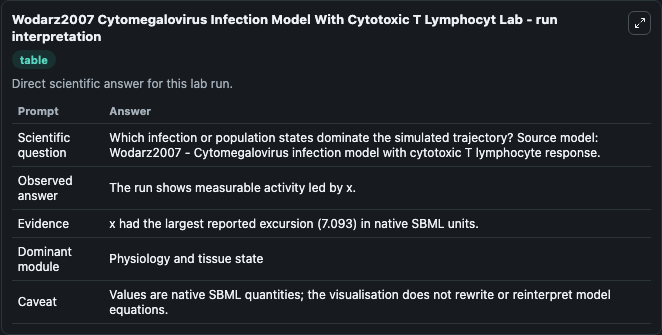
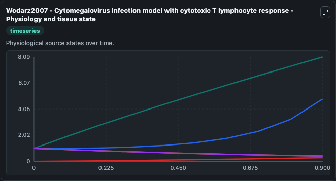
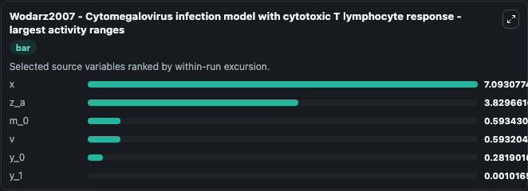
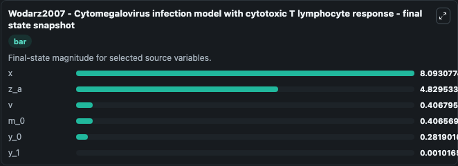
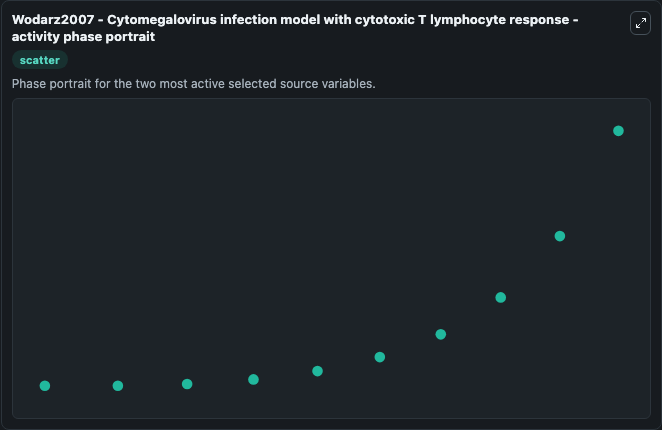

# Wodarz2007 Cytomegalovirus Infection Model With Cytotoxic T Lymphocyt (BIOMD0000000687)

This Biosimulant lab wraps `BIOMD0000000687 Wodarz2007 Cytomegalovirus Infection Model With Cytotoxic T Lymphocyt` as a runnable systems biology model with a companion visualization module.
This a model from the article: Dynamics of killer T cell inflation in viral infections. It can be used to explore the configured dynamics and compare scenario outcomes across configurations.

## What You'll See

The lab asks: Which infection or population states dominate the simulated trajectory? Source model: Wodarz2007 - Cytomegalovirus infection model with cytotoxic T lymphocyte response. It runs for 1.0 time units with a communication step of 0.1. The run uses the model defaults declared by the curated SBML wrapper. The generated visualizations focus on z_a, x, v, m_0, y_1, and y_0, combining trajectory, endpoint-comparison, and summary-table views from one completed dark-mode run.

In this captured run, **x** moved from 1.000 to 8.093 across 1.0 simulation windows.


### Output Visualizations



*Summary table for Wodarz2007 Cytomegalovirus Infection Model With Cytotoxic T Lymphocyt, reporting the scientific question, observed answer, dominant module, and caveat.*



*Trajectories of x, z_a, m_0, v, y_0, and y_1 across the 1.0 simulation. In this run **x** climbed from 1.000 to 8.093 and **m_0** fell from 1.000 to 0.4066 — the largest movements among the focused observables.*



*Trajectories of x, z_a, m_0, v, y_0, and y_1 across the 1.0 simulation. In this run **x** climbed from 1.000 to 8.093 and **m_0** fell from 1.000 to 0.4066 — the largest movements among the focused observables.*



*Trajectories of x, z_a, m_0, v, y_0, and y_1 across the 1.0 simulation. In this run **x** climbed from 1.000 to 8.093 and **m_0** fell from 1.000 to 0.4066 — the largest movements among the focused observables.*



*Trajectories of x, z_a, m_0, v, y_0, and y_1 across the 1.0 simulation. In this run **x** climbed from 1.000 to 8.093 and **m_0** fell from 1.000 to 0.4066 — the largest movements among the focused observables.*


## Model Context

- Core model: `models/core`
- Visualization model: `models/visualisation`
- Standard: `other`
- Upstream source: `biomodels_ebi:BIOMD0000000687`
- License: `CC0`

## Inputs

| Input | Maps To | Default | Notes |
|---|---|---|---|
| Initial Model State Z A | `systemsbiology_sbml_wodarz2007_cytomegalovirus_infection_model_with_biomd0000000687_model.initial_model_state_z_a` | | Source state initial condition exposed as a model-specific control because no explicit intervention parameter is identifiable. Maps to SBML symbol `z_a`. |
| Initial Model State X | `systemsbiology_sbml_wodarz2007_cytomegalovirus_infection_model_with_biomd0000000687_model.initial_model_state_x` | | Source state initial condition exposed as a model-specific control because no explicit intervention parameter is identifiable. Maps to SBML symbol `x_0`. |
| Initial Model State V | `systemsbiology_sbml_wodarz2007_cytomegalovirus_infection_model_with_biomd0000000687_model.initial_model_state_v` | | Source state initial condition exposed as a model-specific control because no explicit intervention parameter is identifiable. Maps to SBML symbol `v_0`. |
| Initial Model State M 0 | `systemsbiology_sbml_wodarz2007_cytomegalovirus_infection_model_with_biomd0000000687_model.initial_model_state_m_0` | | Source state initial condition exposed as a model-specific control because no explicit intervention parameter is identifiable. Maps to SBML symbol `m_0_0`. |
| Initial Model State Y 1 | `systemsbiology_sbml_wodarz2007_cytomegalovirus_infection_model_with_biomd0000000687_model.initial_model_state_y_1` | | Source state initial condition exposed as a model-specific control because no explicit intervention parameter is identifiable. Maps to SBML symbol `y_1`. |
| Initial Model State Y 0 | `systemsbiology_sbml_wodarz2007_cytomegalovirus_infection_model_with_biomd0000000687_model.initial_model_state_y_0` | | Source state initial condition exposed as a model-specific control because no explicit intervention parameter is identifiable. Maps to SBML symbol `y_0`. |

## Outputs

| Output | Maps To | Role |
|---|---|---|
| `state` | `systemsbiology_sbml_wodarz2007_cytomegalovirus_infection_model_with_biomd0000000687_model.state` | Available to the visualization model and downstream workflows. |
| `summary` | `systemsbiology_sbml_wodarz2007_cytomegalovirus_infection_model_with_biomd0000000687_model.summary` | Available to the visualization model and downstream workflows. |
| `species_labels` | `systemsbiology_sbml_wodarz2007_cytomegalovirus_infection_model_with_biomd0000000687_model.species_labels` | Available to the visualization model and downstream workflows. |
| `z_a` | `systemsbiology_sbml_wodarz2007_cytomegalovirus_infection_model_with_biomd0000000687_model.z_a` | Available to the visualization model and downstream workflows. |
| `model_state_x` | `systemsbiology_sbml_wodarz2007_cytomegalovirus_infection_model_with_biomd0000000687_model.model_state_x` | Available to the visualization model and downstream workflows. |
| `model_state_v` | `systemsbiology_sbml_wodarz2007_cytomegalovirus_infection_model_with_biomd0000000687_model.model_state_v` | Available to the visualization model and downstream workflows. |
| `m_0` | `systemsbiology_sbml_wodarz2007_cytomegalovirus_infection_model_with_biomd0000000687_model.m_0` | Available to the visualization model and downstream workflows. |
| `y_1` | `systemsbiology_sbml_wodarz2007_cytomegalovirus_infection_model_with_biomd0000000687_model.y_1` | Available to the visualization model and downstream workflows. |
| `y_0` | `systemsbiology_sbml_wodarz2007_cytomegalovirus_infection_model_with_biomd0000000687_model.y_0` | Available to the visualization model and downstream workflows. |

## Runtime

- Duration: `1.0`
- Communication step: `0.1`

## Running Locally

```bash
biosimulant labs serve
```
