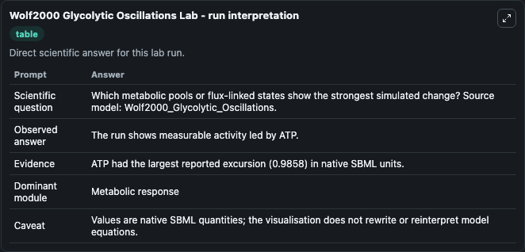
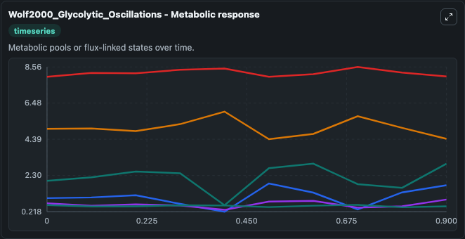
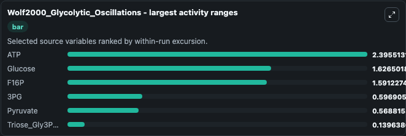
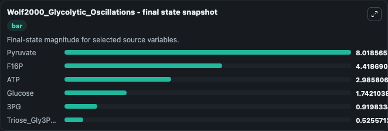
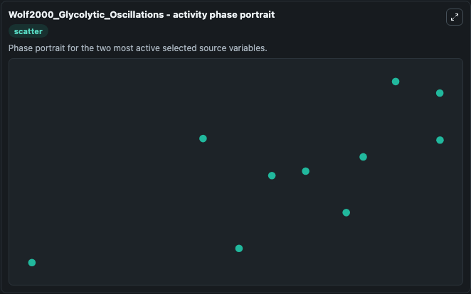

# Wolf2000 Glycolytic Oscillations

This Biosimulant lab wraps `Wolf2000 Glycolytic Oscillations` as a runnable systems biology model with a companion visualization module.
Model reproduces the dynamics of ATP and NADH as depicted in Fig 4 of the paper. It can be used to explore the configured dynamics and compare scenario outcomes across configurations.

## What You'll See

The lab asks: Which metabolic pools or flux-linked states show the strongest simulated change? Source model: Wolf2000_Glycolytic_Oscillations. It runs for 1.0 time units with a communication step of 0.1. The run uses the model defaults declared by the curated SBML wrapper. The generated visualizations focus on Pyruvate, F16P, ATP, Glucose, 3PG, and Triose_Gly3Phos_DHAP, combining trajectory, endpoint-comparison, and summary-table views from one completed dark-mode run.

In this captured run, **ATP** moved from 2.000 to 2.986 across 1.0 simulation windows.


### Output Visualizations



*Summary table for Wolf2000 Glycolytic Oscillations, reporting the scientific question, observed answer, dominant module, and caveat.*



*Trajectories of ATP, Glucose, F16P, 3PG, Pyruvate, and Triose_Gly3Phos_DHAP across the 1.0 simulation. In this run **ATP** climbed from 2.000 to 2.986 and **F16P** fell from 5.000 to 4.419 — the largest movements among the focused observables.*



*Largest-excursion ranking of the focused observables — the absolute movement magnitude during the run. Top 3: **ATP** = 2.396, **Glucose** = 1.627, **F16P** = 1.591, with 3 more observables below.*



*Endpoint snapshot of the focused observables — final values from the captured run. Top 3 by value: **Pyruvate** = 8.019, **F16P** = 4.419, **ATP** = 2.986, with 3 more observables below.*



*Visualization card from the Wolf2000 Glycolytic Oscillations dark-mode run.*


## Model Context

- Core model: `models/core`
- Visualization model: `models/visualisation`
- Standard: `other`
- Upstream source: `biomodels_ebi:BIOMD0000000206`
- License: `CC0`

## Inputs

| Input | Maps To | Default | Notes |
|---|---|---|---|
| Initial Pyruvate | `systemsbiology_sbml_wolf2000_glycolytic_oscillations_biomd0000000206_model.initial_pyruvate` | | Source state initial condition exposed as a model-specific control because no explicit intervention parameter is identifiable. Maps to SBML symbol `s5`. |
| Initial F16 P | `systemsbiology_sbml_wolf2000_glycolytic_oscillations_biomd0000000206_model.initial_f16_p` | | Source state initial condition exposed as a model-specific control because no explicit intervention parameter is identifiable. Maps to SBML symbol `s2`. |
| Initial Model State ATP | `systemsbiology_sbml_wolf2000_glycolytic_oscillations_biomd0000000206_model.initial_model_state_atp` | | Source state initial condition exposed as a model-specific control because no explicit intervention parameter is identifiable. Maps to SBML symbol `at`. |
| Initial Glucose | `systemsbiology_sbml_wolf2000_glycolytic_oscillations_biomd0000000206_model.initial_glucose` | | Source state initial condition exposed as a model-specific control because no explicit intervention parameter is identifiable. Maps to SBML symbol `s1`. |
| Initial Model State 3 Pg | `systemsbiology_sbml_wolf2000_glycolytic_oscillations_biomd0000000206_model.initial_model_state_3_pg` | | Source state initial condition exposed as a model-specific control because no explicit intervention parameter is identifiable. Maps to SBML symbol `s4`. |
| Initial Triose Gly3 Phos Dhap | `systemsbiology_sbml_wolf2000_glycolytic_oscillations_biomd0000000206_model.initial_triose_gly3_phos_dhap` | | Source state initial condition exposed as a model-specific control because no explicit intervention parameter is identifiable. Maps to SBML symbol `s3`. |

## Outputs

| Output | Maps To | Role |
|---|---|---|
| `state` | `systemsbiology_sbml_wolf2000_glycolytic_oscillations_biomd0000000206_model.state` | Available to the visualization model and downstream workflows. |
| `summary` | `systemsbiology_sbml_wolf2000_glycolytic_oscillations_biomd0000000206_model.summary` | Available to the visualization model and downstream workflows. |
| `species_labels` | `systemsbiology_sbml_wolf2000_glycolytic_oscillations_biomd0000000206_model.species_labels` | Available to the visualization model and downstream workflows. |
| `pyruvate` | `systemsbiology_sbml_wolf2000_glycolytic_oscillations_biomd0000000206_model.pyruvate` | Available to the visualization model and downstream workflows. |
| `f16_p` | `systemsbiology_sbml_wolf2000_glycolytic_oscillations_biomd0000000206_model.f16_p` | Available to the visualization model and downstream workflows. |
| `atp` | `systemsbiology_sbml_wolf2000_glycolytic_oscillations_biomd0000000206_model.atp` | Available to the visualization model and downstream workflows. |
| `glucose` | `systemsbiology_sbml_wolf2000_glycolytic_oscillations_biomd0000000206_model.glucose` | Available to the visualization model and downstream workflows. |
| `model_state_3_pg` | `systemsbiology_sbml_wolf2000_glycolytic_oscillations_biomd0000000206_model.model_state_3_pg` | Available to the visualization model and downstream workflows. |
| `triose_gly3_phos_dhap` | `systemsbiology_sbml_wolf2000_glycolytic_oscillations_biomd0000000206_model.triose_gly3_phos_dhap` | Available to the visualization model and downstream workflows. |

## Runtime

- Duration: `1.0`
- Communication step: `0.1`

## Running Locally

```bash
biosimulant labs serve
```
