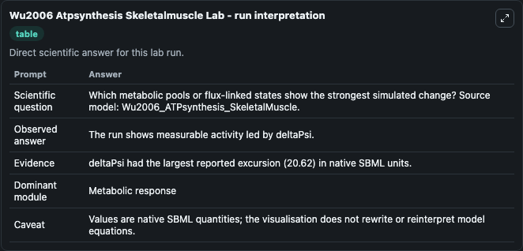
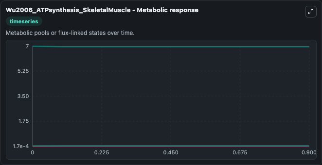
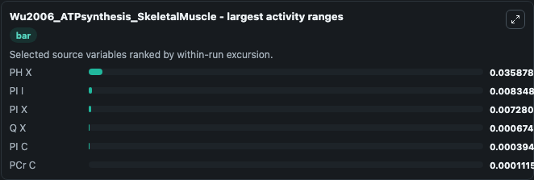
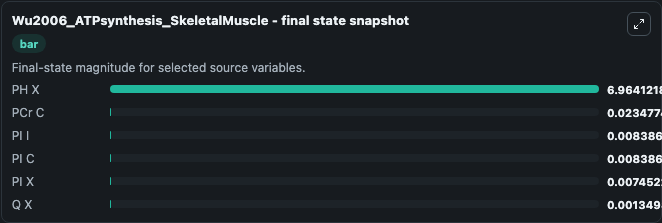
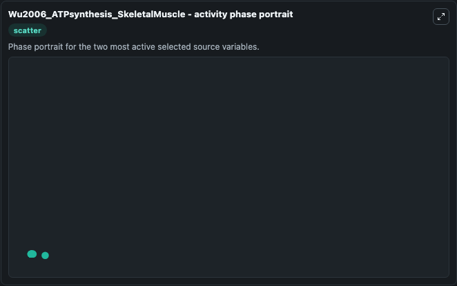

# Wu2006 Atpsynthesis Skeletalmuscle

This Biosimulant lab wraps `Wu2006 Atpsynthesis Skeletalmuscle` as a runnable systems biology model with a companion visualization module.
This a model from the article: Oxidative ATP synthesis in skeletal muscle is controlled by substrate feedback. It can be used to explore the configured dynamics and compare scenario outcomes across configurations.

## What You'll See

The lab asks: Which metabolic pools or flux-linked states show the strongest simulated change? Source model: Wu2006_ATPsynthesis_SkeletalMuscle. It runs for 1.0 time units with a communication step of 0.1. The run uses the model defaults declared by the curated SBML wrapper. The generated visualizations focus on Q X, PI X, PI I, PI C, PH X, and PCr C, combining trajectory, endpoint-comparison, and summary-table views from one completed dark-mode run.

In this captured run, **PH X** moved from 7.000 to 6.964 across 1.0 simulation windows.


### Output Visualizations



*Summary table for Wu2006 Atpsynthesis Skeletalmuscle, reporting the scientific question, observed answer, dominant module, and caveat.*



*Trajectories of PH X, PI I, PI X, Q X, PI C, and PCr C across the 1.0 simulation. In this run **PI I** climbed from 0.000172 to 0.00839 and **PH X** fell from 7.000 to 6.964 — the largest movements among the focused observables.*



*Largest-excursion ranking of the focused observables — the absolute movement magnitude during the run. Top 3: **PH X** = 0.0359, **PI I** = 0.00835, **PI X** = 0.00728, with 3 more observables below.*



*Endpoint snapshot of the focused observables — final values from the captured run. Top 3 by value: **PH X** = 6.964, **PCr C** = 0.0235, **PI I** = 0.00839, with 3 more observables below.*



*Visualization card from the Wu2006 Atpsynthesis Skeletalmuscle dark-mode run.*


## Model Context

- Core model: `models/core`
- Visualization model: `models/visualisation`
- Standard: `other`
- Upstream source: `biomodels_ebi:MODEL1006230034`
- License: `CC0`

## Inputs

| Input | Maps To | Default | Notes |
|---|---|---|---|
| Initial Model State Q X | `systemsbiology_sbml_wu2006_atpsynthesis_skeletalmuscle_model1006230034_model.initial_model_state_q_x` | | Source state initial condition exposed as a model-specific control because no explicit intervention parameter is identifiable. Maps to SBML symbol `Q_x`. |
| Initial Pi X | `systemsbiology_sbml_wu2006_atpsynthesis_skeletalmuscle_model1006230034_model.initial_pi_x` | | Source state initial condition exposed as a model-specific control because no explicit intervention parameter is identifiable. Maps to SBML symbol `PI_x`. |
| Initial Pi I | `systemsbiology_sbml_wu2006_atpsynthesis_skeletalmuscle_model1006230034_model.initial_pi_i` | | Source state initial condition exposed as a model-specific control because no explicit intervention parameter is identifiable. Maps to SBML symbol `PI_i`. |
| Initial Pi C | `systemsbiology_sbml_wu2006_atpsynthesis_skeletalmuscle_model1006230034_model.initial_pi_c` | | Source state initial condition exposed as a model-specific control because no explicit intervention parameter is identifiable. Maps to SBML symbol `PI_c`. |
| Initial Ph X | `systemsbiology_sbml_wu2006_atpsynthesis_skeletalmuscle_model1006230034_model.initial_ph_x` | | Source state initial condition exposed as a model-specific control because no explicit intervention parameter is identifiable. Maps to SBML symbol `pH_x`. |
| Initial P Cr C | `systemsbiology_sbml_wu2006_atpsynthesis_skeletalmuscle_model1006230034_model.initial_p_cr_c` | | Source state initial condition exposed as a model-specific control because no explicit intervention parameter is identifiable. Maps to SBML symbol `PCr_c`. |

## Outputs

| Output | Maps To | Role |
|---|---|---|
| `state` | `systemsbiology_sbml_wu2006_atpsynthesis_skeletalmuscle_model1006230034_model.state` | Available to the visualization model and downstream workflows. |
| `summary` | `systemsbiology_sbml_wu2006_atpsynthesis_skeletalmuscle_model1006230034_model.summary` | Available to the visualization model and downstream workflows. |
| `species_labels` | `systemsbiology_sbml_wu2006_atpsynthesis_skeletalmuscle_model1006230034_model.species_labels` | Available to the visualization model and downstream workflows. |
| `q_x` | `systemsbiology_sbml_wu2006_atpsynthesis_skeletalmuscle_model1006230034_model.q_x` | Available to the visualization model and downstream workflows. |
| `pi_x` | `systemsbiology_sbml_wu2006_atpsynthesis_skeletalmuscle_model1006230034_model.pi_x` | Available to the visualization model and downstream workflows. |
| `pi_i` | `systemsbiology_sbml_wu2006_atpsynthesis_skeletalmuscle_model1006230034_model.pi_i` | Available to the visualization model and downstream workflows. |
| `pi_c` | `systemsbiology_sbml_wu2006_atpsynthesis_skeletalmuscle_model1006230034_model.pi_c` | Available to the visualization model and downstream workflows. |
| `ph_x` | `systemsbiology_sbml_wu2006_atpsynthesis_skeletalmuscle_model1006230034_model.ph_x` | Available to the visualization model and downstream workflows. |
| `p_cr_c` | `systemsbiology_sbml_wu2006_atpsynthesis_skeletalmuscle_model1006230034_model.p_cr_c` | Available to the visualization model and downstream workflows. |

## Runtime

- Duration: `1.0`
- Communication step: `0.1`

## Running Locally

```bash
biosimulant labs serve
```
