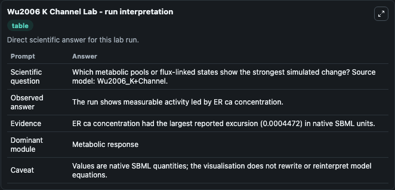
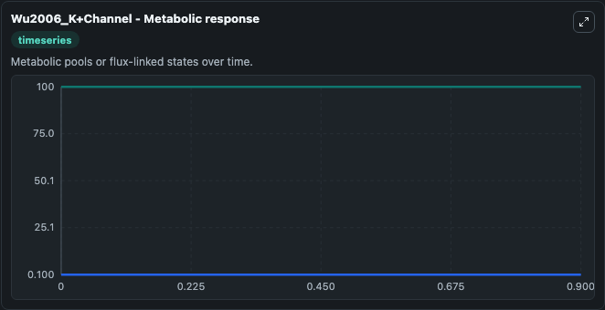
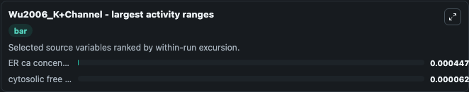
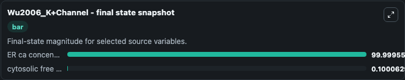
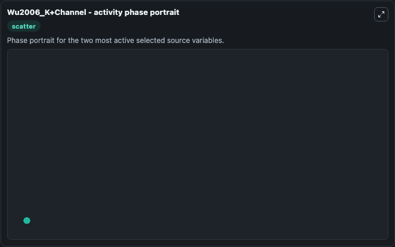

# Wu2006 K Channel

This Biosimulant lab wraps `Wu2006 K Channel` as a runnable systems biology model with a companion visualization module.
The model is described in the paper by Wu and Chang (2006). It can be used to explore the configured dynamics and compare scenario outcomes across configurations.

## What You'll See

The lab asks: Which metabolic pools or flux-linked states show the strongest simulated change? Source model: Wu2006_K+Channel. It runs for 1.0 time units with a communication step of 0.1. The run uses the model defaults declared by the curated SBML wrapper. The generated visualizations focus on ER ca concentration, and cytosolic free ca concentration, combining trajectory, endpoint-comparison, and summary-table views from one completed dark-mode run.

In this captured run, **ER ca concentration** moved from 100.0 to 100.000 across 1.0 simulation windows.


### Output Visualizations



*Summary table for Wu2006 K Channel, reporting the scientific question, observed answer, dominant module, and caveat.*



*Trajectories of ER ca concentration, and cytosolic free ca concentration across the 1.0 simulation. In this run **cytosolic free ca concentration** climbed from 0.1000 to 0.1001 and **ER ca concentration** fell from 100.0 to 100.000 — the largest movements among the focused observables.*



*Largest-excursion ranking of the focused observables — the absolute movement magnitude during the run. Top 2: **ER ca concentration** = 0.000447, **cytosolic free ca concentration** = 6.29e-05.*



*Endpoint snapshot of the focused observables — final values from the captured run. Top 2 by value: **ER ca concentration** = 100.000, **cytosolic free ca concentration** = 0.1001.*



*Visualization card from the Wu2006 K Channel dark-mode run.*


## Model Context

- Core model: `models/core`
- Visualization model: `models/visualisation`
- Standard: `other`
- Upstream source: `biomodels_ebi:BIOMD0000000124`
- License: `CC0`

## Inputs

| Input | Maps To | Default | Notes |
|---|---|---|---|
| Initial Er Ca Concentration | `systemsbiology_sbml_wu2006_k_channel_biomd0000000124_model.initial_er_ca_concentration` | | Source state initial condition exposed as a model-specific control because no explicit intervention parameter is identifiable. Maps to SBML symbol `cer`. |
| Initial Cytosolic Free Ca Concentration | `systemsbiology_sbml_wu2006_k_channel_biomd0000000124_model.initial_cytosolic_free_ca_concentration` | | Source state initial condition exposed as a model-specific control because no explicit intervention parameter is identifiable. Maps to SBML symbol `c`. |

## Outputs

| Output | Maps To | Role |
|---|---|---|
| `state` | `systemsbiology_sbml_wu2006_k_channel_biomd0000000124_model.state` | Available to the visualization model and downstream workflows. |
| `summary` | `systemsbiology_sbml_wu2006_k_channel_biomd0000000124_model.summary` | Available to the visualization model and downstream workflows. |
| `species_labels` | `systemsbiology_sbml_wu2006_k_channel_biomd0000000124_model.species_labels` | Available to the visualization model and downstream workflows. |
| `er_ca_concentration` | `systemsbiology_sbml_wu2006_k_channel_biomd0000000124_model.er_ca_concentration` | Available to the visualization model and downstream workflows. |
| `cytosolic_free_ca_concentration` | `systemsbiology_sbml_wu2006_k_channel_biomd0000000124_model.cytosolic_free_ca_concentration` | Available to the visualization model and downstream workflows. |

## Runtime

- Duration: `1.0`
- Communication step: `0.1`

## Running Locally

```bash
biosimulant labs serve
```
