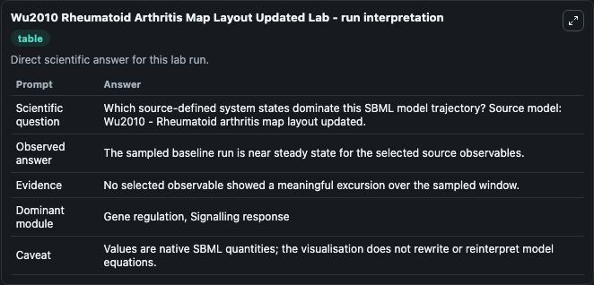
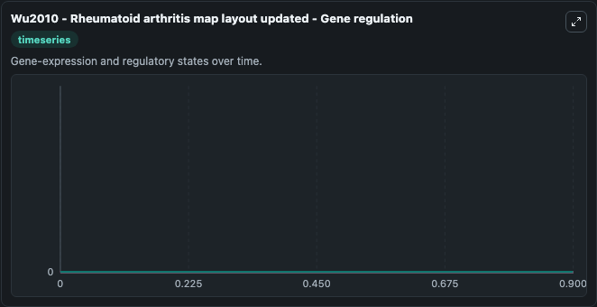

# Wu2010 Rheumatoid Arthritis Map Layout Updated

This Biosimulant lab wraps `Wu2010 Rheumatoid Arthritis Map Layout Updated` as a runnable systems biology model with a companion visualization module.
Contains molecular interactions known to be active in rheumatoid arthritis. It can be used to explore the configured dynamics and compare scenario outcomes across configurations.

## What You'll See

The lab asks: Which source-defined system states dominate this SBML model trajectory? Source model: Wu2010 - Rheumatoid arthritis map layout updated. It runs for 1.0 time units with a communication step of 0.1. The run uses the model defaults declared by the curated SBML wrapper. The generated visualizations focus on Cell growth, Differentiation, Morphogenesis, Wnt signaling pathway, TRAF6, and TRAF3, combining trajectory, endpoint-comparison, and summary-table views from one completed dark-mode run.

In this captured run, **Cell growth, Differentiation, Morphogenesis** moved from 0 to 0 across 1.0 simulation windows.


### Output Visualizations



*Summary table for Wu2010 Rheumatoid Arthritis Map Layout Updated, reporting the scientific question, observed answer, dominant module, and caveat.*



*Trajectories of Cell growth, Differentiation, Morphogenesis, Wnt signaling pathway, TRAF6, TRAF6, TRAF6, and TRAF3 across the 1.0 simulation. In this run Cell growth, Differentiation, Morphogenesis, Wnt signaling pathway, TRAF6, TRAF6 stayed near their initial values — no observable moved appreciably.*


## Model Context

- Core model: `models/core`
- Visualization model: `models/visualisation`
- Standard: `other`
- Upstream source: `biomodels_ebi:MODEL2302140001`
- License: `CC0`

## Inputs

| Input | Maps To | Default | Notes |
|---|---|---|---|
| Initial Cell Growth Differentiation Morphogenesis | `systemsbiology_sbml_wu2010_rheumatoid_arthritis_map_layout_updated_model2302140001_model.initial_cell_growth_differentiation_morphogenesis` | | Source state initial condition exposed as a model-specific control because no explicit intervention parameter is identifiable. Maps to SBML symbol `s422`. |
| Initial Wnt Signaling Pathway | `systemsbiology_sbml_wu2010_rheumatoid_arthritis_map_layout_updated_model2302140001_model.initial_wnt_signaling_pathway` | | Source state initial condition exposed as a model-specific control because no explicit intervention parameter is identifiable. Maps to SBML symbol `s1181`. |
| Initial Traf6 | `systemsbiology_sbml_wu2010_rheumatoid_arthritis_map_layout_updated_model2302140001_model.initial_traf6` | | Source state initial condition exposed as a model-specific control because no explicit intervention parameter is identifiable. Maps to SBML symbol `s360`. |
| Initial Traf6 2 | `systemsbiology_sbml_wu2010_rheumatoid_arthritis_map_layout_updated_model2302140001_model.initial_traf6_2` | | Source state initial condition exposed as a model-specific control because no explicit intervention parameter is identifiable. Maps to SBML symbol `s359`. |
| Initial Traf6 3 | `systemsbiology_sbml_wu2010_rheumatoid_arthritis_map_layout_updated_model2302140001_model.initial_traf6_3` | | Source state initial condition exposed as a model-specific control because no explicit intervention parameter is identifiable. Maps to SBML symbol `s36`. |
| Initial Traf3 | `systemsbiology_sbml_wu2010_rheumatoid_arthritis_map_layout_updated_model2302140001_model.initial_traf3` | | Source state initial condition exposed as a model-specific control because no explicit intervention parameter is identifiable. Maps to SBML symbol `s180`. |

## Outputs

| Output | Maps To | Role |
|---|---|---|
| `state` | `systemsbiology_sbml_wu2010_rheumatoid_arthritis_map_layout_updated_model2302140001_model.state` | Available to the visualization model and downstream workflows. |
| `summary` | `systemsbiology_sbml_wu2010_rheumatoid_arthritis_map_layout_updated_model2302140001_model.summary` | Available to the visualization model and downstream workflows. |
| `species_labels` | `systemsbiology_sbml_wu2010_rheumatoid_arthritis_map_layout_updated_model2302140001_model.species_labels` | Available to the visualization model and downstream workflows. |
| `cell_growth_differentiation_morphogenesis` | `systemsbiology_sbml_wu2010_rheumatoid_arthritis_map_layout_updated_model2302140001_model.cell_growth_differentiation_morphogenesis` | Available to the visualization model and downstream workflows. |
| `wnt_signaling_pathway` | `systemsbiology_sbml_wu2010_rheumatoid_arthritis_map_layout_updated_model2302140001_model.wnt_signaling_pathway` | Available to the visualization model and downstream workflows. |
| `traf6` | `systemsbiology_sbml_wu2010_rheumatoid_arthritis_map_layout_updated_model2302140001_model.traf6` | Available to the visualization model and downstream workflows. |
| `traf6_2` | `systemsbiology_sbml_wu2010_rheumatoid_arthritis_map_layout_updated_model2302140001_model.traf6_2` | Available to the visualization model and downstream workflows. |
| `traf6_3` | `systemsbiology_sbml_wu2010_rheumatoid_arthritis_map_layout_updated_model2302140001_model.traf6_3` | Available to the visualization model and downstream workflows. |
| `traf3` | `systemsbiology_sbml_wu2010_rheumatoid_arthritis_map_layout_updated_model2302140001_model.traf3` | Available to the visualization model and downstream workflows. |

## Runtime

- Duration: `1.0`
- Communication step: `0.1`

## Running Locally

```bash
biosimulant labs serve
```
