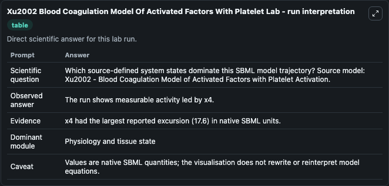
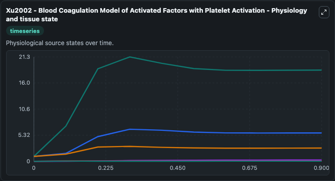
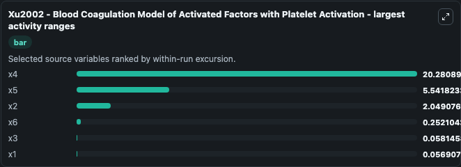
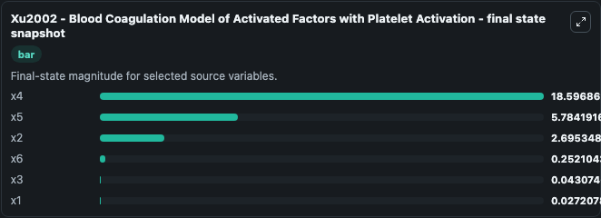
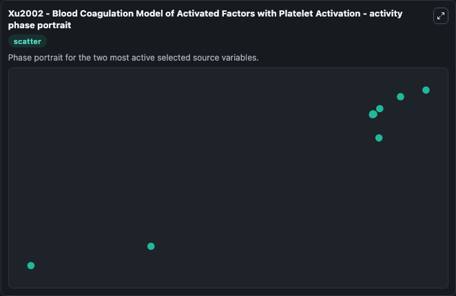

# Xu2002 Blood Coagulation Model Of Activated Factors With Platelet

This Biosimulant lab wraps `Xu2002 Blood Coagulation Model Of Activated Factors With Platelet` as a runnable systems biology model with a companion visualization module.
System of ODEs to describe the dynamics of several activated factors of blood coagulation. It can be used to explore the configured dynamics and compare scenario outcomes across configurations.

## What You'll See

The lab asks: Which source-defined system states dominate this SBML model trajectory? Source model: Xu2002 - Blood Coagulation Model of Activated Factors with Platelet Activation. It runs for 1.0 time units with a communication step of 0.1. The run uses the model defaults declared by the curated SBML wrapper. The generated visualizations focus on x5, x4, x2, x6, x3, and x1, combining trajectory, endpoint-comparison, and summary-table views from one completed dark-mode run.

In this captured run, **x4** moved from 1.000 to 18.597 across 1.0 simulation windows.


### Output Visualizations



*Summary table for Xu2002 Blood Coagulation Model Of Activated Factors With Platelet, reporting the scientific question, observed answer, dominant module, and caveat.*



*Trajectories of x4, x5, x2, x6, x3, and x1 across the 1.0 simulation. In this run **x4** climbed from 1.000 to 18.597 — the largest movements among the focused observables.*



*Largest-excursion ranking of the focused observables — the absolute movement magnitude during the run. Top 3: **x4** = 20.281, **x5** = 5.542, **x2** = 2.049, with 3 more observables below.*



*Endpoint snapshot of the focused observables — final values from the captured run. Top 3 by value: **x4** = 18.597, **x5** = 5.784, **x2** = 2.695, with 3 more observables below.*



*Visualization card from the Xu2002 Blood Coagulation Model Of Activated Factors With Platelet dark-mode run.*


## Model Context

- Core model: `models/core`
- Visualization model: `models/visualisation`
- Standard: `other`
- Upstream source: `biomodels_ebi:MODEL1806130001`
- License: `CC0`

## Inputs

| Input | Maps To | Default | Notes |
|---|---|---|---|
| Initial Model State X5 | `systemsbiology_sbml_xu2002_blood_coagulation_model_of_activated_fact_model1806130001_model.initial_model_state_x5` | | Source state initial condition exposed as a model-specific control because no explicit intervention parameter is identifiable. Maps to SBML symbol `x5`. |
| Initial Model State X4 | `systemsbiology_sbml_xu2002_blood_coagulation_model_of_activated_fact_model1806130001_model.initial_model_state_x4` | | Source state initial condition exposed as a model-specific control because no explicit intervention parameter is identifiable. Maps to SBML symbol `x4`. |
| Initial Model State X2 | `systemsbiology_sbml_xu2002_blood_coagulation_model_of_activated_fact_model1806130001_model.initial_model_state_x2` | | Source state initial condition exposed as a model-specific control because no explicit intervention parameter is identifiable. Maps to SBML symbol `x2`. |
| Initial Model State X6 | `systemsbiology_sbml_xu2002_blood_coagulation_model_of_activated_fact_model1806130001_model.initial_model_state_x6` | | Source state initial condition exposed as a model-specific control because no explicit intervention parameter is identifiable. Maps to SBML symbol `x6`. |
| Initial Model State X3 | `systemsbiology_sbml_xu2002_blood_coagulation_model_of_activated_fact_model1806130001_model.initial_model_state_x3` | | Source state initial condition exposed as a model-specific control because no explicit intervention parameter is identifiable. Maps to SBML symbol `x3`. |
| Initial Model State X1 | `systemsbiology_sbml_xu2002_blood_coagulation_model_of_activated_fact_model1806130001_model.initial_model_state_x1` | | Source state initial condition exposed as a model-specific control because no explicit intervention parameter is identifiable. Maps to SBML symbol `x1`. |

## Outputs

| Output | Maps To | Role |
|---|---|---|
| `state` | `systemsbiology_sbml_xu2002_blood_coagulation_model_of_activated_fact_model1806130001_model.state` | Available to the visualization model and downstream workflows. |
| `summary` | `systemsbiology_sbml_xu2002_blood_coagulation_model_of_activated_fact_model1806130001_model.summary` | Available to the visualization model and downstream workflows. |
| `species_labels` | `systemsbiology_sbml_xu2002_blood_coagulation_model_of_activated_fact_model1806130001_model.species_labels` | Available to the visualization model and downstream workflows. |
| `model_state_x5` | `systemsbiology_sbml_xu2002_blood_coagulation_model_of_activated_fact_model1806130001_model.model_state_x5` | Available to the visualization model and downstream workflows. |
| `model_state_x4` | `systemsbiology_sbml_xu2002_blood_coagulation_model_of_activated_fact_model1806130001_model.model_state_x4` | Available to the visualization model and downstream workflows. |
| `model_state_x2` | `systemsbiology_sbml_xu2002_blood_coagulation_model_of_activated_fact_model1806130001_model.model_state_x2` | Available to the visualization model and downstream workflows. |
| `model_state_x6` | `systemsbiology_sbml_xu2002_blood_coagulation_model_of_activated_fact_model1806130001_model.model_state_x6` | Available to the visualization model and downstream workflows. |
| `model_state_x3` | `systemsbiology_sbml_xu2002_blood_coagulation_model_of_activated_fact_model1806130001_model.model_state_x3` | Available to the visualization model and downstream workflows. |
| `model_state_x1` | `systemsbiology_sbml_xu2002_blood_coagulation_model_of_activated_fact_model1806130001_model.model_state_x1` | Available to the visualization model and downstream workflows. |

## Runtime

- Duration: `1.0`
- Communication step: `0.1`

## Running Locally

```bash
biosimulant labs serve
```
