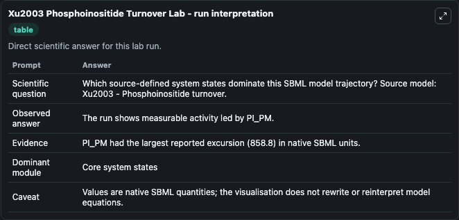
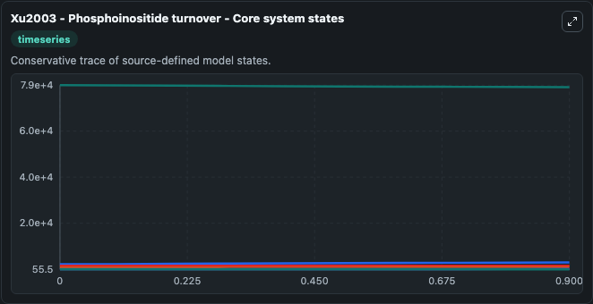
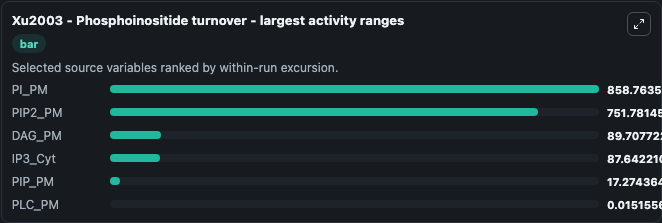
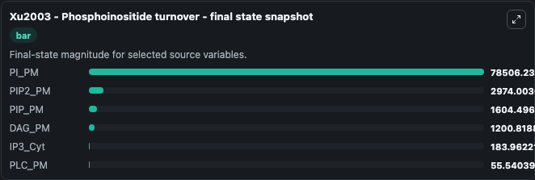
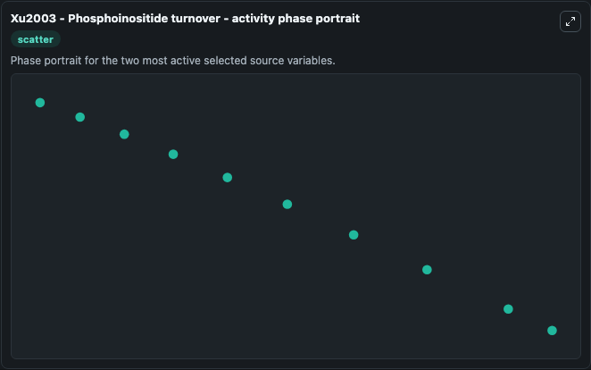

# Xu2003 Phosphoinositide Turnover

This Biosimulant lab wraps `Xu2003 Phosphoinositide Turnover` as a runnable systems biology model with a companion visualization module.
Xu2003 - Phosphoinositide turnover The model reproduces the percentage change of PIP_PM, PIP2_PM and IP3_Cyt as depicted in Figure 1 of the paper. It can be used to explore the configured dynamics and compare scenario outcomes across configurations.

## What You'll See

The lab asks: Which source-defined system states dominate this SBML model trajectory? Source model: Xu2003 - Phosphoinositide turnover. It runs for 1.0 time units with a communication step of 0.1. The run uses the model defaults declared by the curated SBML wrapper. The generated visualizations focus on PI_PM, PIP2_PM, PIP_PM, DAG_PM, PLC_PM, and IP3_Cyt, combining trajectory, endpoint-comparison, and summary-table views from one completed dark-mode run.

In this captured run, **PI_PM** moved from 7.94e+04 to 7.85e+04 across 1.0 simulation windows.


### Output Visualizations



*Summary table for Xu2003 Phosphoinositide Turnover, reporting the scientific question, observed answer, dominant module, and caveat.*



*Trajectories of PI_PM, PIP2_PM, DAG_PM, IP3_Cyt, PIP_PM, and PLC_PM across the 1.0 simulation. In this run **PIP2_PM** climbed from 2222.2 to 2974.0 and **PI_PM** fell from 7.94e+04 to 7.85e+04 — the largest movements among the focused observables.*



*Largest-excursion ranking of the focused observables — the absolute movement magnitude during the run. Top 3: **PI_PM** = 858.8, **PIP2_PM** = 751.8, **DAG_PM** = 89.708, with 3 more observables below.*



*Endpoint snapshot of the focused observables — final values from the captured run. Top 3 by value: **PI_PM** = 7.85e+04, **PIP2_PM** = 2974.0, **PIP_PM** = 1604.5, with 3 more observables below.*



*Visualization card from the Xu2003 Phosphoinositide Turnover dark-mode run.*


## Model Context

- Core model: `models/core`
- Visualization model: `models/visualisation`
- Standard: `other`
- Upstream source: `biomodels_ebi:BIOMD0000000075`
- License: `CC0`

## Inputs

| Input | Maps To | Default | Notes |
|---|---|---|---|
| Initial Pi Pm | `systemsbiology_sbml_xu2003_phosphoinositide_turnover_biomd0000000075_model.initial_pi_pm` | | Source state initial condition exposed as a model-specific control because no explicit intervention parameter is identifiable. Maps to SBML symbol `PI_PM`. |
| Initial Pip2 Pm | `systemsbiology_sbml_xu2003_phosphoinositide_turnover_biomd0000000075_model.initial_pip2_pm` | | Source state initial condition exposed as a model-specific control because no explicit intervention parameter is identifiable. Maps to SBML symbol `PIP2_PM`. |
| Initial Pip Pm | `systemsbiology_sbml_xu2003_phosphoinositide_turnover_biomd0000000075_model.initial_pip_pm` | | Source state initial condition exposed as a model-specific control because no explicit intervention parameter is identifiable. Maps to SBML symbol `PIP_PM`. |
| Initial Dag Pm | `systemsbiology_sbml_xu2003_phosphoinositide_turnover_biomd0000000075_model.initial_dag_pm` | | Source state initial condition exposed as a model-specific control because no explicit intervention parameter is identifiable. Maps to SBML symbol `DAG_PM`. |
| Initial Plc Pm | `systemsbiology_sbml_xu2003_phosphoinositide_turnover_biomd0000000075_model.initial_plc_pm` | | Source state initial condition exposed as a model-specific control because no explicit intervention parameter is identifiable. Maps to SBML symbol `PLC_PM`. |
| Initial IP3 Cyt | `systemsbiology_sbml_xu2003_phosphoinositide_turnover_biomd0000000075_model.initial_ip3_cyt` | | Source state initial condition exposed as a model-specific control because no explicit intervention parameter is identifiable. Maps to SBML symbol `IP3_Cyt`. |

## Outputs

| Output | Maps To | Role |
|---|---|---|
| `state` | `systemsbiology_sbml_xu2003_phosphoinositide_turnover_biomd0000000075_model.state` | Available to the visualization model and downstream workflows. |
| `summary` | `systemsbiology_sbml_xu2003_phosphoinositide_turnover_biomd0000000075_model.summary` | Available to the visualization model and downstream workflows. |
| `species_labels` | `systemsbiology_sbml_xu2003_phosphoinositide_turnover_biomd0000000075_model.species_labels` | Available to the visualization model and downstream workflows. |
| `pi_pm` | `systemsbiology_sbml_xu2003_phosphoinositide_turnover_biomd0000000075_model.pi_pm` | Available to the visualization model and downstream workflows. |
| `pip2_pm` | `systemsbiology_sbml_xu2003_phosphoinositide_turnover_biomd0000000075_model.pip2_pm` | Available to the visualization model and downstream workflows. |
| `pip_pm` | `systemsbiology_sbml_xu2003_phosphoinositide_turnover_biomd0000000075_model.pip_pm` | Available to the visualization model and downstream workflows. |
| `dag_pm` | `systemsbiology_sbml_xu2003_phosphoinositide_turnover_biomd0000000075_model.dag_pm` | Available to the visualization model and downstream workflows. |
| `plc_pm` | `systemsbiology_sbml_xu2003_phosphoinositide_turnover_biomd0000000075_model.plc_pm` | Available to the visualization model and downstream workflows. |
| `ip3_cyt` | `systemsbiology_sbml_xu2003_phosphoinositide_turnover_biomd0000000075_model.ip3_cyt` | Available to the visualization model and downstream workflows. |

## Runtime

- Duration: `1.0`
- Communication step: `0.1`

## Running Locally

```bash
biosimulant labs serve
```
