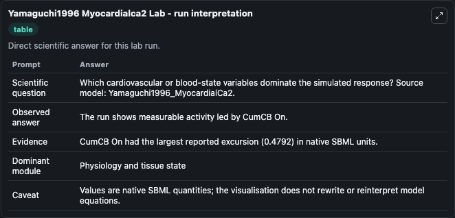
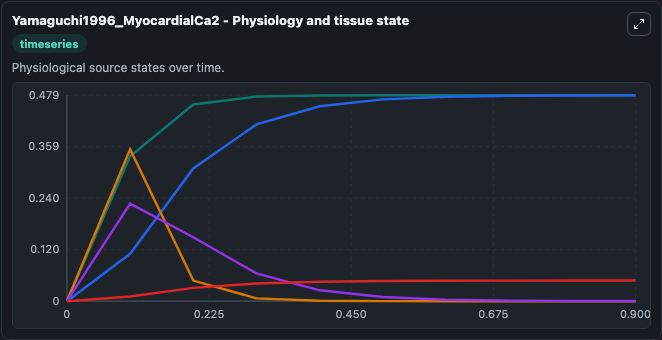
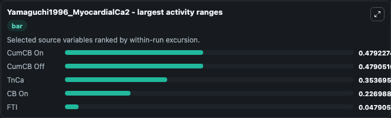
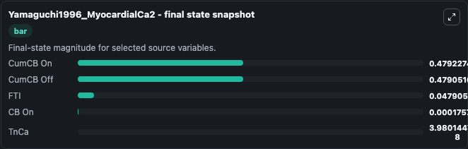
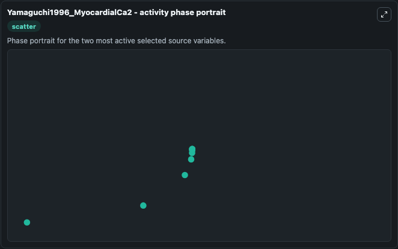

# Yamaguchi1996 Myocardialca2

This Biosimulant lab wraps `Yamaguchi1996 Myocardialca2` as a runnable systems biology model with a companion visualization module.
This a model from the article: Constancy and variability of contractile efficiency as a function of calcium andcross-bridge kinetics: simulation. It can be used to explore the configured dynamics and compare scenario outcomes across configurations.

## What You'll See

The lab asks: Which cardiovascular or blood-state variables dominate the simulated response? Source model: Yamaguchi1996_MyocardialCa2. It runs for 1.0 time units with a communication step of 0.1. The run uses the model defaults declared by the curated SBML wrapper. The generated visualizations focus on TnCa, FTI, CumCB On, CumCB Off, and CB On, combining trajectory, endpoint-comparison, and summary-table views from one completed dark-mode run.

In this captured run, **CumCB On** moved from 0 to 0.4792 across 1.0 simulation windows.


### Output Visualizations



*Summary table for Yamaguchi1996 Myocardialca2, reporting the scientific question, observed answer, dominant module, and caveat.*



*Trajectories of CumCB On, CumCB Off, TnCa, CB On, and FTI across the 1.0 simulation. In this run **CumCB On** climbed from 0 to 0.4792 — the largest movements among the focused observables.*



*Largest-excursion ranking of the focused observables — the absolute movement magnitude during the run. Top 3: **CumCB On** = 0.4792, **CumCB Off** = 0.4791, **TnCa** = 0.3537, with 2 more observables below.*



*Endpoint snapshot of the focused observables — final values from the captured run. Top 3 by value: **CumCB On** = 0.4792, **CumCB Off** = 0.4791, **FTI** = 0.0479, with 2 more observables below.*



*Visualization card from the Yamaguchi1996 Myocardialca2 dark-mode run.*


## Model Context

- Core model: `models/core`
- Visualization model: `models/visualisation`
- Standard: `other`
- Upstream source: `biomodels_ebi:MODEL1006230032`
- License: `CC0`

## Inputs

| Input | Maps To | Default | Notes |
|---|---|---|---|
| Initial Tn Ca | `systemsbiology_sbml_yamaguchi1996_myocardialca2_model1006230032_model.initial_tn_ca` | | Source state initial condition exposed as a model-specific control because no explicit intervention parameter is identifiable. Maps to SBML symbol `TnCa`. |
| Initial Model State Fti | `systemsbiology_sbml_yamaguchi1996_myocardialca2_model1006230032_model.initial_model_state_fti` | | Source state initial condition exposed as a model-specific control because no explicit intervention parameter is identifiable. Maps to SBML symbol `FTI`. |
| Initial Cum Cb On | `systemsbiology_sbml_yamaguchi1996_myocardialca2_model1006230032_model.initial_cum_cb_on` | | Source state initial condition exposed as a model-specific control because no explicit intervention parameter is identifiable. Maps to SBML symbol `CumCB_on`. |
| Initial Cum Cb Off | `systemsbiology_sbml_yamaguchi1996_myocardialca2_model1006230032_model.initial_cum_cb_off` | | Source state initial condition exposed as a model-specific control because no explicit intervention parameter is identifiable. Maps to SBML symbol `CumCB_off`. |
| Initial Cb On | `systemsbiology_sbml_yamaguchi1996_myocardialca2_model1006230032_model.initial_cb_on` | | Source state initial condition exposed as a model-specific control because no explicit intervention parameter is identifiable. Maps to SBML symbol `CB_on`. |

## Outputs

| Output | Maps To | Role |
|---|---|---|
| `state` | `systemsbiology_sbml_yamaguchi1996_myocardialca2_model1006230032_model.state` | Available to the visualization model and downstream workflows. |
| `summary` | `systemsbiology_sbml_yamaguchi1996_myocardialca2_model1006230032_model.summary` | Available to the visualization model and downstream workflows. |
| `species_labels` | `systemsbiology_sbml_yamaguchi1996_myocardialca2_model1006230032_model.species_labels` | Available to the visualization model and downstream workflows. |
| `tn_ca` | `systemsbiology_sbml_yamaguchi1996_myocardialca2_model1006230032_model.tn_ca` | Available to the visualization model and downstream workflows. |
| `fti` | `systemsbiology_sbml_yamaguchi1996_myocardialca2_model1006230032_model.fti` | Available to the visualization model and downstream workflows. |
| `cum_cb_on` | `systemsbiology_sbml_yamaguchi1996_myocardialca2_model1006230032_model.cum_cb_on` | Available to the visualization model and downstream workflows. |
| `cum_cb_off` | `systemsbiology_sbml_yamaguchi1996_myocardialca2_model1006230032_model.cum_cb_off` | Available to the visualization model and downstream workflows. |
| `cb_on` | `systemsbiology_sbml_yamaguchi1996_myocardialca2_model1006230032_model.cb_on` | Available to the visualization model and downstream workflows. |

## Runtime

- Duration: `1.0`
- Communication step: `0.1`

## Running Locally

```bash
biosimulant labs serve
```
