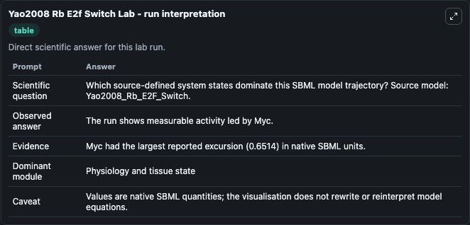
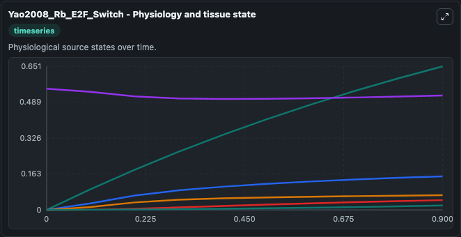
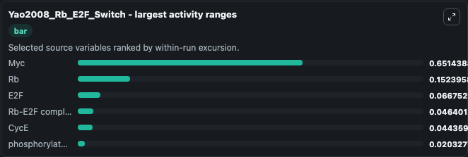
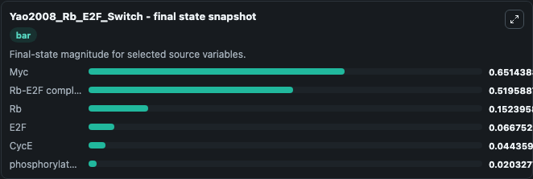
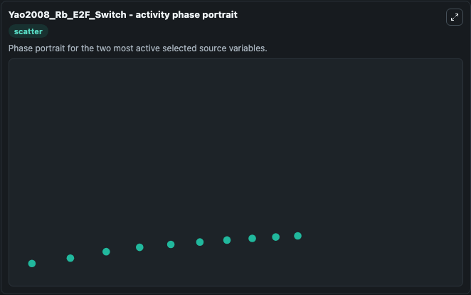

# Yao2008 Rb E2f Switch

This Biosimulant lab wraps `Yao2008 Rb E2f Switch` as a runnable systems biology model with a companion visualization module.
This is the model described in the article: A bistable Rb-E2F switch underlies the restriction point Guang Yao, Tae Jun Lee, Seiichi Mori, Joseph R. It can be used to explore the configured dynamics and compare scenario outcomes across configurations.

## What You'll See

The lab asks: Which source-defined system states dominate this SBML model trajectory? Source model: Yao2008_Rb_E2F_Switch. It runs for 1.0 time units with a communication step of 0.1. The run uses the model defaults declared by the curated SBML wrapper. The generated visualizations focus on Rb-E2F complex, phosphorylated Rb, Rb, Myc, E2F, and CycE, combining trajectory, endpoint-comparison, and summary-table views from one completed dark-mode run.

In this captured run, **Myc** moved from 0 to 0.6514 across 1.0 simulation windows.


### Output Visualizations



*Summary table for Yao2008 Rb E2f Switch, reporting the scientific question, observed answer, dominant module, and caveat.*



*Trajectories of Myc, Rb, E2F, Rb-E2F complex, CycE, and phosphorylated Rb across the 1.0 simulation. In this run **Myc** climbed from 0 to 0.6514 and **Rb-E2F complex** fell from 0.5500 to 0.5196 — the largest movements among the focused observables.*



*Largest-excursion ranking of the focused observables — the absolute movement magnitude during the run. Top 3: **Myc** = 0.6514, **Rb** = 0.1524, **E2F** = 0.0668, with 3 more observables below.*



*Endpoint snapshot of the focused observables — final values from the captured run. Top 3 by value: **Myc** = 0.6514, **Rb-E2F complex** = 0.5196, **Rb** = 0.1524, with 3 more observables below.*



*Visualization card from the Yao2008 Rb E2f Switch dark-mode run.*


## Model Context

- Core model: `models/core`
- Visualization model: `models/visualisation`
- Standard: `other`
- Upstream source: `biomodels_ebi:BIOMD0000000318`
- License: `CC0`

## Inputs

| Input | Maps To | Default | Notes |
|---|---|---|---|
| Initial Rb E2 F Complex | `systemsbiology_sbml_yao2008_rb_e2f_switch_biomd0000000318_model.initial_rb_e2_f_complex` | | Source state initial condition exposed as a model-specific control because no explicit intervention parameter is identifiable. Maps to SBML symbol `RE`. |
| Initial Phosphorylated Rb | `systemsbiology_sbml_yao2008_rb_e2f_switch_biomd0000000318_model.initial_phosphorylated_rb` | | Source state initial condition exposed as a model-specific control because no explicit intervention parameter is identifiable. Maps to SBML symbol `RP`. |
| Initial Model State Rb | `systemsbiology_sbml_yao2008_rb_e2f_switch_biomd0000000318_model.initial_model_state_rb` | | Source state initial condition exposed as a model-specific control because no explicit intervention parameter is identifiable. Maps to SBML symbol `RB`. |
| Initial Model State Myc | `systemsbiology_sbml_yao2008_rb_e2f_switch_biomd0000000318_model.initial_model_state_myc` | | Source state initial condition exposed as a model-specific control because no explicit intervention parameter is identifiable. Maps to SBML symbol `MC`. |
| Initial E2 F | `systemsbiology_sbml_yao2008_rb_e2f_switch_biomd0000000318_model.initial_e2_f` | | Source state initial condition exposed as a model-specific control because no explicit intervention parameter is identifiable. Maps to SBML symbol `EF`. |
| Initial Cyc E | `systemsbiology_sbml_yao2008_rb_e2f_switch_biomd0000000318_model.initial_cyc_e` | | Source state initial condition exposed as a model-specific control because no explicit intervention parameter is identifiable. Maps to SBML symbol `CE`. |

## Outputs

| Output | Maps To | Role |
|---|---|---|
| `state` | `systemsbiology_sbml_yao2008_rb_e2f_switch_biomd0000000318_model.state` | Available to the visualization model and downstream workflows. |
| `summary` | `systemsbiology_sbml_yao2008_rb_e2f_switch_biomd0000000318_model.summary` | Available to the visualization model and downstream workflows. |
| `species_labels` | `systemsbiology_sbml_yao2008_rb_e2f_switch_biomd0000000318_model.species_labels` | Available to the visualization model and downstream workflows. |
| `rb_e2_f_complex` | `systemsbiology_sbml_yao2008_rb_e2f_switch_biomd0000000318_model.rb_e2_f_complex` | Available to the visualization model and downstream workflows. |
| `phosphorylated_rb` | `systemsbiology_sbml_yao2008_rb_e2f_switch_biomd0000000318_model.phosphorylated_rb` | Available to the visualization model and downstream workflows. |
| `model_state_rb` | `systemsbiology_sbml_yao2008_rb_e2f_switch_biomd0000000318_model.model_state_rb` | Available to the visualization model and downstream workflows. |
| `myc` | `systemsbiology_sbml_yao2008_rb_e2f_switch_biomd0000000318_model.myc` | Available to the visualization model and downstream workflows. |
| `e2_f` | `systemsbiology_sbml_yao2008_rb_e2f_switch_biomd0000000318_model.e2_f` | Available to the visualization model and downstream workflows. |
| `cyc_e` | `systemsbiology_sbml_yao2008_rb_e2f_switch_biomd0000000318_model.cyc_e` | Available to the visualization model and downstream workflows. |

## Runtime

- Duration: `1.0`
- Communication step: `0.1`

## Running Locally

```bash
biosimulant labs serve
```
