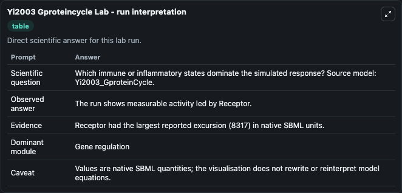
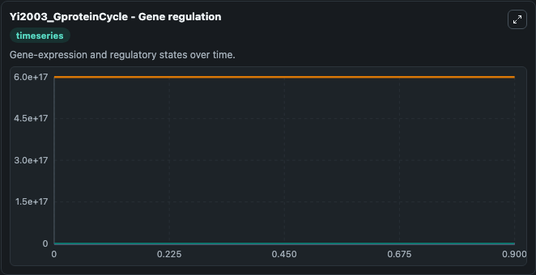
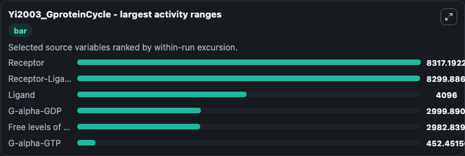
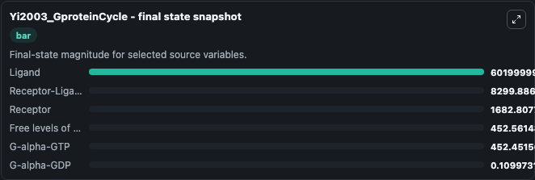
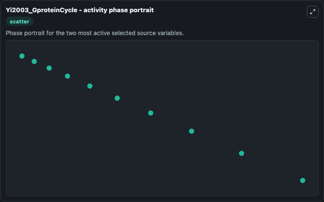

# Yi2003 Gproteincycle

This Biosimulant lab wraps `Yi2003 Gproteincycle` as a runnable systems biology model with a companion visualization module.
The paper describes both wild-type and mutant cells of G protein cycle by using different values of G protein deactivation. It can be used to explore the configured dynamics and compare scenario outcomes across configurations.

## What You'll See

The lab asks: Which immune or inflammatory states dominate the simulated response? Source model: Yi2003_GproteinCycle. It runs for 1.0 time units with a communication step of 0.1. The run uses the model defaults declared by the curated SBML wrapper. The generated visualizations focus on G-alpha-GDP, Free levels of G-beta-gamma, Receptor-Ligand, G-alpha-GTP, Ligand, and Receptor, combining trajectory, endpoint-comparison, and summary-table views from one completed dark-mode run.

In this captured run, **Receptor** moved from 1e+04 to 1682.8 across 1.0 simulation windows.


### Output Visualizations



*Summary table for Yi2003 Gproteincycle, reporting the scientific question, observed answer, dominant module, and caveat.*



*Trajectories of Receptor, Receptor-Ligand, Ligand, G-alpha-GDP, Free levels of G-beta-gamma, and G-alpha-GTP across the 1.0 simulation. In this run **Receptor-Ligand** climbed from 0 to 8299.9 and **Receptor** fell from 1e+04 to 1682.8 — the largest movements among the focused observables.*



*Largest-excursion ranking of the focused observables — the absolute movement magnitude during the run. Top 3: **Receptor** = 8317.2, **Receptor-Ligand** = 8299.9, **Ligand** = 4096.0, with 3 more observables below.*



*Endpoint snapshot of the focused observables — final values from the captured run. Top 3 by value: **Ligand** = 6.02e+17, **Receptor-Ligand** = 8299.9, **Receptor** = 1682.8, with 3 more observables below.*



*Visualization card from the Yi2003 Gproteincycle dark-mode run.*


## Model Context

- Core model: `models/core`
- Visualization model: `models/visualisation`
- Standard: `other`
- Upstream source: `biomodels_ebi:BIOMD0000000072`
- License: `CC0`

## Inputs

| Input | Maps To | Default | Notes |
|---|---|---|---|
| Initial G Alpha Gdp | `systemsbiology_sbml_yi2003_gproteincycle_biomd0000000072_model.initial_g_alpha_gdp` | | Source state initial condition exposed as a model-specific control because no explicit intervention parameter is identifiable. Maps to SBML symbol `Gd`. |
| Initial Free Levels Of G Beta Gamma | `systemsbiology_sbml_yi2003_gproteincycle_biomd0000000072_model.initial_free_levels_of_g_beta_gamma` | | Source state initial condition exposed as a model-specific control because no explicit intervention parameter is identifiable. Maps to SBML symbol `Gbg`. |
| Initial Receptor Ligand | `systemsbiology_sbml_yi2003_gproteincycle_biomd0000000072_model.initial_receptor_ligand` | | Source state initial condition exposed as a model-specific control because no explicit intervention parameter is identifiable. Maps to SBML symbol `RL`. |
| Initial G Alpha Gtp | `systemsbiology_sbml_yi2003_gproteincycle_biomd0000000072_model.initial_g_alpha_gtp` | | Source state initial condition exposed as a model-specific control because no explicit intervention parameter is identifiable. Maps to SBML symbol `Ga`. |
| Initial Ligand | `systemsbiology_sbml_yi2003_gproteincycle_biomd0000000072_model.initial_ligand` | | Source state initial condition exposed as a model-specific control because no explicit intervention parameter is identifiable. Maps to SBML symbol `L`. |
| Initial Receptor | `systemsbiology_sbml_yi2003_gproteincycle_biomd0000000072_model.initial_receptor` | | Source state initial condition exposed as a model-specific control because no explicit intervention parameter is identifiable. Maps to SBML symbol `R`. |

## Outputs

| Output | Maps To | Role |
|---|---|---|
| `state` | `systemsbiology_sbml_yi2003_gproteincycle_biomd0000000072_model.state` | Available to the visualization model and downstream workflows. |
| `summary` | `systemsbiology_sbml_yi2003_gproteincycle_biomd0000000072_model.summary` | Available to the visualization model and downstream workflows. |
| `species_labels` | `systemsbiology_sbml_yi2003_gproteincycle_biomd0000000072_model.species_labels` | Available to the visualization model and downstream workflows. |
| `g_alpha_gdp` | `systemsbiology_sbml_yi2003_gproteincycle_biomd0000000072_model.g_alpha_gdp` | Available to the visualization model and downstream workflows. |
| `free_levels_of_g_beta_gamma` | `systemsbiology_sbml_yi2003_gproteincycle_biomd0000000072_model.free_levels_of_g_beta_gamma` | Available to the visualization model and downstream workflows. |
| `receptor_ligand` | `systemsbiology_sbml_yi2003_gproteincycle_biomd0000000072_model.receptor_ligand` | Available to the visualization model and downstream workflows. |
| `g_alpha_gtp` | `systemsbiology_sbml_yi2003_gproteincycle_biomd0000000072_model.g_alpha_gtp` | Available to the visualization model and downstream workflows. |
| `ligand` | `systemsbiology_sbml_yi2003_gproteincycle_biomd0000000072_model.ligand` | Available to the visualization model and downstream workflows. |
| `receptor` | `systemsbiology_sbml_yi2003_gproteincycle_biomd0000000072_model.receptor` | Available to the visualization model and downstream workflows. |

## Runtime

- Duration: `1.0`
- Communication step: `0.1`

## Running Locally

```bash
biosimulant labs serve
```
