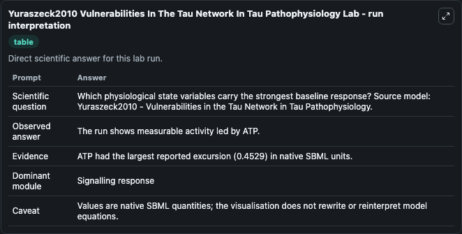
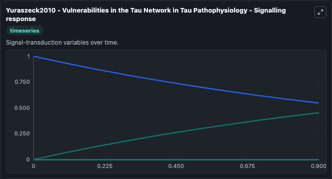
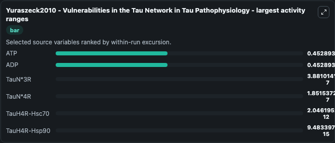
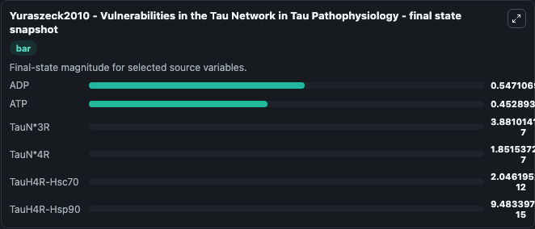
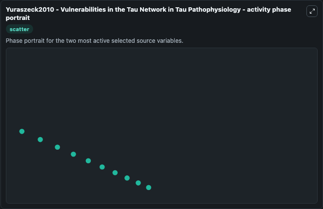

# Yuraszeck2010 Vulnerabilities In The Tau Network In Tau Pathophysiology

This Biosimulant lab wraps `Yuraszeck2010 Vulnerabilities In The Tau Network In Tau Pathophysiology` as a runnable systems biology model with a companion visualization module.
Yuraszeck2010 - Vulnerabilities in the TauNetwork in Tau Pathophysiology This model is described in the article: Vulnerabilities in the tau network and the role of ultrasensitive points in tau pathoph. It can be used to explore the configured dynamics and compare scenario outcomes across configurations.

## What You'll See

The lab asks: Which physiological state variables carry the strongest baseline response? Source model: Yuraszeck2010 - Vulnerabilities in the Tau Network in Tau Pathophysiology. It runs for 1.0 time units with a communication step of 0.1. The run uses the model defaults declared by the curated SBML wrapper. The generated visualizations focus on ADP, ATP, TauN*4R, TauN*3R, TauH4R-Hsp90, and TauH4R-Hsc70, combining trajectory, endpoint-comparison, and summary-table views from one completed dark-mode run.

In this captured run, **ATP** moved from 0 to 0.4529 across 1.0 simulation windows.


### Output Visualizations



*Summary table for Yuraszeck2010 Vulnerabilities In The Tau Network In Tau Pathophysiology, reporting the scientific question, observed answer, dominant module, and caveat.*



*Trajectories of ATP, ADP, TauN*3R, TauN*4R, TauH4R-Hsc70, and TauH4R-Hsp90 across the 1.0 simulation. In this run **ATP** climbed from 0 to 0.4529 and **ADP** fell from 1.000 to 0.5471 — the largest movements among the focused observables.*



*Largest-excursion ranking of the focused observables — the absolute movement magnitude during the run. Top 3: **ATP** = 0.4529, **ADP** = 0.4529, **TauN*3R** = 3.88e-07, with 3 more observables below.*



*Endpoint snapshot of the focused observables — final values from the captured run. Top 3 by value: **ADP** = 0.5471, **ATP** = 0.4529, **TauN*3R** = 3.88e-07, with 3 more observables below.*



*Visualization card from the Yuraszeck2010 Vulnerabilities In The Tau Network In Tau Pathophysiology dark-mode run.*


## Model Context

- Core model: `models/core`
- Visualization model: `models/visualisation`
- Standard: `other`
- Upstream source: `biomodels_ebi:BIOMD0000000542`
- License: `CC0`

## Inputs

| Input | Maps To | Default | Notes |
|---|---|---|---|
| Initial Model State ADP | `systemsbiology_sbml_yuraszeck2010_vulnerabilities_in_the_tau_network_biomd0000000542_model.initial_model_state_adp` | | Source state initial condition exposed as a model-specific control because no explicit intervention parameter is identifiable. Maps to SBML symbol `ADP`. |
| Initial Model State ATP | `systemsbiology_sbml_yuraszeck2010_vulnerabilities_in_the_tau_network_biomd0000000542_model.initial_model_state_atp` | | Source state initial condition exposed as a model-specific control because no explicit intervention parameter is identifiable. Maps to SBML symbol `ATP`. |
| Initial Tau N 4 R | `systemsbiology_sbml_yuraszeck2010_vulnerabilities_in_the_tau_network_biomd0000000542_model.initial_tau_n_4_r` | | Source state initial condition exposed as a model-specific control because no explicit intervention parameter is identifiable. Maps to SBML symbol `TauN_4R`. |
| Initial Tau N 3 R | `systemsbiology_sbml_yuraszeck2010_vulnerabilities_in_the_tau_network_biomd0000000542_model.initial_tau_n_3_r` | | Source state initial condition exposed as a model-specific control because no explicit intervention parameter is identifiable. Maps to SBML symbol `TauN_3R`. |
| Initial Tau H4 R Hsp90 | `systemsbiology_sbml_yuraszeck2010_vulnerabilities_in_the_tau_network_biomd0000000542_model.initial_tau_h4_r_hsp90` | | Source state initial condition exposed as a model-specific control because no explicit intervention parameter is identifiable. Maps to SBML symbol `TauH4R_Hsp90`. |
| Initial Tau H4 R Hsc70 | `systemsbiology_sbml_yuraszeck2010_vulnerabilities_in_the_tau_network_biomd0000000542_model.initial_tau_h4_r_hsc70` | | Source state initial condition exposed as a model-specific control because no explicit intervention parameter is identifiable. Maps to SBML symbol `TauH4R_Hsc70`. |

## Outputs

| Output | Maps To | Role |
|---|---|---|
| `state` | `systemsbiology_sbml_yuraszeck2010_vulnerabilities_in_the_tau_network_biomd0000000542_model.state` | Available to the visualization model and downstream workflows. |
| `summary` | `systemsbiology_sbml_yuraszeck2010_vulnerabilities_in_the_tau_network_biomd0000000542_model.summary` | Available to the visualization model and downstream workflows. |
| `species_labels` | `systemsbiology_sbml_yuraszeck2010_vulnerabilities_in_the_tau_network_biomd0000000542_model.species_labels` | Available to the visualization model and downstream workflows. |
| `adp` | `systemsbiology_sbml_yuraszeck2010_vulnerabilities_in_the_tau_network_biomd0000000542_model.adp` | Available to the visualization model and downstream workflows. |
| `atp` | `systemsbiology_sbml_yuraszeck2010_vulnerabilities_in_the_tau_network_biomd0000000542_model.atp` | Available to the visualization model and downstream workflows. |
| `tau_n_4_r` | `systemsbiology_sbml_yuraszeck2010_vulnerabilities_in_the_tau_network_biomd0000000542_model.tau_n_4_r` | Available to the visualization model and downstream workflows. |
| `tau_n_3_r` | `systemsbiology_sbml_yuraszeck2010_vulnerabilities_in_the_tau_network_biomd0000000542_model.tau_n_3_r` | Available to the visualization model and downstream workflows. |
| `tau_h4_r_hsp90` | `systemsbiology_sbml_yuraszeck2010_vulnerabilities_in_the_tau_network_biomd0000000542_model.tau_h4_r_hsp90` | Available to the visualization model and downstream workflows. |
| `tau_h4_r_hsc70` | `systemsbiology_sbml_yuraszeck2010_vulnerabilities_in_the_tau_network_biomd0000000542_model.tau_h4_r_hsc70` | Available to the visualization model and downstream workflows. |

## Runtime

- Duration: `1.0`
- Communication step: `0.1`

## Running Locally

```bash
biosimulant labs serve
```
