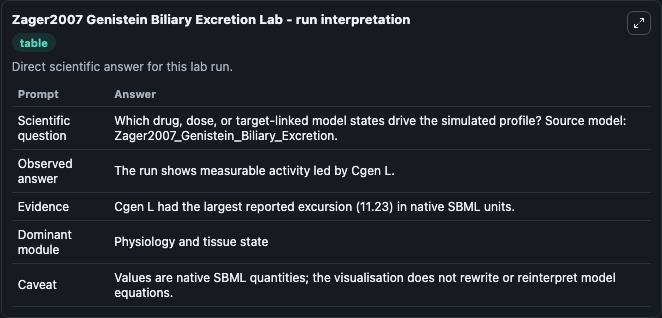
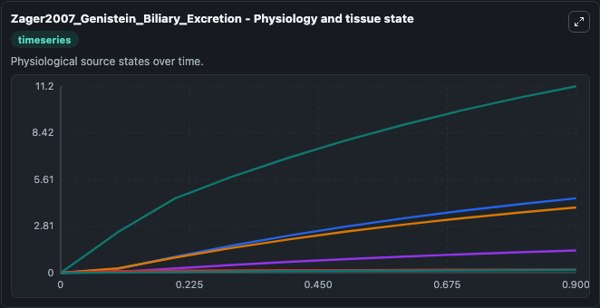
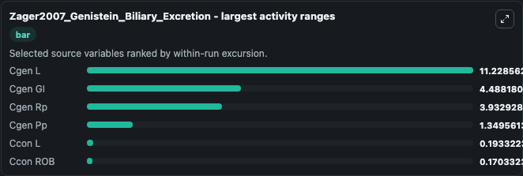
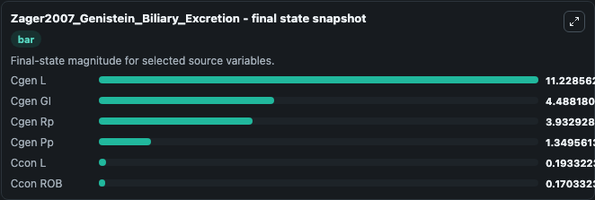
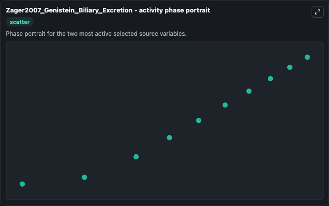

# Zager2007 Genistein Biliary Excretion

This Biosimulant lab wraps `Zager2007 Genistein Biliary Excretion` as a runnable systems biology model with a companion visualization module.
This the model from the article without the time delays: A Delayed Nonlinear PBPK Model for Genistein Dosimetry in Rats. It can be used to explore the configured dynamics and compare scenario outcomes across configurations.

## What You'll See

The lab asks: Which drug, dose, or target-linked model states drive the simulated profile? Source model: Zager2007_Genistein_Biliary_Excretion. It runs for 1.0 time units with a communication step of 0.1. The run uses the model defaults declared by the curated SBML wrapper. The generated visualizations focus on Cgen Rp, Cgen Pp, Cgen L, Cgen GI, Ccon ROB, and Ccon L, combining trajectory, endpoint-comparison, and summary-table views from one completed dark-mode run.

In this captured run, **Cgen L** moved from 0 to 11.229 across 1.0 simulation windows.


### Output Visualizations



*Summary table for Zager2007 Genistein Biliary Excretion, reporting the scientific question, observed answer, dominant module, and caveat.*



*Trajectories of Cgen L, Cgen GI, Cgen Rp, Cgen Pp, Ccon L, and Ccon ROB across the 1.0 simulation. In this run **Cgen L** climbed from 0 to 11.229 — the largest movements among the focused observables.*



*Largest-excursion ranking of the focused observables — the absolute movement magnitude during the run. Top 3: **Cgen L** = 11.229, **Cgen GI** = 4.488, **Cgen Rp** = 3.933, with 3 more observables below.*



*Endpoint snapshot of the focused observables — final values from the captured run. Top 3 by value: **Cgen L** = 11.229, **Cgen GI** = 4.488, **Cgen Rp** = 3.933, with 3 more observables below.*



*Visualization card from the Zager2007 Genistein Biliary Excretion dark-mode run.*


## Model Context

- Core model: `models/core`
- Visualization model: `models/visualisation`
- Standard: `other`
- Upstream source: `biomodels_ebi:MODEL6963432821`
- License: `CC0`

## Inputs

| Input | Maps To | Default | Notes |
|---|---|---|---|
| Initial Cgen Rp | `systemsbiology_sbml_zager2007_genistein_biliary_excretion_model6963432821_model.initial_cgen_rp` | | Source state initial condition exposed as a model-specific control because no explicit intervention parameter is identifiable. Maps to SBML symbol `Cgen_rp`. |
| Initial Cgen Pp | `systemsbiology_sbml_zager2007_genistein_biliary_excretion_model6963432821_model.initial_cgen_pp` | | Source state initial condition exposed as a model-specific control because no explicit intervention parameter is identifiable. Maps to SBML symbol `Cgen_pp`. |
| Initial Cgen L | `systemsbiology_sbml_zager2007_genistein_biliary_excretion_model6963432821_model.initial_cgen_l` | | Source state initial condition exposed as a model-specific control because no explicit intervention parameter is identifiable. Maps to SBML symbol `Cgen_l`. |
| Initial Cgen Gi | `systemsbiology_sbml_zager2007_genistein_biliary_excretion_model6963432821_model.initial_cgen_gi` | | Source state initial condition exposed as a model-specific control because no explicit intervention parameter is identifiable. Maps to SBML symbol `Cgen_GI`. |
| Initial Ccon Rob | `systemsbiology_sbml_zager2007_genistein_biliary_excretion_model6963432821_model.initial_ccon_rob` | | Source state initial condition exposed as a model-specific control because no explicit intervention parameter is identifiable. Maps to SBML symbol `Ccon_ROB`. |
| Initial Ccon L | `systemsbiology_sbml_zager2007_genistein_biliary_excretion_model6963432821_model.initial_ccon_l` | | Source state initial condition exposed as a model-specific control because no explicit intervention parameter is identifiable. Maps to SBML symbol `Ccon_l`. |

## Outputs

| Output | Maps To | Role |
|---|---|---|
| `state` | `systemsbiology_sbml_zager2007_genistein_biliary_excretion_model6963432821_model.state` | Available to the visualization model and downstream workflows. |
| `summary` | `systemsbiology_sbml_zager2007_genistein_biliary_excretion_model6963432821_model.summary` | Available to the visualization model and downstream workflows. |
| `species_labels` | `systemsbiology_sbml_zager2007_genistein_biliary_excretion_model6963432821_model.species_labels` | Available to the visualization model and downstream workflows. |
| `cgen_rp` | `systemsbiology_sbml_zager2007_genistein_biliary_excretion_model6963432821_model.cgen_rp` | Available to the visualization model and downstream workflows. |
| `cgen_pp` | `systemsbiology_sbml_zager2007_genistein_biliary_excretion_model6963432821_model.cgen_pp` | Available to the visualization model and downstream workflows. |
| `cgen_l` | `systemsbiology_sbml_zager2007_genistein_biliary_excretion_model6963432821_model.cgen_l` | Available to the visualization model and downstream workflows. |
| `cgen_gi` | `systemsbiology_sbml_zager2007_genistein_biliary_excretion_model6963432821_model.cgen_gi` | Available to the visualization model and downstream workflows. |
| `ccon_rob` | `systemsbiology_sbml_zager2007_genistein_biliary_excretion_model6963432821_model.ccon_rob` | Available to the visualization model and downstream workflows. |
| `ccon_l` | `systemsbiology_sbml_zager2007_genistein_biliary_excretion_model6963432821_model.ccon_l` | Available to the visualization model and downstream workflows. |

## Runtime

- Duration: `1.0`
- Communication step: `0.1`

## Running Locally

```bash
biosimulant labs serve
```
