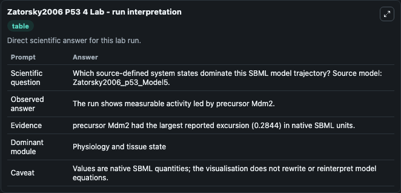
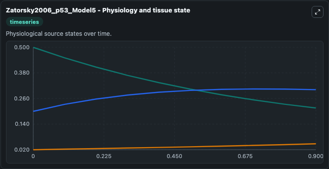
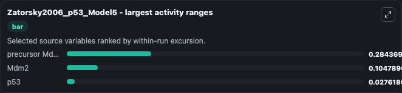
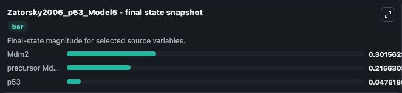
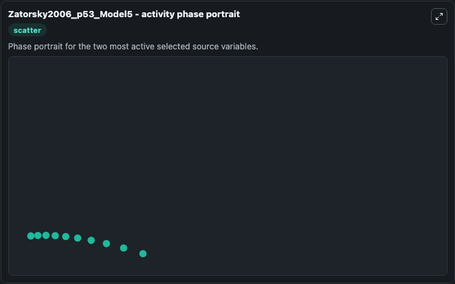

# Zatorsky2006 P53 4

This Biosimulant lab wraps `Zatorsky2006 P53 4` as a runnable systems biology model with a companion visualization module.
The model reproduces time profile of p53 and Mdm2 as depicted in Fig 6B of the paper for Model 5. It can be used to explore the configured dynamics and compare scenario outcomes across configurations.

## What You'll See

The lab asks: Which source-defined system states dominate this SBML model trajectory? Source model: Zatorsky2006_p53_Model5. It runs for 1.0 time units with a communication step of 0.1. The run uses the model defaults declared by the curated SBML wrapper. The generated visualizations focus on precursor Mdm2, Mdm2, and p53, combining trajectory, endpoint-comparison, and summary-table views from one completed dark-mode run.

In this captured run, **precursor Mdm2** moved from 0.5000 to 0.2156 across 1.0 simulation windows.


### Output Visualizations



*Summary table for Zatorsky2006 P53 4, reporting the scientific question, observed answer, dominant module, and caveat.*



*Trajectories of precursor Mdm2, Mdm2, and p53 across the 1.0 simulation. In this run **Mdm2** climbed from 0.2000 to 0.3016 and **precursor Mdm2** fell from 0.5000 to 0.2156 — the largest movements among the focused observables.*



*Largest-excursion ranking of the focused observables — the absolute movement magnitude during the run. Top 3: **precursor Mdm2** = 0.2844, **Mdm2** = 0.1048, **p53** = 0.0276.*



*Endpoint snapshot of the focused observables — final values from the captured run. Top 3 by value: **Mdm2** = 0.3016, **precursor Mdm2** = 0.2156, **p53** = 0.0476.*



*Visualization card from the Zatorsky2006 P53 4 dark-mode run.*


## Model Context

- Core model: `models/core`
- Visualization model: `models/visualisation`
- Standard: `other`
- Upstream source: `biomodels_ebi:BIOMD0000000156`
- License: `CC0`

## Inputs

| Input | Maps To | Default | Notes |
|---|---|---|---|
| Initial Precursor Mdm2 | `systemsbiology_sbml_zatorsky2006_p53_model5_biomd0000000156_model.initial_precursor_mdm2` | | Source state initial condition exposed as a model-specific control because no explicit intervention parameter is identifiable. Maps to SBML symbol `y0`. |
| Initial Mdm2 | `systemsbiology_sbml_zatorsky2006_p53_model5_biomd0000000156_model.initial_mdm2` | | Source state initial condition exposed as a model-specific control because no explicit intervention parameter is identifiable. Maps to SBML symbol `y`. |
| Initial Model State P53 | `systemsbiology_sbml_zatorsky2006_p53_model5_biomd0000000156_model.initial_model_state_p53` | | Source state initial condition exposed as a model-specific control because no explicit intervention parameter is identifiable. Maps to SBML symbol `x`. |

## Outputs

| Output | Maps To | Role |
|---|---|---|
| `state` | `systemsbiology_sbml_zatorsky2006_p53_model5_biomd0000000156_model.state` | Available to the visualization model and downstream workflows. |
| `summary` | `systemsbiology_sbml_zatorsky2006_p53_model5_biomd0000000156_model.summary` | Available to the visualization model and downstream workflows. |
| `species_labels` | `systemsbiology_sbml_zatorsky2006_p53_model5_biomd0000000156_model.species_labels` | Available to the visualization model and downstream workflows. |
| `precursor_mdm2` | `systemsbiology_sbml_zatorsky2006_p53_model5_biomd0000000156_model.precursor_mdm2` | Available to the visualization model and downstream workflows. |
| `mdm2` | `systemsbiology_sbml_zatorsky2006_p53_model5_biomd0000000156_model.mdm2` | Available to the visualization model and downstream workflows. |
| `p53` | `systemsbiology_sbml_zatorsky2006_p53_model5_biomd0000000156_model.p53` | Available to the visualization model and downstream workflows. |

## Runtime

- Duration: `1.0`
- Communication step: `0.1`

## Running Locally

```bash
biosimulant labs serve
```
