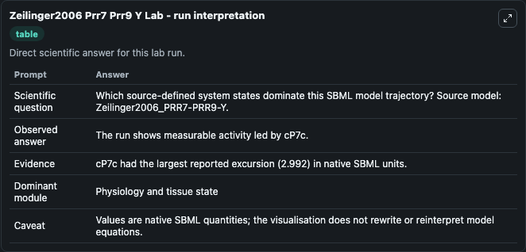
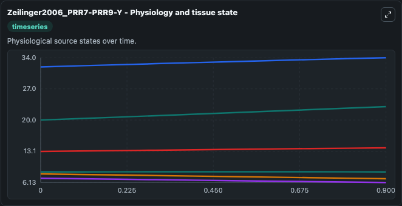
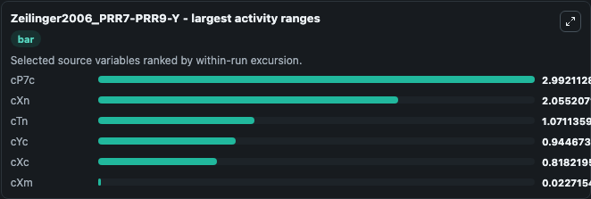
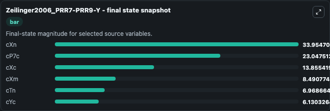
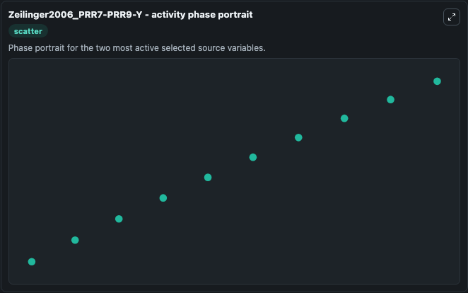

# Zeilinger2006 Prr7 Prr9 Y

This Biosimulant lab wraps `Zeilinger2006 Prr7 Prr9 Y` as a runnable systems biology model with a companion visualization module.
The model reproduces the circadian charecteristics as given in Table 1 for the PRR7-PRR9-Y model. It can be used to explore the configured dynamics and compare scenario outcomes across configurations.

## What You'll See

The lab asks: Which source-defined system states dominate this SBML model trajectory? Source model: Zeilinger2006_PRR7-PRR9-Y. It runs for 1.0 time units with a communication step of 0.1. The run uses the model defaults declared by the curated SBML wrapper. The generated visualizations focus on cXn, cP7c, cXc, cXm, cTn, and cYc, combining trajectory, endpoint-comparison, and summary-table views from one completed dark-mode run.

In this captured run, **cP7c** moved from 20.055 to 23.048 across 1.0 simulation windows.


### Output Visualizations



*Summary table for Zeilinger2006 Prr7 Prr9 Y, reporting the scientific question, observed answer, dominant module, and caveat.*



*Trajectories of cP7c, cXn, cTn, cYc, cXc, and cXm across the 1.0 simulation. In this run **cP7c** climbed from 20.055 to 23.048 and **cTn** fell from 8.040 to 6.969 — the largest movements among the focused observables.*



*Largest-excursion ranking of the focused observables — the absolute movement magnitude during the run. Top 3: **cP7c** = 2.992, **cXn** = 2.055, **cTn** = 1.071, with 3 more observables below.*



*Endpoint snapshot of the focused observables — final values from the captured run. Top 3 by value: **cXn** = 33.955, **cP7c** = 23.048, **cXc** = 13.855, with 3 more observables below.*



*Visualization card from the Zeilinger2006 Prr7 Prr9 Y dark-mode run.*


## Model Context

- Core model: `models/core`
- Visualization model: `models/visualisation`
- Standard: `other`
- Upstream source: `biomodels_ebi:BIOMD0000000095`
- License: `CC0`

## Inputs

| Input | Maps To | Default | Notes |
|---|---|---|---|
| Initial C Xn | `systemsbiology_sbml_zeilinger2006_prr7_prr9_y_biomd0000000095_model.initial_c_xn` | | Source state initial condition exposed as a model-specific control because no explicit intervention parameter is identifiable. Maps to SBML symbol `cXn`. |
| Initial C P7C | `systemsbiology_sbml_zeilinger2006_prr7_prr9_y_biomd0000000095_model.initial_c_p7c` | | Source state initial condition exposed as a model-specific control because no explicit intervention parameter is identifiable. Maps to SBML symbol `cP7c`. |
| Initial C Xc | `systemsbiology_sbml_zeilinger2006_prr7_prr9_y_biomd0000000095_model.initial_c_xc` | | Source state initial condition exposed as a model-specific control because no explicit intervention parameter is identifiable. Maps to SBML symbol `cXc`. |
| Initial C Xm | `systemsbiology_sbml_zeilinger2006_prr7_prr9_y_biomd0000000095_model.initial_c_xm` | | Source state initial condition exposed as a model-specific control because no explicit intervention parameter is identifiable. Maps to SBML symbol `cXm`. |
| Initial C Tn | `systemsbiology_sbml_zeilinger2006_prr7_prr9_y_biomd0000000095_model.initial_c_tn` | | Source state initial condition exposed as a model-specific control because no explicit intervention parameter is identifiable. Maps to SBML symbol `cTn`. |
| Initial C Yc | `systemsbiology_sbml_zeilinger2006_prr7_prr9_y_biomd0000000095_model.initial_c_yc` | | Source state initial condition exposed as a model-specific control because no explicit intervention parameter is identifiable. Maps to SBML symbol `cYc`. |

## Outputs

| Output | Maps To | Role |
|---|---|---|
| `state` | `systemsbiology_sbml_zeilinger2006_prr7_prr9_y_biomd0000000095_model.state` | Available to the visualization model and downstream workflows. |
| `summary` | `systemsbiology_sbml_zeilinger2006_prr7_prr9_y_biomd0000000095_model.summary` | Available to the visualization model and downstream workflows. |
| `species_labels` | `systemsbiology_sbml_zeilinger2006_prr7_prr9_y_biomd0000000095_model.species_labels` | Available to the visualization model and downstream workflows. |
| `c_xn` | `systemsbiology_sbml_zeilinger2006_prr7_prr9_y_biomd0000000095_model.c_xn` | Available to the visualization model and downstream workflows. |
| `c_p7c` | `systemsbiology_sbml_zeilinger2006_prr7_prr9_y_biomd0000000095_model.c_p7c` | Available to the visualization model and downstream workflows. |
| `c_xc` | `systemsbiology_sbml_zeilinger2006_prr7_prr9_y_biomd0000000095_model.c_xc` | Available to the visualization model and downstream workflows. |
| `c_xm` | `systemsbiology_sbml_zeilinger2006_prr7_prr9_y_biomd0000000095_model.c_xm` | Available to the visualization model and downstream workflows. |
| `c_tn` | `systemsbiology_sbml_zeilinger2006_prr7_prr9_y_biomd0000000095_model.c_tn` | Available to the visualization model and downstream workflows. |
| `c_yc` | `systemsbiology_sbml_zeilinger2006_prr7_prr9_y_biomd0000000095_model.c_yc` | Available to the visualization model and downstream workflows. |

## Runtime

- Duration: `1.0`
- Communication step: `0.1`

## Running Locally

```bash
biosimulant labs serve
```
