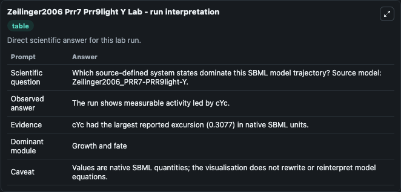
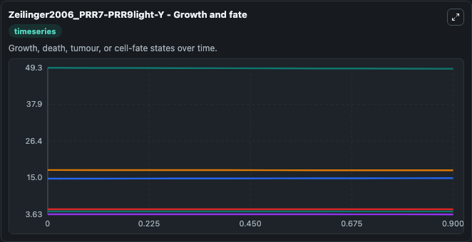
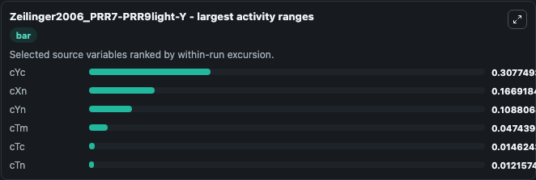
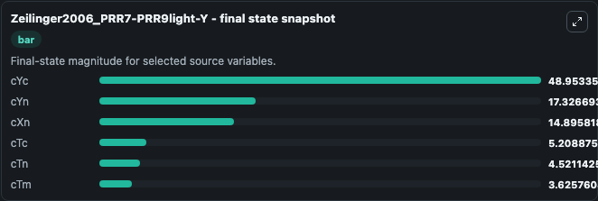
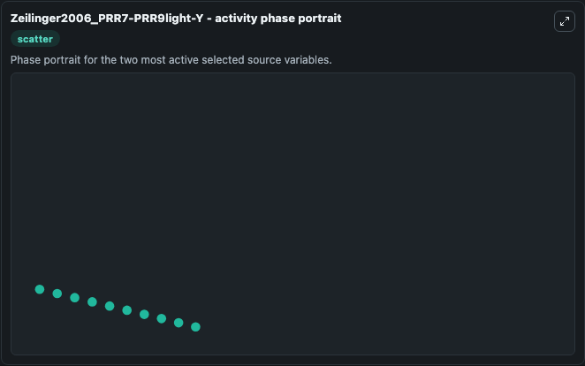

# Zeilinger2006 Prr7 Prr9light Y

This Biosimulant lab wraps `Zeilinger2006 Prr7 Prr9light Y` as a runnable systems biology model with a companion visualization module.
The model reproduces the time profile of cYm and cTm under light-dark cycles as depicted in Fig 4 and Fig 5 respectively. 12 hour light-dark cycles are accomplished using a simple algorithm in the eve. It can be used to explore the configured dynamics and compare scenario outcomes across configurations.

## What You'll See

The lab asks: Which source-defined system states dominate this SBML model trajectory? Source model: Zeilinger2006_PRR7-PRR9light-Y. It runs for 1.0 time units with a communication step of 0.1. The run uses the model defaults declared by the curated SBML wrapper. The generated visualizations focus on cYc, cYn, cXn, cTc, cTn, and cTm, combining trajectory, endpoint-comparison, and summary-table views from one completed dark-mode run.

In this captured run, **cYc** moved from 49.261 to 48.953 across 1.0 simulation windows.


### Output Visualizations



*Summary table for Zeilinger2006 Prr7 Prr9light Y, reporting the scientific question, observed answer, dominant module, and caveat.*



*Trajectories of cYc, cXn, cYn, cTm, cTc, and cTn across the 1.0 simulation. In this run **cXn** climbed from 14.729 to 14.896 and **cYc** fell from 49.261 to 48.953 — the largest movements among the focused observables.*



*Largest-excursion ranking of the focused observables — the absolute movement magnitude during the run. Top 3: **cYc** = 0.3077, **cXn** = 0.1669, **cYn** = 0.1088, with 3 more observables below.*



*Endpoint snapshot of the focused observables — final values from the captured run. Top 3 by value: **cYc** = 48.953, **cYn** = 17.327, **cXn** = 14.896, with 3 more observables below.*



*Visualization card from the Zeilinger2006 Prr7 Prr9light Y dark-mode run.*


## Model Context

- Core model: `models/core`
- Visualization model: `models/visualisation`
- Standard: `other`
- Upstream source: `biomodels_ebi:BIOMD0000000096`
- License: `CC0`

## Inputs

| Input | Maps To | Default | Notes |
|---|---|---|---|
| Initial C Yc | `systemsbiology_sbml_zeilinger2006_prr7_prr9light_y_biomd0000000096_model.initial_c_yc` | | Source state initial condition exposed as a model-specific control because no explicit intervention parameter is identifiable. Maps to SBML symbol `cYc`. |
| Initial C Yn | `systemsbiology_sbml_zeilinger2006_prr7_prr9light_y_biomd0000000096_model.initial_c_yn` | | Source state initial condition exposed as a model-specific control because no explicit intervention parameter is identifiable. Maps to SBML symbol `cYn`. |
| Initial C Xn | `systemsbiology_sbml_zeilinger2006_prr7_prr9light_y_biomd0000000096_model.initial_c_xn` | | Source state initial condition exposed as a model-specific control because no explicit intervention parameter is identifiable. Maps to SBML symbol `cXn`. |
| Initial C Tc | `systemsbiology_sbml_zeilinger2006_prr7_prr9light_y_biomd0000000096_model.initial_c_tc` | | Source state initial condition exposed as a model-specific control because no explicit intervention parameter is identifiable. Maps to SBML symbol `cTc`. |
| Initial C Tn | `systemsbiology_sbml_zeilinger2006_prr7_prr9light_y_biomd0000000096_model.initial_c_tn` | | Source state initial condition exposed as a model-specific control because no explicit intervention parameter is identifiable. Maps to SBML symbol `cTn`. |
| Initial C Tm | `systemsbiology_sbml_zeilinger2006_prr7_prr9light_y_biomd0000000096_model.initial_c_tm` | | Source state initial condition exposed as a model-specific control because no explicit intervention parameter is identifiable. Maps to SBML symbol `cTm`. |

## Outputs

| Output | Maps To | Role |
|---|---|---|
| `state` | `systemsbiology_sbml_zeilinger2006_prr7_prr9light_y_biomd0000000096_model.state` | Available to the visualization model and downstream workflows. |
| `summary` | `systemsbiology_sbml_zeilinger2006_prr7_prr9light_y_biomd0000000096_model.summary` | Available to the visualization model and downstream workflows. |
| `species_labels` | `systemsbiology_sbml_zeilinger2006_prr7_prr9light_y_biomd0000000096_model.species_labels` | Available to the visualization model and downstream workflows. |
| `c_yc` | `systemsbiology_sbml_zeilinger2006_prr7_prr9light_y_biomd0000000096_model.c_yc` | Available to the visualization model and downstream workflows. |
| `c_yn` | `systemsbiology_sbml_zeilinger2006_prr7_prr9light_y_biomd0000000096_model.c_yn` | Available to the visualization model and downstream workflows. |
| `c_xn` | `systemsbiology_sbml_zeilinger2006_prr7_prr9light_y_biomd0000000096_model.c_xn` | Available to the visualization model and downstream workflows. |
| `c_tc` | `systemsbiology_sbml_zeilinger2006_prr7_prr9light_y_biomd0000000096_model.c_tc` | Available to the visualization model and downstream workflows. |
| `c_tn` | `systemsbiology_sbml_zeilinger2006_prr7_prr9light_y_biomd0000000096_model.c_tn` | Available to the visualization model and downstream workflows. |
| `c_tm` | `systemsbiology_sbml_zeilinger2006_prr7_prr9light_y_biomd0000000096_model.c_tm` | Available to the visualization model and downstream workflows. |

## Runtime

- Duration: `1.0`
- Communication step: `0.1`

## Running Locally

```bash
biosimulant labs serve
```
