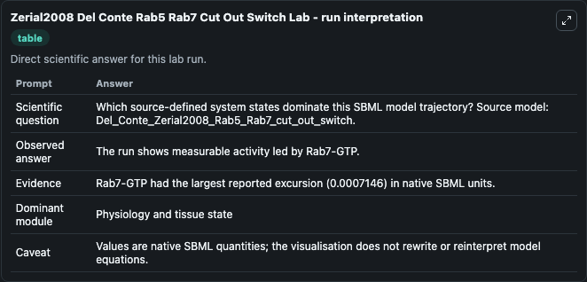
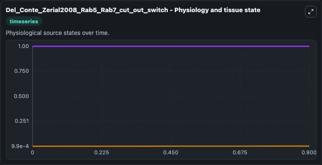
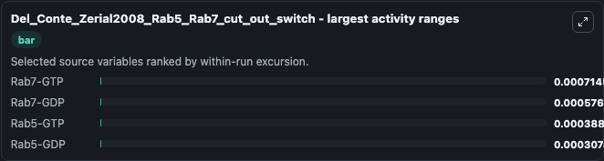
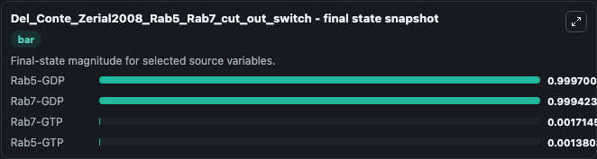
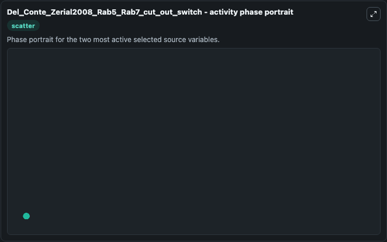

# Zerial2008 Del Conte Rab5 Rab7 Cut Out Switch

This Biosimulant lab wraps `Zerial2008 Del Conte Rab5 Rab7 Cut Out Switch` as a runnable systems biology model with a companion visualization module.
Cut-out switch model Membrane identity and GTPase cascades regulated by toggle and cut-out switches Perla Del Conte-Zerial, Lutz Brusch, Jochen C Rink, Claudio Collinet, Yannis Kalaidzidis, Marino Zer. It can be used to explore the configured dynamics and compare scenario outcomes across configurations.

## What You'll See

The lab asks: Which source-defined system states dominate this SBML model trajectory? Source model: Del_Conte_Zerial2008_Rab5_Rab7_cut_out_switch. It runs for 1.0 time units with a communication step of 0.1. The run uses the model defaults declared by the curated SBML wrapper. The generated visualizations focus on Rab7-GDP, Rab5-GDP, Rab7-GTP, and Rab5-GTP, combining trajectory, endpoint-comparison, and summary-table views from one completed dark-mode run.

In this captured run, **Rab7-GTP** moved from 0.001 to 0.00171 across 1.0 simulation windows.


### Output Visualizations



*Summary table for Zerial2008 Del Conte Rab5 Rab7 Cut Out Switch, reporting the scientific question, observed answer, dominant module, and caveat.*



*Trajectories of Rab7-GTP, Rab7-GDP, Rab5-GTP, and Rab5-GDP across the 1.0 simulation. In this run **Rab7-GTP** climbed from 0.001 to 0.00171 and **Rab7-GDP** fell from 1.000 to 0.9994 — the largest movements among the focused observables.*



*Largest-excursion ranking of the focused observables — the absolute movement magnitude during the run. Top 3: **Rab7-GTP** = 0.000715, **Rab7-GDP** = 0.000577, **Rab5-GTP** = 0.000389, with 1 more observable below.*



*Endpoint snapshot of the focused observables — final values from the captured run. Top 3 by value: **Rab5-GDP** = 0.9997, **Rab7-GDP** = 0.9994, **Rab7-GTP** = 0.00171, with 1 more observable below.*



*Visualization card from the Zerial2008 Del Conte Rab5 Rab7 Cut Out Switch dark-mode run.*


## Model Context

- Core model: `models/core`
- Visualization model: `models/visualisation`
- Standard: `other`
- Upstream source: `biomodels_ebi:BIOMD0000000174`
- License: `CC0`

## Inputs

| Input | Maps To | Default | Notes |
|---|---|---|---|
| Initial Rab7 Gdp | `systemsbiology_sbml_del_conte_zerial2008_rab5_rab7_cut_out_switch_biomd0000000174_model.initial_rab7_gdp` | | Source state initial condition exposed as a model-specific control because no explicit intervention parameter is identifiable. Maps to SBML symbol `r7`. |
| Initial Rab5 Gdp | `systemsbiology_sbml_del_conte_zerial2008_rab5_rab7_cut_out_switch_biomd0000000174_model.initial_rab5_gdp` | | Source state initial condition exposed as a model-specific control because no explicit intervention parameter is identifiable. Maps to SBML symbol `r5`. |
| Initial Rab7 Gtp | `systemsbiology_sbml_del_conte_zerial2008_rab5_rab7_cut_out_switch_biomd0000000174_model.initial_rab7_gtp` | | Source state initial condition exposed as a model-specific control because no explicit intervention parameter is identifiable. Maps to SBML symbol `R7`. |
| Initial Rab5 Gtp | `systemsbiology_sbml_del_conte_zerial2008_rab5_rab7_cut_out_switch_biomd0000000174_model.initial_rab5_gtp` | | Source state initial condition exposed as a model-specific control because no explicit intervention parameter is identifiable. Maps to SBML symbol `R5`. |

## Outputs

| Output | Maps To | Role |
|---|---|---|
| `state` | `systemsbiology_sbml_del_conte_zerial2008_rab5_rab7_cut_out_switch_biomd0000000174_model.state` | Available to the visualization model and downstream workflows. |
| `summary` | `systemsbiology_sbml_del_conte_zerial2008_rab5_rab7_cut_out_switch_biomd0000000174_model.summary` | Available to the visualization model and downstream workflows. |
| `species_labels` | `systemsbiology_sbml_del_conte_zerial2008_rab5_rab7_cut_out_switch_biomd0000000174_model.species_labels` | Available to the visualization model and downstream workflows. |
| `rab7_gdp` | `systemsbiology_sbml_del_conte_zerial2008_rab5_rab7_cut_out_switch_biomd0000000174_model.rab7_gdp` | Available to the visualization model and downstream workflows. |
| `rab5_gdp` | `systemsbiology_sbml_del_conte_zerial2008_rab5_rab7_cut_out_switch_biomd0000000174_model.rab5_gdp` | Available to the visualization model and downstream workflows. |
| `rab7_gtp` | `systemsbiology_sbml_del_conte_zerial2008_rab5_rab7_cut_out_switch_biomd0000000174_model.rab7_gtp` | Available to the visualization model and downstream workflows. |
| `rab5_gtp` | `systemsbiology_sbml_del_conte_zerial2008_rab5_rab7_cut_out_switch_biomd0000000174_model.rab5_gtp` | Available to the visualization model and downstream workflows. |

## Runtime

- Duration: `1.0`
- Communication step: `0.1`

## Running Locally

```bash
biosimulant labs serve
```
