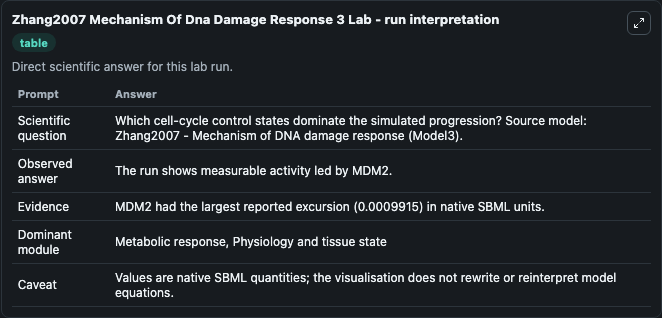
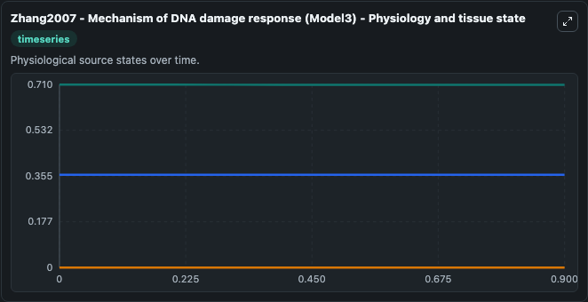
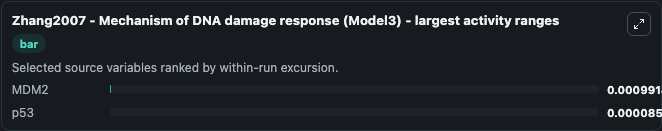
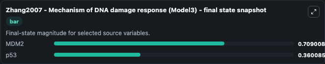
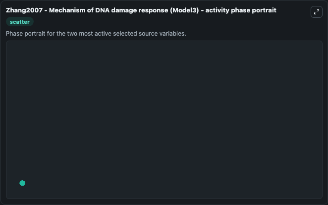

# Zhang2007 Mechanism Of Dna Damage Response 3

This Biosimulant lab wraps `Zhang2007 Mechanism Of Dna Damage Response 3` as a runnable systems biology model with a companion visualization module.
It's a mechanistic model explaining the impact of p53 on apoptosis decision. It can be used to explore the configured dynamics and compare scenario outcomes across configurations.

## What You'll See

The lab asks: Which cell-cycle control states dominate the simulated progression? Source model: Zhang2007 - Mechanism of DNA damage response (Model3). It runs for 1.0 time units with a communication step of 0.1. The run uses the model defaults declared by the curated SBML wrapper. The generated visualizations focus on DNAdamage, p53, and MDM2, combining trajectory, endpoint-comparison, and summary-table views from one completed dark-mode run.

In this captured run, **MDM2** moved from 0.7100 to 0.7090 across 1.0 simulation windows.


### Output Visualizations



*Summary table for Zhang2007 Mechanism Of Dna Damage Response 3, reporting the scientific question, observed answer, dominant module, and caveat.*



*Trajectories of MDM2, p53, and DNAdamage across the 1.0 simulation. In this run **p53** climbed from 0.3600 to 0.3601 and **MDM2** fell from 0.7100 to 0.7090 — the largest movements among the focused observables.*



*Trajectories of MDM2, p53, and DNAdamage across the 1.0 simulation. In this run **p53** climbed from 0.3600 to 0.3601 and **MDM2** fell from 0.7100 to 0.7090 — the largest movements among the focused observables.*



*Endpoint snapshot of the focused observables — final values from the captured run. Top 2 by value: **MDM2** = 0.7090, **p53** = 0.3601.*



*Trajectories of MDM2, p53, and DNAdamage across the 1.0 simulation. In this run **p53** climbed from 0.3600 to 0.3601 and **MDM2** fell from 0.7100 to 0.7090 — the largest movements among the focused observables.*


## Model Context

- Core model: `models/core`
- Visualization model: `models/visualisation`
- Standard: `other`
- Upstream source: `biomodels_ebi:BIOMD0000001010`
- License: `CC0`

## Inputs

| Input | Maps To | Default | Notes |
|---|---|---|---|
| Initial Dn Adamage | `systemsbiology_sbml_zhang2007_mechanism_of_dna_damage_response_model_biomd0000001010_model.initial_dn_adamage` | | Source state initial condition exposed as a model-specific control because no explicit intervention parameter is identifiable. Maps to SBML symbol `DNAdamage`. |
| Initial Model State P53 | `systemsbiology_sbml_zhang2007_mechanism_of_dna_damage_response_model_biomd0000001010_model.initial_model_state_p53` | | Source state initial condition exposed as a model-specific control because no explicit intervention parameter is identifiable. Maps to SBML symbol `p53`. |
| Initial Mdm2 | `systemsbiology_sbml_zhang2007_mechanism_of_dna_damage_response_model_biomd0000001010_model.initial_mdm2` | | Source state initial condition exposed as a model-specific control because no explicit intervention parameter is identifiable. Maps to SBML symbol `MDM2`. |

## Outputs

| Output | Maps To | Role |
|---|---|---|
| `state` | `systemsbiology_sbml_zhang2007_mechanism_of_dna_damage_response_model_biomd0000001010_model.state` | Available to the visualization model and downstream workflows. |
| `summary` | `systemsbiology_sbml_zhang2007_mechanism_of_dna_damage_response_model_biomd0000001010_model.summary` | Available to the visualization model and downstream workflows. |
| `species_labels` | `systemsbiology_sbml_zhang2007_mechanism_of_dna_damage_response_model_biomd0000001010_model.species_labels` | Available to the visualization model and downstream workflows. |
| `dn_adamage` | `systemsbiology_sbml_zhang2007_mechanism_of_dna_damage_response_model_biomd0000001010_model.dn_adamage` | Available to the visualization model and downstream workflows. |
| `p53` | `systemsbiology_sbml_zhang2007_mechanism_of_dna_damage_response_model_biomd0000001010_model.p53` | Available to the visualization model and downstream workflows. |
| `mdm2` | `systemsbiology_sbml_zhang2007_mechanism_of_dna_damage_response_model_biomd0000001010_model.mdm2` | Available to the visualization model and downstream workflows. |

## Runtime

- Duration: `1.0`
- Communication step: `0.1`

## Running Locally

```bash
biosimulant labs serve
```
