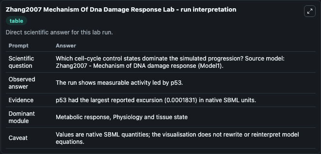
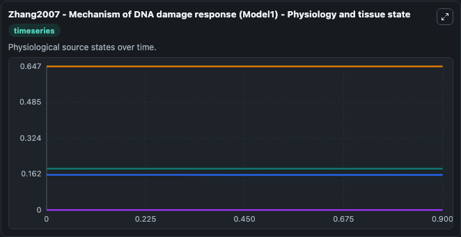
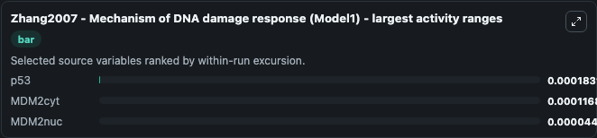
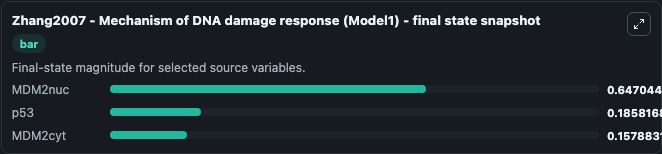
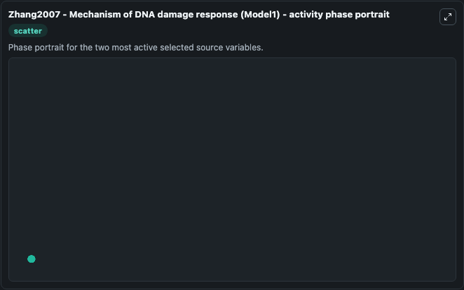

# Zhang2007 Mechanism Of Dna Damage Response

This Biosimulant lab wraps `Zhang2007 Mechanism Of Dna Damage Response` as a runnable systems biology model with a companion visualization module.
Its a mechanistic model explaining the impact of p53 om apoptosis decision. It can be used to explore the configured dynamics and compare scenario outcomes across configurations.

## What You'll See

The lab asks: Which cell-cycle control states dominate the simulated progression? Source model: Zhang2007 - Mechanism of DNA damage response (Model1). It runs for 1.0 time units with a communication step of 0.1. The run uses the model defaults declared by the curated SBML wrapper. The generated visualizations focus on DNAdamage, p53, MDM2nuc, and MDM2cyt, combining trajectory, endpoint-comparison, and summary-table views from one completed dark-mode run.

In this captured run, **p53** moved from 0.1860 to 0.1858 across 1.0 simulation windows.


### Output Visualizations



*Summary table for Zhang2007 Mechanism Of Dna Damage Response, reporting the scientific question, observed answer, dominant module, and caveat.*



*Trajectories of p53, MDM2cyt, MDM2nuc, and DNAdamage across the 1.0 simulation. In this run **MDM2nuc** climbed from 0.6470 to 0.6470 and **p53** fell from 0.1860 to 0.1858 — the largest movements among the focused observables.*



*Trajectories of p53, MDM2cyt, MDM2nuc, and DNAdamage across the 1.0 simulation. In this run **MDM2nuc** climbed from 0.6470 to 0.6470 and **p53** fell from 0.1860 to 0.1858 — the largest movements among the focused observables.*



*Endpoint snapshot of the focused observables — final values from the captured run. Top 3 by value: **MDM2nuc** = 0.6470, **p53** = 0.1858, **MDM2cyt** = 0.1579.*



*Trajectories of p53, MDM2cyt, MDM2nuc, and DNAdamage across the 1.0 simulation. In this run **MDM2nuc** climbed from 0.6470 to 0.6470 and **p53** fell from 0.1860 to 0.1858 — the largest movements among the focused observables.*


## Model Context

- Core model: `models/core`
- Visualization model: `models/visualisation`
- Standard: `other`
- Upstream source: `biomodels_ebi:BIOMD0000001007`
- License: `CC0`

## Inputs

| Input | Maps To | Default | Notes |
|---|---|---|---|
| Initial Dn Adamage | `systemsbiology_sbml_zhang2007_mechanism_of_dna_damage_response_model_biomd0000001007_model.initial_dn_adamage` | | Source state initial condition exposed as a model-specific control because no explicit intervention parameter is identifiable. Maps to SBML symbol `DNAdamage`. |
| Initial Model State P53 | `systemsbiology_sbml_zhang2007_mechanism_of_dna_damage_response_model_biomd0000001007_model.initial_model_state_p53` | | Source state initial condition exposed as a model-specific control because no explicit intervention parameter is identifiable. Maps to SBML symbol `p53`. |
| Initial Mdm2nuc | `systemsbiology_sbml_zhang2007_mechanism_of_dna_damage_response_model_biomd0000001007_model.initial_mdm2nuc` | | Source state initial condition exposed as a model-specific control because no explicit intervention parameter is identifiable. Maps to SBML symbol `MDM2nuc`. |
| Initial Mdm2cyt | `systemsbiology_sbml_zhang2007_mechanism_of_dna_damage_response_model_biomd0000001007_model.initial_mdm2cyt` | | Source state initial condition exposed as a model-specific control because no explicit intervention parameter is identifiable. Maps to SBML symbol `MDM2cyt`. |

## Outputs

| Output | Maps To | Role |
|---|---|---|
| `state` | `systemsbiology_sbml_zhang2007_mechanism_of_dna_damage_response_model_biomd0000001007_model.state` | Available to the visualization model and downstream workflows. |
| `summary` | `systemsbiology_sbml_zhang2007_mechanism_of_dna_damage_response_model_biomd0000001007_model.summary` | Available to the visualization model and downstream workflows. |
| `species_labels` | `systemsbiology_sbml_zhang2007_mechanism_of_dna_damage_response_model_biomd0000001007_model.species_labels` | Available to the visualization model and downstream workflows. |
| `dn_adamage` | `systemsbiology_sbml_zhang2007_mechanism_of_dna_damage_response_model_biomd0000001007_model.dn_adamage` | Available to the visualization model and downstream workflows. |
| `p53` | `systemsbiology_sbml_zhang2007_mechanism_of_dna_damage_response_model_biomd0000001007_model.p53` | Available to the visualization model and downstream workflows. |
| `mdm2nuc` | `systemsbiology_sbml_zhang2007_mechanism_of_dna_damage_response_model_biomd0000001007_model.mdm2nuc` | Available to the visualization model and downstream workflows. |
| `mdm2cyt` | `systemsbiology_sbml_zhang2007_mechanism_of_dna_damage_response_model_biomd0000001007_model.mdm2cyt` | Available to the visualization model and downstream workflows. |

## Runtime

- Duration: `1.0`
- Communication step: `0.1`

## Running Locally

```bash
biosimulant labs serve
```
