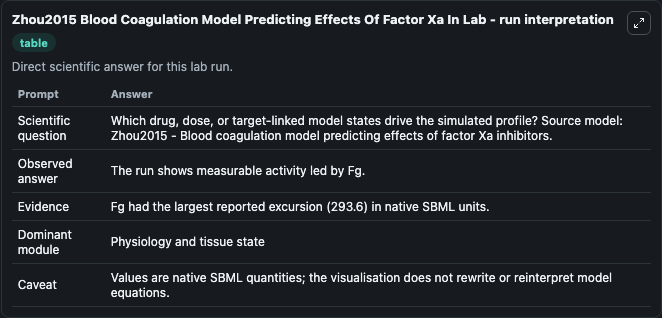
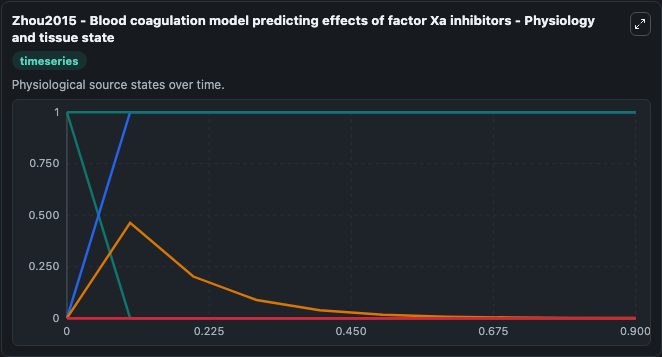
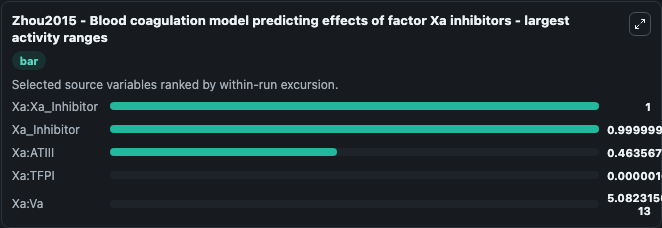
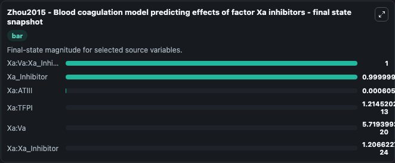
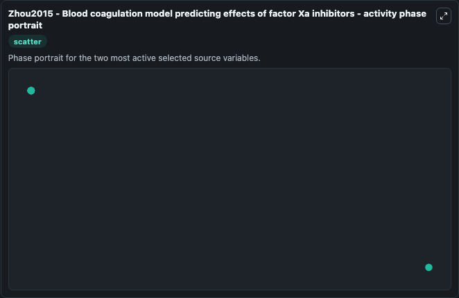

# Zhou2015 Blood Coagulation Model Predicting Effects Of Factor Xa In

This Biosimulant lab wraps `Zhou2015 Blood Coagulation Model Predicting Effects Of Factor Xa In` as a runnable systems biology model with a companion visualization module.
Blood coagulation model investigating effects of Xa-inhibitors (Rivaroxaban and Apixaban). It can be used to explore the configured dynamics and compare scenario outcomes across configurations.

## What You'll See

The lab asks: Which drug, dose, or target-linked model states drive the simulated profile? Source model: Zhou2015 - Blood coagulation model predicting effects of factor Xa inhibitors. It runs for 1.0 time units with a communication step of 0.1. The run uses the model defaults declared by the curated SBML wrapper. The generated visualizations focus on Xa:Xa_Inhibitor, Xa:Va:Xa_Inhibitor, Xa_Inhibitor, Xa:Va, Xa:TFPI, and Xa:ATIII, combining trajectory, endpoint-comparison, and summary-table views from one completed dark-mode run.

In this captured run, **Xa:Xa_Inhibitor** moved from 1.000 to 1.21e-24 across 1.0 simulation windows.


### Output Visualizations



*Summary table for Zhou2015 Blood Coagulation Model Predicting Effects Of Factor Xa In, reporting the scientific question, observed answer, dominant module, and caveat.*



*Trajectories of Xa:Xa_Inhibitor, Xa_Inhibitor, Xa:ATIII, Xa:TFPI, Xa:Va, and Xa:Va:Xa_Inhibitor across the 1.0 simulation. In this run **Xa_Inhibitor** climbed from 0 to 1.0000 and **Xa:Xa_Inhibitor** fell from 1.000 to 1.21e-24 — the largest movements among the focused observables.*



*Largest-excursion ranking of the focused observables — the absolute movement magnitude during the run. Top 3: **Xa:Xa_Inhibitor** = 1.000, **Xa_Inhibitor** = 1.0000, **Xa:ATIII** = 0.4636, with 2 more observables below.*



*Endpoint snapshot of the focused observables — final values from the captured run. Top 3 by value: **Xa:Va:Xa_Inhibitor** = 1.000, **Xa_Inhibitor** = 1.0000, **Xa:ATIII** = 0.000606, with 3 more observables below.*



*Visualization card from the Zhou2015 Blood Coagulation Model Predicting Effects Of Factor Xa In dark-mode run.*


## Model Context

- Core model: `models/core`
- Visualization model: `models/visualisation`
- Standard: `other`
- Upstream source: `biomodels_ebi:MODEL1806070001`
- License: `CC0`

## Inputs

| Input | Maps To | Default | Notes |
|---|---|---|---|
| Drug | `systemsbiology_sbml_zhou2015_blood_coagulation_model_predicting_effe_model1806070001_model.drug` | | Source parameter exposed because its SBML label indicates a boundary, stimulus, dose, ligand, protocol, substrate, or environmental control. Maps to SBML symbol `Drug`. |

## Outputs

| Output | Maps To | Role |
|---|---|---|
| `state` | `systemsbiology_sbml_zhou2015_blood_coagulation_model_predicting_effe_model1806070001_model.state` | Available to the visualization model and downstream workflows. |
| `summary` | `systemsbiology_sbml_zhou2015_blood_coagulation_model_predicting_effe_model1806070001_model.summary` | Available to the visualization model and downstream workflows. |
| `species_labels` | `systemsbiology_sbml_zhou2015_blood_coagulation_model_predicting_effe_model1806070001_model.species_labels` | Available to the visualization model and downstream workflows. |
| `xa_xa_inhibitor` | `systemsbiology_sbml_zhou2015_blood_coagulation_model_predicting_effe_model1806070001_model.xa_xa_inhibitor` | Available to the visualization model and downstream workflows. |
| `xa_va_xa_inhibitor` | `systemsbiology_sbml_zhou2015_blood_coagulation_model_predicting_effe_model1806070001_model.xa_va_xa_inhibitor` | Available to the visualization model and downstream workflows. |
| `xa_inhibitor` | `systemsbiology_sbml_zhou2015_blood_coagulation_model_predicting_effe_model1806070001_model.xa_inhibitor` | Available to the visualization model and downstream workflows. |
| `xa_va` | `systemsbiology_sbml_zhou2015_blood_coagulation_model_predicting_effe_model1806070001_model.xa_va` | Available to the visualization model and downstream workflows. |
| `xa_tfpi` | `systemsbiology_sbml_zhou2015_blood_coagulation_model_predicting_effe_model1806070001_model.xa_tfpi` | Available to the visualization model and downstream workflows. |
| `xa_atiii` | `systemsbiology_sbml_zhou2015_blood_coagulation_model_predicting_effe_model1806070001_model.xa_atiii` | Available to the visualization model and downstream workflows. |

## Runtime

- Duration: `1.0`
- Communication step: `0.1`

## Running Locally

```bash
biosimulant labs serve
```
